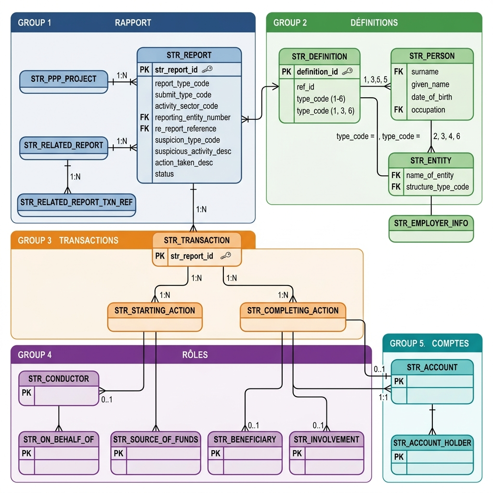

# CANAFE STR Report — Modèle de données cible

Architecture de données pour la soumission de **Suspicious Transaction Reports (STR / DOD)** à **CANAFE / FINTRAC** via leur API officielle.

## 📋 Description

Ce projet contient le modèle de données relationnel (34 tables) conçu pour permettre à une banque canadienne de :

1. **Stocker** les données nécessaires au STRReport
2. **Valider** la conformité avant soumission (2 couches : schéma + business rules)
3. **Générer** le payload JSON conforme au `swaggerExternal.yaml` officiel
4. **Soumettre** via l'API CANAFE et journaliser les résultats

## 🏗️ Architecture

```
34 tables normalisées réparties en 8 domaines :

🔵 Rapport (4)     : STR_REPORT, PPP_PROJECT, RELATED_REPORT, RELATED_REPORT_TXN_REF
🟢 Définitions (4) : DEFINITION, PERSON, ENTITY, EMPLOYER_INFO
🟡 Identité (2)    : ADDRESS, IDENTIFICATION
🟢 Entité (2)      : REGISTRATION_INCORPORATION, AUTHORIZED_PERSON
🔴 Benef. Own. (7) : DIRECTOR, SHARE_OWNER, TRUSTEE, SETTLOR, TRUST_UNIT_OWNER, TRUST_BENEFICIARY, OTHER_ENTITY_OWNER
🟠 Transactions (3): TRANSACTION, STARTING_ACTION, COMPLETING_ACTION
🟣 Rôles (5)       : CONDUCTOR, ON_BEHALF_OF, SOURCE_OF_FUNDS, INVOLVEMENT, BENEFICIARY
💚 Comptes (3)      : ACCOUNT, ACCOUNT_HOLDER, VC_DATA
⬜ Audit (4)        : API_SUBMISSION, SUBMITTED_PAYLOAD, VALIDATION_ERROR, AUDIT_EVENT
```

## 📂 Structure du repo

```
├── README.md                                  ← Ce fichier
├── V2_CANAFE_STR_Document_Complet.md          ← Document technique V2 (12 sections)
├── V2_CANAFE_STR_Modele_Complet.md            ← Modèle de données V2 avec diagrammes Mermaid
├── CORRECTIONS_POST_YAML.md                   ← Delta V1→V2 (traçabilité des corrections)
│
├── diagrams/                                  ← Diagrammes visuels
│   ├── CANAFE_STR_ERD_v2.drawio               ← ERD complet (5 pages Draw.io)
│   ├── str_erd_overview.png                   ← Vue d'ensemble 34 tables
│   ├── str_erd_definitions.png                ← Sous-système Définitions
│   └── str_erd_transactions.png               ← Sous-système Transactions
│
├── sections/                                  ← Document V2 découpé par sections
│   ├── V2_Section1_2.md
│   ├── V2_Section2_suite.md
│   ├── V2_Section3_4.md
│   ├── V2_Section4_suite.md
│   ├── V2_Section5_8.md
│   └── V2_Section9_12.md
│
├── scripts/                                   ← Scripts de génération
│   ├── gen_erd2.ps1                           ← Générateur Draw.io ERD (5 pages)
│   └── generate_drawio.ps1                    ← Générateur Draw.io ERD (1 page)
│
├── source/                                    ← Source officielle CANAFE
│   └── swaggerExternal.yaml                   ← OpenAPI 6 883 lignes
│
└── archive/                                   ← Versions antérieures (V1)
    └── v1/
        ├── CANAFE_STR_Document_Complet.md
        ├── CANAFE_STR_Modele_Donnees_Cible.md
        ├── Section4_Modele_Relationnel.md
        ├── Sections5_8_Diagramme_Mapping_Exemple.md
        ├── Sections9_12_Validation_Architecture.md
        ├── V2_Modele_Donnees_Corrige_Part1.md
        ├── V2_Modele_Donnees_Corrige_Part2.md
        └── CANAFE_STR_ERD.drawio
```

## 🔑 Points critiques du schéma YAML

| Aspect | Détail |
|--------|--------|
| `additionalProperties: false` | Partout — aucun champ custom autorisé |
| `amount`, `exchangeRate` | **Strings** avec regex, pas des numbers |
| Arrays required vides | 16+ arrays doivent être `[]` même si vides |
| Polymorphisme definitions | 6 typeCodes (1-6) avec oneOf |
| Beneficial Ownership | 7 arrays séparés (typeCode 6) |
| `refId` pattern | `^[A-Za-z0-9-_]{1,50}$` — pivot de liaison |

## 📊 Diagramme ER — Vue d'ensemble



## 📖 Sources

- **Swagger officiel** : https://www148.fintrac-canafe.canada.ca/swagger
- **YAML officiel** : `source/swaggerExternal.yaml` (261 Ko, 6 883 lignes)
- **Guidance STR** : https://fintrac-canafe.canada.ca/guidance-directives/transaction-operation/str-dod/str-dod-eng

## 📜 Licence

Usage interne — Projet de conformité réglementaire AML/CANAFE.
