# Modèle de données cible — STRReport CANAFE
## Document d'architecture V2 — Corrigé selon le swaggerExternal.yaml officiel

**Version :** 2.0  
**Date :** 2026-06-17  
**Sources analysées :**
- Swagger officiel : `https://www148.fintrac-canafe.canada.ca/swagger`
- YAML officiel téléchargé : `swaggerExternal.yaml` (261 794 octets, 6 883 lignes)
- Guidance STR officielle (Annex A) : `https://fintrac-canafe.canada.ca/guidance-directives/transaction-operation/str-dod/str-dod-eng`

---

# SECTION 1 — Résumé exécutif

## 1.1 Qu'est-ce qu'un STRReport ?

Un **STRReport** (Suspicious Transaction Report / Déclaration d'opérations douteuses — DOD) est un rapport réglementaire qu'une entité déclarante canadienne doit soumettre à **CANAFE / FINTRAC** lorsqu'elle a des motifs raisonnables de soupçonner qu'une transaction est liée au blanchiment d'argent, au financement du terrorisme ou à l'évasion de sanctions.

Le code de type de rapport dans l'API est **`reportTypeCode = 102`**.

## 1.2 Obligations légales

- **Loi** : Loi sur le recyclage des produits de la criminalité et le financement des activités terroristes (LRPCFAT)
- **Aucun seuil monétaire** — tout montant peut déclencher un STR
- **Délai** : Dès que praticable après évaluation des motifs raisonnables
- Depuis **août 2024**, l'obligation couvre aussi l'**évasion de sanctions**
- **Tipping off interdit** : Ne pas informer le client de la déclaration

## 1.3 Structure du payload JSON

L'API `POST /api/v1/reports` attend un payload JSON avec ces blocs **tous required** dans le schéma :

| Bloc JSON | Required | Description |
|-----------|----------|-------------|
| `reportDetails` | ✅ | Métadonnées (entité déclarante, références, secteur) |
| `detailsOfSuspicion` | ✅ | Narratif + type de suspicion + PPP codes |
| `relatedReports` | ✅ | Rapports liés (peut être `[]` vide) |
| `definitions` | ✅ | Catalogue polymorphe personnes/entités (peut être `[]`) |
| `transactions` | ✅ `minItems:1` | Transactions avec starting/completing actions |

> **Blocs NON required au niveau racine :** `actionTaken` (objet optionnel)

## 1.4 Périmètre du modèle

Ce document couvre **exclusivement** :
1. Stocker les données cibles alimentant le JSON STRReport
2. Valider la conformité avant soumission
3. Générer le payload JSON conforme au schéma CANAFE
4. Soumettre via l'API et journaliser les résultats

> **Hors périmètre** : Case management AML, scoring, alertes, workflow d'investigation.

---

# SECTION 2 — Compréhension fonctionnelle du STRReport (corrigée YAML)

## 2.1 reportDetails

| Champ YAML exact | Type YAML | Required | Description |
|------------------|-----------|----------|-------------|
| `reportTypeCode` | integer | ✅ | Toujours `102` pour STR |
| `submitTypeCode` | integer | ✅ | `1`=Submit, `2`=Update, `5`=Delete |
| `activitySectorCode` | integer | ❌ schéma | Enum 28 valeurs (validé par business rules) |
| `reportingEntityNumber` | **number** | ✅ | Numéro CANAFE 7 chiffres |
| `submittingReportingEntityNumber` | **number** | ✅ | Si soumis par un tiers |
| `reportingEntityReportReference` | string | ✅ | `^[A-Za-z0-9-_]{1,100}$` unique |
| `reportingEntityContactId` | **number** | ✅ | Contact pour suivi |
| `ministerialDirectiveCode` | string | ❌ | Seule valeur : `IR2020` |

### Enum `activitySectorCode` (28 valeurs officielles)

| Code | EN | FR |
|------|----|----|
| 1 | Accountant | Comptable |
| 2 | Bank | Banque |
| 3 | Caisse populaire | Caisse populaire |
| 4 | Crown agent | Mandataire de Sa Majesté |
| 5 | Casino | Casino |
| 6 | Co-op credit society | Coopérative de crédit |
| 9 | Life insurance broker/agent | Courtier/agent d'assurance-vie |
| 10 | Life insurance company | Société d'assurance-vie |
| 11 | Money services business | ESM |
| 12 | Provincial savings office | Caisse d'épargne provinciale |
| 13 | Real estate | Immobilier |
| 14 | Credit union | Caisse d'épargne et de crédit |
| 15 | Securities dealer | Courtier en valeurs mobilières |
| 16 | Trust and/or loan company | Société de fiducie/prêt |
| 17 | BC notary | Notaire C.-B. |
| 18 | Dealer precious metals/stones | Négociant pierres/métaux précieux |
| 19 | Credit union central | Centrale de caisses de crédit |
| 20 | Financial services cooperative | Coopérative de services financiers |
| 21 | Foreign MSB | ESM étrangère |
| 22 | Mortgage administrators | Administrateurs hypothécaires |
| 24 | Mortgage brokers | Courtiers hypothécaires |
| 25 | Mortgage lenders | Prêteurs hypothécaires |
| 26 | Factor | Affactureur |
| 27 | Financing/Leasing Entities | Entité de financement/bail |
| 28 | Title Insurer | Assureurs de titres |

> **Note :** Codes 7, 8, 23 absents de l'enum officiel.

## 2.2 detailsOfSuspicion

| Champ YAML exact | Type | Required schéma |
|------------------|------|----------------|
| `descriptionOfSuspiciousActivity` | string | ❌ (business rules) |
| `suspicionTypeCode` | integer enum 1-7 | ❌ (business rules) |
| `publicPrivatePartnershipProjectNameCodes` | integer[] | ✅ (peut être `[]`) |
| `politicallyExposedPersonIncludedIndicator` | boolean | ❌ |

### Enum `suspicionTypeCode`

| Code | Description |
|------|-------------|
| 1 | Blanchiment d'argent |
| 2 | Financement du terrorisme |
| 3 | Blanchiment + Financement terrorisme |
| 4 | Évasion de sanctions |
| 5 | Blanchiment + Évasion sanctions |
| 6 | Financement terrorisme + Évasion sanctions |
| 7 | Blanchiment + Financement terrorisme + Évasion sanctions |

### Enum `publicPrivatePartnershipProjectNameCodes`

| Code | Projet |
|------|--------|
| 1 | ANTON |
| 2 | ATHENA |
| 3 | CHAMELEON |
| 5 | GUARDIAN |
| 6 | LEGION |
| 7 | PROTECT |
| 8 | SHADOW |

## 2.3 relatedReports[]

Required au niveau racine (peut être `[]`).

| Champ | Type | Required |
|-------|------|----------|
| `reportingEntityReportReference` | string `^[A-Za-z0-9-_]{1,100}$` | ✅ |
| `reportingEntityTransactionReferences` | string[] `^[A-Za-z0-9-_]{1,200}$` | ✅ |

## 2.4 actionTaken

NON required au niveau racine. Objet simple :

| Champ | Type |
|-------|------|
| `description` | string (texte libre) |

## 2.5 definitions[] — Catalogue polymorphe

Required au niveau racine (peut être `[]`). Utilise `oneOf` pour 6 types :

| typeCode | Schéma YAML | Description |
|----------|------------|-------------|
| **1** | `PersonName` | Nom simple (surname, givenName, otherNameInitial) |
| **2** | `EntityName` | Nom d'entité simple (nameOfEntity) |
| **3** | `PersonDetails` | Personne détaillée (adresse, téléphone, DOB, occupation, identifications[]) |
| **4** | `EntityDetails` | Entité détaillée (adresse, registrations[], identifications[], authorizedPersons[]) |
| **5** | `personAndEmployerDetails` | Personne + employeur (objet imbriqué `employerInformation`) |
| **6** | `entityAndBeneficialOwnershipDetails` | Entité + BO complet (7 arrays de personnes) |

### Champs exacts par typeCode

**PersonName (1) :**
```yaml
typeCode: 1, refId, givenName, surname, otherNameInitial
```

**EntityName (2) :**
```yaml
typeCode: 2, refId, nameOfEntity
```

**PersonDetails (3) :**
```yaml
typeCode: 3, refId, givenName, surname, otherNameInitial, alias,
telephoneNumber, extensionNumber, dateOfBirth, countryOfResidenceCode,
occupation, nameOfEmployer, addressTypeCode, address (oneOf Structured|Unstructured),
identifications[] (required)
```

**EntityDetails (4) :**
```yaml
typeCode: 4, refId, nameOfEntity, telephoneNumber, extensionNumber,
natureOfPrincipalBusiness, addressTypeCode, address, identifications[] (required),
authorizedPersons[] (required), registrationIncorporationIndicator,
registrationsIncorporations[] (required)
```

**personAndEmployerDetails (5) :**
```yaml
typeCode: 5, refId, surname, givenName, otherNameInitial, alias,
addressTypeCode, address, telephoneNumber, extensionNumber,
dateOfBirth, countryOfResidenceCode, countryOfCitizenshipCode,
occupation, identifications[] (required),
employerInformation: { name, addressTypeCode, address, telephoneNumber, extensionNumber }
```

**entityAndBeneficialOwnershipDetails (6) :**
```yaml
typeCode: 6, refId, nameOfEntity, addressTypeCode, address,
telephoneNumber, extensionNumber, identifications[] (required),
authorizedPersons[] (required), structureTypeCode (enum 1-4),
structureTypeOther, natureOfPrincipalBusiness,
registrationIncorporationIndicator, registrationsIncorporations[] (required),
directorsOfCorporation[] (required), personsOwningSharesOfCorporation[] (required),
trusteesOfTrust[] (required), settlorsOfTrust[] (required),
personsOwningUnitsOfTrust[] (required), beneficiariesOfTrust[] (required),
personsOwningEntityNotCorporationOrTrust[] (required)
```

### Enum `structureTypeCode`

| Code | Type |
|------|------|
| 1 | Corporation |
| 2 | Entity other than corporation or trust |
| 3 | Trust |
| 4 | Widely held or publicly traded trust |

### Addresses — Polymorphisme via addressTypeCode

Le champ `addressTypeCode` est au même niveau que `address` :

**StructuredAddress (typeCode: 1) :**
```yaml
typeCode: 1, unitNumber (10), buildingNumber (10), streetAddress (100),
city (100), district (100), provinceStateCode, provinceStateName (100),
subProvinceSubLocality (100), postalZipCode (20), countryCode
```

**UnstructuredAddress (typeCode: 2) :**
```yaml
typeCode: 2, countryCode, unstructured (500)
```

### Identifications — Personnes vs Entités

**personIdentificationWithJurisdiction :**

| identifierTypeCode | Type |
|--------------------|------|
| 1 | Birth certificate |
| 2 | Passport |
| 3 | Other |
| 4 | Driver's licence |
| 5 | Provincial health card |
| 14 | Citizenship card |
| 15 | Certificate of Indian Status |
| 27 | Social Insurance Number card |
| 32 | Permanent resident card |
| 33 | Record of landing |
| 34 | Credit file |
| 35 | Government issued ID |
| 36 | Insurance documents |
| 37 | Provincial/territorial identity card |
| 38 | Record of employment |
| 39 | Travel visa |
| 40 | Utility statement |

Champs : `identifierTypeCode, identifierTypeOther, number, jurisdictionOfIssueCountryCode, jurisdictionOfIssueProvinceStateCode, jurisdictionOfIssueProvinceStateName`

**entityIdentificationWithJurisdiction :**

| identifierTypeCode | Type |
|--------------------|------|
| 1 | Articles of association |
| 2 | Certificate of corporate status |
| 3 | Certificate of incorporation |
| 4 | Letter/Notice of assessment |
| 5 | Partnership agreement |
| 6 | Annual report |
| 7 | Other |

### registrationIncorporation (entités)

| Champ | Type |
|-------|------|
| `typeCode` | enum: 1=Registered, 2=Incorporated, 4=Both, 5=Unknown |
| `number` | string100 |
| `jurisdictionOfIssueCountryCode` | CountryCode |
| `jurisdictionOfIssueProvinceStateCode` | ProvinceStateCode |
| `jurisdictionOfIssueProvinceStateName` | string100 |

## 2.6 transactions[]

Required, `minItems: 1`.

### suspiciousTransactionDetails

| Champ YAML exact | Type | Required |
|------------------|------|----------|
| `attemptedTransactionIndicator` | boolean | ✅ |
| `reasonNotCompleted` | string200 | ❌ |
| `dateOfTransaction` | localDate `YYYY-MM-DD` | ❌ |
| `timeOfTransaction` | zonedTime `HH:MM:SS±HH:MM` | ❌ |
| `methodCode` | integer enum 1-12 | ❌ |
| `methodOther` | string200 | ❌ |
| `dateOfPosting` | localDate | ❌ |
| `timeOfPosting` | zonedTime | ❌ |
| `reportingEntityTransactionReference` | string `^[A-Za-z0-9-_]{1,200}$` | ❌ |
| `purpose` | string200 | ❌ |

### Enum `methodCode`

| Code | EN | FR |
|------|----|----|
| 1 | In person | En personne |
| 2 | ABM | Guichet automatique |
| 3 | Armoured car | Véhicule blindé |
| 4 | Courier | Messager |
| 5 | Mail deposit | Poste |
| 6 | Telephone | Téléphone |
| 7 | Other | Autre |
| 8 | Night deposit | Dépôt de nuit |
| 9 | Quick drop | Dépôt express |
| 10 | Self-redemption kiosk | Guichet de rachat |
| 11 | Virtual currency ATM | GAB monnaie virtuelle |
| 12 | Online | En ligne |

### Transaction required fields

```yaml
required:
  - reportingEntityLocationId    # string30
  - suspiciousTransactionDetails
  - startingActions              # array, min 1 implicite
  - completingActions            # array, peut être []
```

## 2.7 startingActions[] (dans transaction)

Required array dans le schéma.

### startingAction.details

| Champ YAML exact | Type | Required |
|------------------|------|----------|
| `direction` | integer `1`=In, `2`=Out | ❌ schéma |
| `fundAssetVirtualCurrencyTypeCode` | integer enum | ❌ |
| `fundAssetVirtualCurrencyTypeOther` | string200 | ❌ |
| `amount` | **string** `^\d{1,17}(\.\d{2,10})?$` | ❌ |
| `currencyCode` | CurrencyCode | ❌ |
| `virtualCurrencyTypeCode` | VirtualCurrencyCode | ❌ |
| `virtualCurrencyTypeOther` | string200 | ❌ |
| `exchangeRate` | **string** `^\d{1,17}(\.\d{2,10})?$` | ❌ |
| `virtualCurrencyTransactionIds` | string200[] | ✅ (vide OK) |
| `sendingVirtualCurrencyAddresses` | string200[] | ✅ (vide OK) |
| `receivingVirtualCurrencyAddresses` | string200[] | ✅ (vide OK) |
| `referenceNumber` | string200 | ❌ |
| `referenceNumberOtherRelatedNumber` | string200 | ❌ |
| `account` | strAccount | ❌ |
| `accountStatusAtTimeOfTransaction` | integer enum 1-4 | ❌ |
| `howFundsOrVirtualCurrencyObtained` | string200 | ❌ |
| `sourcesOfFundsOrVirtualCurrencyIndicator` | boolean | ❌ |
| `conductorIndicator` | boolean | ❌ |

```yaml
# startingAction required:
- details
- sourcesOfFundsOrVirtualCurrency    # array, vide OK []
- conductors                          # array, vide OK []
```

### Enum `fundAssetVirtualCurrencyTypeCode`

| Direction=1 (In) | Direction=2 (Out) |
|-------------------|-------------------|
| 1 Bank draft | 3 Casino product |
| 2 Cash | 7 Funds withdrawal |
| 3 Casino product | 9 Investment product |
| 4 Cheque | 16 Virtual currency |
| 5 Domestic funds transfer | 17 Other |
| 6 Email money transfer | |
| 8 International funds transfer | |
| 9 Investment product | |
| 10 Jewellery | |
| 11 Mobile money transfer | |
| 12 Money order | |
| 13 Precious metals | |
| 14 Precious stones | |
| 16 Virtual currency | |
| 17 Other | |

> **Note :** Code 15 n'existe PAS dans le YAML officiel.

### Enum `accountStatusAtTimeOfTransaction`

| Code | Statut |
|------|--------|
| 1 | Active |
| 2 | Inactive |
| 3 | Dormant |
| 4 | Closed |

### conductors[] (dans startingAction)

Required array (vide OK). Chaque conductor :

```yaml
# conductor required:
- typeCode     # definitionType56 → 5 ou 6
- refId        # ^[A-Za-z0-9-_]{1,50}$
- details      # objet required
- onBehalfOfs  # array required, vide OK []
```

**conductor.details :**

| Champ | Type |
|-------|------|
| `clientNumber` | string100 |
| `emailAddress` | string200 |
| `url` | string200 |
| `typeOfDeviceCode` | integer enum 1-4 |
| `typeOfDeviceOther` | string200 |
| `username` | string100 |
| `deviceIdentifierNumber` | string200 |
| `internetProtocolAddress` | string200 |
| `dateTimeOfOnlineSession` | zonedDateTime |
| `onBehalfOfIndicator` | boolean |

### Enum `typeOfDeviceCode`

| Code | Type |
|------|------|
| 1 | Computer/Laptop |
| 2 | Mobile phone |
| 3 | Tablet |
| 4 | Other |

### onBehalfOfs[] (dans conductor)

Required array (vide OK). Chaque entry :

```yaml
# onBehalfOf required:
- typeCode    # definitionType56 → 5 ou 6
- refId
```

**onBehalfOf.details :**

| Champ | Type |
|-------|------|
| `clientNumber` | string100 |
| `emailAddress` | string200 |
| `url` | string200 |
| `relationshipOfConductorCode` | integer enum 1-14 (withVendor) |
| `relationshipOfConductorOther` | string200 |

### sourcesOfFundsOrVirtualCurrency[] (dans startingAction)

Required array (vide OK).

```yaml
# sourceOfFunds required:
- typeCode    # definitionType12 → 1 ou 2
- refId
```

**details :** `accountNumber` (string200), `policyNumber` (string100), `identifyingNumber` (string100)

## 2.8 completingActions[] (dans transaction)

Required array (vide OK).

### completingAction.details

| Champ YAML exact | Type | Required |
|------------------|------|----------|
| `dispositionCode` | integer enum 28 valeurs | ❌ |
| `dispositionOther` | string200 | ❌ |
| `amount` | **string** pattern | ❌ |
| `currencyCode` | CurrencyCode | ❌ |
| `virtualCurrencyTypeCode` | VirtualCurrencyCode | ❌ |
| `virtualCurrencyTypeOther` | string200 | ❌ |
| `exchangeRate` | **string** pattern | ❌ |
| `valueInCanadianDollars` | **string** pattern | ❌ |
| `virtualCurrencyTransactionIds` | string200[] | ✅ (vide OK) |
| `sendingVirtualCurrencyAddresses` | string200[] | ✅ (vide OK) |
| `receivingVirtualCurrencyAddresses` | string200[] | ✅ (vide OK) |
| `referenceNumber` | string200 | ❌ |
| `referenceNumberOtherRelatedNumber` | string200 | ❌ |
| `account` | strAccount | ❌ |
| `accountStatusAtTimeOfTransaction` | integer enum 1-4 | ❌ |
| `involvementIndicator` | boolean | ❌ |
| `beneficiaryIndicator` | boolean | ❌ |

```yaml
# completingAction required:
- details
- involvements    # array, vide OK []
- beneficiaries   # array, vide OK []
```

### Enum `dispositionCode` (28 valeurs)

| Code | EN | FR |
|------|----|----|
| 1 | Deposit to account | Dépôt au compte |
| 3 | Exchange to fiat currency | Échange en monnaie fiduciaire |
| 4 | Purchase of casino product | Achat produits casino |
| 5 | Purchase of bank draft | Achat traite bancaire |
| 6 | Purchase of money order | Achat mandat |
| 7 | Life insurance purchase/deposit | Assurance-vie |
| 8 | Investment product purchase/deposit | Produit d'investissement |
| 9 | Real estate purchase/deposit | Biens immobiliers |
| 10 | Cash out | Encaissement |
| 11 | Other | Autre |
| 14 | Purchase of jewellery | Achat bijoux |
| 15 | Purchase precious metals | Métaux précieux |
| 17 | Added to VC wallet | Portefeuille monnaie virtuelle |
| 18 | Exchange to virtual currency | Échange en MV |
| 19 | Outgoing VC transfer | Transfert MV |
| 20 | Outgoing email money transfer | Virement par courriel |
| 21 | Holding funds | Fonds retenus |
| 22 | Purchase precious stones | Pierres précieuses |
| 23 | Issued cheque | Émission chèque |
| 24 | Outgoing domestic funds transfer | Virement domestique |
| 25 | Outgoing international funds transfer | Virement international |
| 26 | Purchase prepaid card | Carte prépayée |
| 27 | Denomination exchange | Échange coupures |
| 28 | Payment to account | Paiement au compte |
| 29 | Purchase/Payment for goods | Achat biens |
| 30 | Purchase/Payment for services | Achat services |
| 31 | Outgoing mobile money transfer | Virement mobile |
| 32 | Cash withdrawal (account based) | Retrait (lié au compte) |

> **Note :** Codes 2, 12, 13, 16 absents du YAML officiel.

### involvements[] (dans completingAction)

Required array (vide OK).

```yaml
# involvement required:
- typeCode    # definitionType12 → 1 ou 2
- refId
```

**details :** `accountNumber` (string200), `identifyingNumber` (string100), `policyNumber` (string100)

### beneficiaries[] (dans completingAction)

Required array (vide OK).

```yaml
# beneficiary required:
- typeCode    # definitionType34 → 3 ou 4
- refId
```

**details :** `clientNumber` (string100), `username` (string100), `emailAddress` (string200)

> **Note :** Pas de `relationshipOfConductorCode` sur les beneficiaries du STR (contrairement au LCTR). Le champ existe seulement dans le LCTR completing action beneficiaries.

## 2.9 strAccount

Utilisé dans les starting et completing actions.

| Champ | Type | Required |
|-------|------|----------|
| `financialInstitutionNumber` | string50 | ❌ |
| `branchNumber` | string50 | ❌ |
| `number` | string100 | ❌ |
| `typeCode` | integer enum 1-5 | ❌ |
| `typeOther` | string200 | ❌ |
| `currencyCode` | CurrencyCode | ❌ |
| `virtualCurrencyTypeCode` | VirtualCurrencyCode | ❌ |
| `virtualCurrencyTypeOther` | string200 | ❌ |
| `dateOpened` | localDate | ❌ |
| `dateClosed` | localDate | ❌ |
| `holders` | array | ✅ |

### Enum `typeCode` (AccountTypeCode)

| Code | Type |
|------|------|
| 1 | Personal |
| 2 | Business |
| 3 | Trust |
| 4 | Other |
| 5 | Casino |

### holders[] (required dans strAccount)

```yaml
# holder required:
- typeCode    # definitionType12 → 1 ou 2
- refId
```

## 2.10 Formats et patterns critiques

| Type YAML | Pattern | Exemple |
|-----------|---------|---------|
| `refId` | `^[A-Za-z0-9-_]{1,50}$` | `person-green-01` |
| `externalReportReference` | `^[A-Za-z0-9-_]{1,100}$` | `STR-2026-00142` |
| `externalTransactionReference` | `^[A-Za-z0-9-_]{1,200}$` | `TXN-2026-A1` |
| `currencyAmount` | `^\d{1,17}(\.\d{2,10})?$` | `9900.00` |
| `exchangeRate` | `^\d{1,17}(\.\d{2,10})?$` | `501.7966918945` |
| `localDate` | `^[0-9]{4}-[0-9]{2}-[0-9]{2}$` | `2026-06-15` |
| `zonedTime` | `^[0-9]{2}:[0-9]{2}:[0-9]{2}[\-\+][0-9]{2}:[0-9]{2}$` | `14:30:00-04:00` |
| `zonedDateTime` | `^..T..[+-]..` | `2026-06-15T14:30:00-04:00` |

> **CRITIQUE :** `amount`, `exchangeRate`, `valueInCanadianDollars` sont des **strings** (pas des numbers). La validation de format se fait par regex.

## 2.11 Contrainte `additionalProperties: false`

Quasiment **tous** les objets du YAML ont `additionalProperties: false`. Cela signifie que l'API CANAFE **rejettera** tout champ non déclaré dans le schéma. Il est interdit d'ajouter des propriétés custom.

## 2.12 Authentification API

L'API utilise un **token Bearer OAuth2** :

```yaml
AccessTokenResponse:
  token_type: string      # "Bearer"
  expires_in: number
  ext_expires_in: number
  access_token: string
```

## 2.13 Réponse d'erreur de validation

```yaml
ErrorWithValidation:
  code: number
  message: { en: string, fr: string }
  payload:
    validationMessages[]:
      instancePath: string    # "/transactions/0/startingActions/0/details/amount"
      schemaPath: string
      keyword: string
      params: object
      message: { en: string, fr: string }
```

---

# SECTION 3 — Structure logique du payload STRReport (corrigée YAML)

```
STRReport (additionalProperties: false)
├── reportDetails (required, additionalProperties: false)
│   ├── reportTypeCode: integer (102) ← required
│   ├── submitTypeCode: integer (1|2|5) ← required
│   ├── activitySectorCode: integer (28 valeurs)
│   ├── reportingEntityNumber: number ← required
│   ├── submittingReportingEntityNumber: number ← required
│   ├── reportingEntityReportReference: string ^[A-Za-z0-9-_]{1,100}$ ← required
│   ├── reportingEntityContactId: number ← required
│   └── ministerialDirectiveCode: string (IR2020)
│
├── detailsOfSuspicion (required, additionalProperties: false)
│   ├── descriptionOfSuspiciousActivity: string
│   ├── suspicionTypeCode: integer (1-7)
│   ├── publicPrivatePartnershipProjectNameCodes: integer[] ← required (vide OK)
│   └── politicallyExposedPersonIncludedIndicator: boolean
│
├── relatedReports: [] (required, vide OK)
│   └── [n] (additionalProperties: false)
│       ├── reportingEntityReportReference: string ← required
│       └── reportingEntityTransactionReferences: string[] ← required
│
├── actionTaken (NOT required)
│   └── description: string
│
├── definitions: [] (required, vide OK)
│   └── [n] oneOf:
│       ├── PersonName (typeCode=1): refId, givenName, surname, otherNameInitial
│       ├── EntityName (typeCode=2): refId, nameOfEntity
│       ├── PersonDetails (typeCode=3): refId, names, alias, phone, DOB, address, identifications[]
│       ├── EntityDetails (typeCode=4): refId, nameOfEntity, phone, address, identifications[], authorizedPersons[], registrationsIncorporations[]
│       ├── personAndEmployerDetails (typeCode=5): refId, names, alias, address, phone, DOB, countryOfResidence/Citizenship, occupation, identifications[], employerInformation{name, address, phone}
│       └── entityAndBeneficialOwnershipDetails (typeCode=6): refId, nameOfEntity, address, phone, identifications[], authorizedPersons[], structureTypeCode, registrationsIncorporations[], directorsOfCorporation[], personsOwningSharesOfCorporation[], trusteesOfTrust[], settlorsOfTrust[], personsOwningUnitsOfTrust[], beneficiariesOfTrust[], personsOwningEntityNotCorporationOrTrust[]
│
└── transactions: [] (required, minItems: 1)
    └── [n] (additionalProperties: false)
        ├── reportingEntityLocationId: string30 ← required
        ├── suspiciousTransactionDetails (required, additionalProperties: false)
        │   ├── attemptedTransactionIndicator: boolean ← required
        │   ├── reasonNotCompleted: string200
        │   ├── dateOfTransaction: localDate
        │   ├── timeOfTransaction: zonedTime
        │   ├── methodCode: integer (1-12)
        │   ├── methodOther: string200
        │   ├── dateOfPosting: localDate
        │   ├── timeOfPosting: zonedTime
        │   ├── reportingEntityTransactionReference: string ^[A-Za-z0-9-_]{1,200}$
        │   └── purpose: string200
        │
        ├── startingActions: [] (required)
        │   └── [n] (additionalProperties: false)
        │       ├── details (required, additionalProperties: false)
        │       │   ├── direction: integer (1=In | 2=Out)
        │       │   ├── fundAssetVirtualCurrencyTypeCode: integer
        │       │   ├── fundAssetVirtualCurrencyTypeOther: string200
        │       │   ├── amount: string (pattern)
        │       │   ├── currencyCode: CurrencyCode
        │       │   ├── virtualCurrencyTypeCode, virtualCurrencyTypeOther
        │       │   ├── exchangeRate: string (pattern)
        │       │   ├── virtualCurrencyTransactionIds: string[] ← required (vide OK)
        │       │   ├── sendingVirtualCurrencyAddresses: string[] ← required (vide OK)
        │       │   ├── receivingVirtualCurrencyAddresses: string[] ← required (vide OK)
        │       │   ├── referenceNumber, referenceNumberOtherRelatedNumber: string200
        │       │   ├── account: strAccount
        │       │   ├── accountStatusAtTimeOfTransaction: integer (1-4)
        │       │   ├── howFundsOrVirtualCurrencyObtained: string200
        │       │   ├── sourcesOfFundsOrVirtualCurrencyIndicator: boolean
        │       │   └── conductorIndicator: boolean
        │       │
        │       ├── sourcesOfFundsOrVirtualCurrency: [] (required, vide OK)
        │       │   └── [n]: typeCode (1|2), refId, details{accountNumber, policyNumber, identifyingNumber}
        │       │
        │       └── conductors: [] (required, vide OK)
        │           └── [n]: typeCode (5|6), refId, details{...deviceInfo, onBehalfOfIndicator},
        │               onBehalfOfs: [] (required, vide OK)
        │               └── [n]: typeCode (5|6), refId, details{clientNumber, email, url, relationshipCode}
        │
        └── completingActions: [] (required, vide OK)
            └── [n] (additionalProperties: false)
                ├── details (required, additionalProperties: false)
                │   ├── dispositionCode: integer (28 valeurs)
                │   ├── dispositionOther: string200
                │   ├── amount: string (pattern)
                │   ├── currencyCode, virtualCurrencyTypeCode/Other, exchangeRate
                │   ├── valueInCanadianDollars: string (pattern)
                │   ├── virtualCurrencyTransactionIds: string[] ← required (vide OK)
                │   ├── sendingVirtualCurrencyAddresses: string[] ← required (vide OK)
                │   ├── receivingVirtualCurrencyAddresses: string[] ← required (vide OK)
                │   ├── referenceNumber, referenceNumberOtherRelatedNumber
                │   ├── account: strAccount
                │   ├── accountStatusAtTimeOfTransaction: integer (1-4)
                │   ├── involvementIndicator: boolean
                │   └── beneficiaryIndicator: boolean
                │
                ├── involvements: [] (required, vide OK)
                │   └── [n]: typeCode (1|2), refId, details{accountNumber, identifyingNumber, policyNumber}
                │
                └── beneficiaries: [] (required, vide OK)
                    └── [n]: typeCode (3|4), refId, details{clientNumber, username, emailAddress}
```

---

# SECTION 4 — Modèle de données cible (34 tables — corrigé YAML)

## 4.1 DOMAINE RAPPORT (4 tables)

### STR_REPORT

| Colonne | Type SQL | Null | Validation | YAML |
|---------|----------|------|-----------|------|
| `str_report_id` | BIGINT PK | Non | Auto | — |
| `report_type_code` | SMALLINT | Non | = 102 | `reportDetails.reportTypeCode` |
| `submit_type_code` | SMALLINT | Non | 1, 2, 5 | `reportDetails.submitTypeCode` |
| `activity_sector_code` | SMALLINT | Oui | 28 valeurs | `reportDetails.activitySectorCode` |
| `reporting_entity_number` | NUMERIC(7) | Non | 7 chiffres | `reportDetails.reportingEntityNumber` |
| `submitting_re_number` | NUMERIC(7) | Non | — | `reportDetails.submittingReportingEntityNumber` |
| `re_report_reference` | VARCHAR(100) | Non | regex, unique | `reportDetails.reportingEntityReportReference` |
| `re_contact_id` | NUMERIC | Non | — | `reportDetails.reportingEntityContactId` |
| `ministerial_directive_code` | VARCHAR(10) | Oui | IR2020 | `reportDetails.ministerialDirectiveCode` |
| `suspicion_type_code` | SMALLINT | Oui | 1-7 | `detailsOfSuspicion.suspicionTypeCode` |
| `suspicious_activity_desc` | TEXT | Oui | — | `detailsOfSuspicion.descriptionOfSuspiciousActivity` |
| `pep_included_indicator` | BOOLEAN | Oui | — | `detailsOfSuspicion.politicallyExposedPersonIncludedIndicator` |
| `action_taken_desc` | TEXT | Oui | — | `actionTaken.description` |
| `status` | VARCHAR(20) | Non | Interne | — |
| `created_at` | TIMESTAMP | Non | — | — |
| `submitted_at` | TIMESTAMP | Oui | — | — |

### STR_PPP_PROJECT

| Colonne | Type SQL | Null | YAML |
|---------|----------|------|------|
| `ppp_id` | BIGINT PK | Non | — |
| `str_report_id` | BIGINT FK | Non | — |
| `project_name_code` | SMALLINT | Non | `detailsOfSuspicion.publicPrivatePartnershipProjectNameCodes[n]` |

### STR_RELATED_REPORT

| Colonne | Type SQL | Null | YAML |
|---------|----------|------|------|
| `related_report_id` | BIGINT PK | Non | — |
| `str_report_id` | BIGINT FK | Non | — |
| `re_report_reference` | VARCHAR(100) | Non | `relatedReports[n].reportingEntityReportReference` |

### STR_RELATED_REPORT_TXN_REF

| Colonne | Type SQL | Null | YAML |
|---------|----------|------|------|
| `id` | BIGINT PK | Non | — |
| `related_report_id` | BIGINT FK | Non | — |
| `txn_reference` | VARCHAR(200) | Non | `relatedReports[n].reportingEntityTransactionReferences[n]` |

## 4.2 DOMAINE DÉFINITIONS (4 tables)

### STR_DEFINITION

| Colonne | Type SQL | Null | YAML |
|---------|----------|------|------|
| `definition_id` | BIGINT PK | Non | — |
| `str_report_id` | BIGINT FK | Non | — |
| `ref_id` | VARCHAR(50) | Non | `definitions[n].refId` — unique dans le rapport |
| `type_code` | SMALLINT | Non | `definitions[n].typeCode` (1-6) |

### STR_PERSON (typeCode 1, 3, 5)

| Colonne | Type SQL | Null | YAML |
|---------|----------|------|------|
| `person_id` | BIGINT PK | Non | — |
| `definition_id` | BIGINT FK UNIQUE | Non | — |
| `surname` | VARCHAR(100) | Oui | `surname` |
| `given_name` | VARCHAR(100) | Oui | `givenName` |
| `other_name_initial` | VARCHAR(100) | Oui | `otherNameInitial` |
| `alias` | VARCHAR(100) | Oui | `alias` (tc 3,5) |
| `telephone_number` | VARCHAR(20) | Oui | `telephoneNumber` (tc 3,5) |
| `extension_number` | VARCHAR(10) | Oui | `extensionNumber` (tc 3,5) |
| `date_of_birth` | VARCHAR(10) | Oui | `dateOfBirth` (tc 3,5) |
| `country_of_residence_code` | VARCHAR(2) | Oui | `countryOfResidenceCode` (tc 3,5) |
| `country_of_citizenship_code` | VARCHAR(2) | Oui | `countryOfCitizenshipCode` (tc 5 seul) |
| `occupation` | VARCHAR(200) | Oui | `occupation` (tc 3,5) |
| `name_of_employer` | VARCHAR(100) | Oui | `nameOfEmployer` (tc 3 seul) |
| `address_type_code` | SMALLINT | Oui | `addressTypeCode` (tc 3,5) |

### STR_EMPLOYER_INFO (typeCode 5 seulement)

| Colonne | Type SQL | Null | YAML |
|---------|----------|------|------|
| `employer_id` | BIGINT PK | Non | — |
| `person_id` | BIGINT FK UNIQUE | Non | — |
| `name` | VARCHAR(100) | Oui | `employerInformation.name` |
| `address_type_code` | SMALLINT | Oui | `employerInformation.addressTypeCode` |
| `telephone_number` | VARCHAR(20) | Oui | `employerInformation.telephoneNumber` |
| `extension_number` | VARCHAR(10) | Oui | `employerInformation.extensionNumber` |

### STR_ENTITY (typeCode 2, 4, 6)

| Colonne | Type SQL | Null | YAML |
|---------|----------|------|------|
| `entity_id` | BIGINT PK | Non | — |
| `definition_id` | BIGINT FK UNIQUE | Non | — |
| `name_of_entity` | VARCHAR(100) | Oui | `nameOfEntity` |
| `telephone_number` | VARCHAR(20) | Oui | `telephoneNumber` (tc 4,6) |
| `extension_number` | VARCHAR(10) | Oui | `extensionNumber` (tc 4,6) |
| `nature_of_principal_business` | VARCHAR(200) | Oui | `natureOfPrincipalBusiness` (tc 4,6) |
| `address_type_code` | SMALLINT | Oui | `addressTypeCode` (tc 4,6) |
| `structure_type_code` | SMALLINT | Oui | `structureTypeCode` (tc 6) enum 1-4 |
| `structure_type_other` | VARCHAR(200) | Oui | `structureTypeOther` (tc 6) |
| `registration_incorporation_indicator` | BOOLEAN | Oui | `registrationIncorporationIndicator` (tc 4,6) |

## 4.3 DOMAINE IDENTITÉ (2 tables partagées)

### STR_ADDRESS

| Colonne | Type SQL | Null | YAML |
|---------|----------|------|------|
| `address_id` | BIGINT PK | Non | — |
| `owner_type` | VARCHAR(20) | Non | PERSON, ENTITY, EMPLOYER, DIRECTOR, etc. |
| `owner_id` | BIGINT | Non | FK polymorphe |
| `type_code` | SMALLINT | Non | 1=Structured, 2=Unstructured |
| `unit_number` | VARCHAR(10) | Oui | `unitNumber` |
| `building_number` | VARCHAR(10) | Oui | `buildingNumber` |
| `street_address` | VARCHAR(100) | Oui | `streetAddress` |
| `city` | VARCHAR(100) | Oui | `city` |
| `district` | VARCHAR(100) | Oui | `district` |
| `province_state_code` | VARCHAR(10) | Oui | `provinceStateCode` |
| `province_state_name` | VARCHAR(100) | Oui | `provinceStateName` |
| `sub_province_sub_locality` | VARCHAR(100) | Oui | `subProvinceSubLocality` |
| `postal_zip_code` | VARCHAR(20) | Oui | `postalZipCode` |
| `country_code` | VARCHAR(2) | Oui | `countryCode` |
| `unstructured` | VARCHAR(500) | Oui | `unstructured` (si type_code=2) |

### STR_IDENTIFICATION

| Colonne | Type SQL | Null | YAML |
|---------|----------|------|------|
| `identification_id` | BIGINT PK | Non | — |
| `owner_type` | VARCHAR(20) | Non | PERSON ou ENTITY |
| `owner_id` | BIGINT | Non | FK polymorphe |
| `identifier_type_code` | SMALLINT | Oui | enum (17 codes personne, 7 codes entité) |
| `identifier_type_other` | VARCHAR(200) | Oui | `identifierTypeOther` |
| `number` | VARCHAR(100) | Oui | `number` |
| `jurisdiction_country_code` | VARCHAR(2) | Oui | `jurisdictionOfIssueCountryCode` |
| `jurisdiction_province_state_code` | VARCHAR(10) | Oui | `jurisdictionOfIssueProvinceStateCode` |
| `jurisdiction_province_state_name` | VARCHAR(100) | Oui | `jurisdictionOfIssueProvinceStateName` |

## 4.4 DOMAINE ENTITÉ — DÉTAILS (2 tables)

### STR_REGISTRATION_INCORPORATION

| Colonne | Type SQL | Null | YAML |
|---------|----------|------|------|
| `reg_inc_id` | BIGINT PK | Non | — |
| `entity_id` | BIGINT FK | Non | — |
| `type_code` | SMALLINT | Oui | 1=Reg, 2=Inc, 4=Both, 5=Unknown |
| `number` | VARCHAR(100) | Oui | `number` |
| `jurisdiction_country_code` | VARCHAR(2) | Oui | `jurisdictionOfIssueCountryCode` |
| `jurisdiction_province_state_code` | VARCHAR(10) | Oui | `jurisdictionOfIssueProvinceStateCode` |
| `jurisdiction_province_state_name` | VARCHAR(100) | Oui | `jurisdictionOfIssueProvinceStateName` |

### STR_AUTHORIZED_PERSON

| Colonne | Type SQL | Null | YAML |
|---------|----------|------|------|
| `auth_id` | BIGINT PK | Non | — |
| `entity_id` | BIGINT FK | Non | — |
| `surname` | VARCHAR(100) | Oui | `surname` |
| `given_name` | VARCHAR(100) | Oui | `givenName` |
| `other_name_initial` | VARCHAR(100) | Oui | `otherNameInitial` |

## 4.5 DOMAINE BENEFICIAL OWNERSHIP — typeCode 6 (7 tables)

### STR_DIRECTOR (personContact)

| Colonne | Type SQL | Null | YAML |
|---------|----------|------|------|
| `director_id` | BIGINT PK | Non | — |
| `entity_id` | BIGINT FK | Non | — |
| `surname` | VARCHAR(100) | Oui | `surname` |
| `given_name` | VARCHAR(100) | Oui | `givenName` |
| `other_name_initial` | VARCHAR(100) | Oui | `otherNameInitial` |
| `address_type_code` | SMALLINT | Oui | `addressTypeCode` |
| `telephone_number` | VARCHAR(20) | Oui | `telephoneNumber` |
| `extension_number` | VARCHAR(10) | Oui | `extensionNumber` |

### STR_SHARE_OWNER (nom seulement)

| Colonne | Type SQL | Null | YAML |
|---------|----------|------|------|
| `share_owner_id` | BIGINT PK | Non | — |
| `entity_id` | BIGINT FK | Non | — |
| `surname` | VARCHAR(100) | Oui | `surname` |
| `given_name` | VARCHAR(100) | Oui | `givenName` |
| `other_name_initial` | VARCHAR(100) | Oui | `otherNameInitial` |

### STR_TRUSTEE, STR_SETTLOR, STR_TRUST_UNIT_OWNER, STR_TRUST_BENEFICIARY

> Même structure que STR_DIRECTOR (personContact) : surname, givenName, otherNameInitial, addressTypeCode, telephoneNumber, extensionNumber + adresse via STR_ADDRESS.

### STR_OTHER_ENTITY_OWNER (nom seulement)

> Même structure que STR_SHARE_OWNER : surname, givenName, otherNameInitial.

## 4.6 DOMAINE TRANSACTIONS (3 tables)

### STR_TRANSACTION

| Colonne | Type SQL | Null | YAML |
|---------|----------|------|------|
| `transaction_id` | BIGINT PK | Non | — |
| `str_report_id` | BIGINT FK | Non | — |
| `re_location_id` | VARCHAR(30) | Non | `reportingEntityLocationId` |
| `attempted_indicator` | BOOLEAN | Non | `suspiciousTransactionDetails.attemptedTransactionIndicator` |
| `reason_not_completed` | VARCHAR(200) | Oui | `reasonNotCompleted` |
| `date_of_transaction` | VARCHAR(10) | Oui | `dateOfTransaction` |
| `time_of_transaction` | VARCHAR(25) | Oui | `timeOfTransaction` |
| `method_code` | SMALLINT | Oui | `methodCode` (1-12) |
| `method_other` | VARCHAR(200) | Oui | `methodOther` |
| `date_of_posting` | VARCHAR(10) | Oui | `dateOfPosting` |
| `time_of_posting` | VARCHAR(25) | Oui | `timeOfPosting` |
| `re_txn_reference` | VARCHAR(200) | Oui | `reportingEntityTransactionReference` |
| `purpose` | VARCHAR(200) | Oui | `purpose` |

### STR_STARTING_ACTION

| Colonne | Type SQL | Null | YAML |
|---------|----------|------|------|
| `starting_action_id` | BIGINT PK | Non | — |
| `transaction_id` | BIGINT FK | Non | — |
| `direction` | SMALLINT | Oui | `details.direction` (1=In, 2=Out) |
| `fund_type_code` | SMALLINT | Oui | `details.fundAssetVirtualCurrencyTypeCode` |
| `fund_type_other` | VARCHAR(200) | Oui | `details.fundAssetVirtualCurrencyTypeOther` |
| `amount` | VARCHAR(28) | Oui | `details.amount` — STRING pattern! |
| `currency_code` | VARCHAR(3) | Oui | `details.currencyCode` |
| `vc_type_code` | VARCHAR(10) | Oui | `details.virtualCurrencyTypeCode` |
| `vc_type_other` | VARCHAR(200) | Oui | `details.virtualCurrencyTypeOther` |
| `exchange_rate` | VARCHAR(28) | Oui | `details.exchangeRate` — STRING pattern! |
| `reference_number` | VARCHAR(200) | Oui | `details.referenceNumber` |
| `ref_number_other` | VARCHAR(200) | Oui | `details.referenceNumberOtherRelatedNumber` |
| `account_status_code` | SMALLINT | Oui | `details.accountStatusAtTimeOfTransaction` (1-4) |
| `how_funds_obtained` | VARCHAR(200) | Oui | `details.howFundsOrVirtualCurrencyObtained` |
| `source_funds_indicator` | BOOLEAN | Oui | `details.sourcesOfFundsOrVirtualCurrencyIndicator` |
| `conductor_indicator` | BOOLEAN | Oui | `details.conductorIndicator` |

### STR_COMPLETING_ACTION

| Colonne | Type SQL | Null | YAML |
|---------|----------|------|------|
| `completing_action_id` | BIGINT PK | Non | — |
| `transaction_id` | BIGINT FK | Non | — |
| `disposition_code` | SMALLINT | Oui | `details.dispositionCode` (28 valeurs) |
| `disposition_other` | VARCHAR(200) | Oui | `details.dispositionOther` |
| `amount` | VARCHAR(28) | Oui | `details.amount` — STRING! |
| `currency_code` | VARCHAR(3) | Oui | `details.currencyCode` |
| `vc_type_code` | VARCHAR(10) | Oui | `details.virtualCurrencyTypeCode` |
| `vc_type_other` | VARCHAR(200) | Oui | `details.virtualCurrencyTypeOther` |
| `exchange_rate` | VARCHAR(28) | Oui | `details.exchangeRate` — STRING! |
| `value_in_cad` | VARCHAR(28) | Oui | `details.valueInCanadianDollars` — STRING! |
| `reference_number` | VARCHAR(200) | Oui | `details.referenceNumber` |
| `ref_number_other` | VARCHAR(200) | Oui | `details.referenceNumberOtherRelatedNumber` |
| `account_status_code` | SMALLINT | Oui | `details.accountStatusAtTimeOfTransaction` (1-4) |
| `involvement_indicator` | BOOLEAN | Oui | `details.involvementIndicator` |
| `beneficiary_indicator` | BOOLEAN | Oui | `details.beneficiaryIndicator` |

## 4.7 DOMAINE RÔLES (5 tables)

### STR_CONDUCTOR

| Colonne | Type SQL | Null | YAML |
|---------|----------|------|------|
| `conductor_id` | BIGINT PK | Non | — |
| `starting_action_id` | BIGINT FK | Non | — |
| `type_code` | SMALLINT | Non | `typeCode` (5 ou 6) |
| `ref_id` | VARCHAR(50) | Non | `refId` |
| `client_number` | VARCHAR(100) | Oui | `details.clientNumber` |
| `email_address` | VARCHAR(200) | Oui | `details.emailAddress` |
| `url` | VARCHAR(200) | Oui | `details.url` |
| `device_type_code` | SMALLINT | Oui | `details.typeOfDeviceCode` (1-4) |
| `device_type_other` | VARCHAR(200) | Oui | `details.typeOfDeviceOther` |
| `username` | VARCHAR(100) | Oui | `details.username` |
| `device_id_number` | VARCHAR(200) | Oui | `details.deviceIdentifierNumber` |
| `ip_address` | VARCHAR(200) | Oui | `details.internetProtocolAddress` |
| `online_session_datetime` | VARCHAR(30) | Oui | `details.dateTimeOfOnlineSession` |
| `on_behalf_of_indicator` | BOOLEAN | Oui | `details.onBehalfOfIndicator` |

### STR_ON_BEHALF_OF

| Colonne | Type SQL | Null | YAML |
|---------|----------|------|------|
| `obo_id` | BIGINT PK | Non | — |
| `conductor_id` | BIGINT FK | Non | — |
| `type_code` | SMALLINT | Non | `typeCode` (5 ou 6) |
| `ref_id` | VARCHAR(50) | Non | `refId` |
| `client_number` | VARCHAR(100) | Oui | `details.clientNumber` |
| `email_address` | VARCHAR(200) | Oui | `details.emailAddress` |
| `url` | VARCHAR(200) | Oui | `details.url` |
| `relationship_code` | SMALLINT | Oui | `details.relationshipOfConductorCode` (1-14) |
| `relationship_other` | VARCHAR(200) | Oui | `details.relationshipOfConductorOther` |

### STR_SOURCE_OF_FUNDS

| Colonne | Type SQL | Null | YAML |
|---------|----------|------|------|
| `source_id` | BIGINT PK | Non | — |
| `starting_action_id` | BIGINT FK | Non | — |
| `type_code` | SMALLINT | Non | `typeCode` (1 ou 2) |
| `ref_id` | VARCHAR(50) | Non | `refId` |
| `account_number` | VARCHAR(200) | Oui | `details.accountNumber` |
| `policy_number` | VARCHAR(100) | Oui | `details.policyNumber` |
| `identifying_number` | VARCHAR(100) | Oui | `details.identifyingNumber` |

### STR_INVOLVEMENT

| Colonne | Type SQL | Null | YAML |
|---------|----------|------|------|
| `involvement_id` | BIGINT PK | Non | — |
| `completing_action_id` | BIGINT FK | Non | — |
| `type_code` | SMALLINT | Non | `typeCode` (1 ou 2) |
| `ref_id` | VARCHAR(50) | Non | `refId` |
| `account_number` | VARCHAR(200) | Oui | `details.accountNumber` |
| `identifying_number` | VARCHAR(100) | Oui | `details.identifyingNumber` |
| `policy_number` | VARCHAR(100) | Oui | `details.policyNumber` |

### STR_BENEFICIARY

| Colonne | Type SQL | Null | YAML |
|---------|----------|------|------|
| `beneficiary_id` | BIGINT PK | Non | — |
| `completing_action_id` | BIGINT FK | Non | — |
| `type_code` | SMALLINT | Non | `typeCode` (3 ou 4) |
| `ref_id` | VARCHAR(50) | Non | `refId` |
| `client_number` | VARCHAR(100) | Oui | `details.clientNumber` |
| `username` | VARCHAR(100) | Oui | `details.username` |
| `email_address` | VARCHAR(200) | Oui | `details.emailAddress` |

## 4.8 DOMAINE COMPTES (3 tables)

### STR_ACCOUNT

| Colonne | Type SQL | Null | YAML |
|---------|----------|------|------|
| `account_id` | BIGINT PK | Non | — |
| `action_type` | VARCHAR(10) | Non | STARTING ou COMPLETING |
| `action_id` | BIGINT | Non | FK polymorphe |
| `fi_number` | VARCHAR(50) | Oui | `financialInstitutionNumber` |
| `branch_number` | VARCHAR(50) | Oui | `branchNumber` |
| `number` | VARCHAR(100) | Oui | `number` |
| `type_code` | SMALLINT | Oui | `typeCode` (1-5) |
| `type_other` | VARCHAR(200) | Oui | `typeOther` |
| `currency_code` | VARCHAR(3) | Oui | `currencyCode` |
| `vc_type_code` | VARCHAR(10) | Oui | `virtualCurrencyTypeCode` |
| `vc_type_other` | VARCHAR(200) | Oui | `virtualCurrencyTypeOther` |
| `date_opened` | VARCHAR(10) | Oui | `dateOpened` |
| `date_closed` | VARCHAR(10) | Oui | `dateClosed` |

### STR_ACCOUNT_HOLDER

| Colonne | Type SQL | Null | YAML |
|---------|----------|------|------|
| `holder_id` | BIGINT PK | Non | — |
| `account_id` | BIGINT FK | Non | — |
| `type_code` | SMALLINT | Non | `typeCode` (1 ou 2) |
| `ref_id` | VARCHAR(50) | Non | `refId` |

### STR_VC_DATA

| Colonne | Type SQL | Null | YAML |
|---------|----------|------|------|
| `vc_data_id` | BIGINT PK | Non | — |
| `action_type` | VARCHAR(10) | Non | STARTING ou COMPLETING |
| `action_id` | BIGINT | Non | FK polymorphe |
| `data_type` | VARCHAR(20) | Non | TXN_ID, SENDING_ADDR, RECEIVING_ADDR |
| `value` | VARCHAR(200) | Non | valeur |

## 4.9 DOMAINE AUDIT (4 tables)

### STR_API_SUBMISSION

| Colonne | Type SQL | Null | YAML |
|---------|----------|------|------|
| `submission_id` | BIGINT PK | Non | — |
| `str_report_id` | BIGINT FK | Non | — |
| `submitted_at` | TIMESTAMP | Non | — |
| `http_status_code` | SMALLINT | Oui | — |
| `api_response_body` | TEXT | Oui | — |
| `canafe_acknowledgement_id` | VARCHAR(100) | Oui | — |
| `success_indicator` | BOOLEAN | Non | — |

### STR_SUBMITTED_PAYLOAD

| Colonne | Type SQL | Null | YAML |
|---------|----------|------|------|
| `payload_id` | BIGINT PK | Non | — |
| `str_report_id` | BIGINT FK | Non | — |
| `submission_id` | BIGINT FK | Non | — |
| `payload_json` | TEXT | Non | JSON intégral soumis |
| `payload_hash_sha256` | VARCHAR(64) | Non | Non-répudiation |
| `created_at` | TIMESTAMP | Non | — |

### STR_VALIDATION_ERROR

| Colonne | Type SQL | Null | YAML |
|---------|----------|------|------|
| `error_id` | BIGINT PK | Non | — |
| `str_report_id` | BIGINT FK | Non | — |
| `instance_path` | VARCHAR(500) | Oui | `validationMessages[n].instancePath` |
| `schema_path` | VARCHAR(500) | Oui | `validationMessages[n].schemaPath` |
| `keyword` | VARCHAR(100) | Oui | `validationMessages[n].keyword` |
| `message_en` | TEXT | Oui | `validationMessages[n].message.en` |
| `message_fr` | TEXT | Oui | `validationMessages[n].message.fr` |
| `detected_at` | TIMESTAMP | Non | — |

### STR_AUDIT_EVENT

| Colonne | Type SQL | Null | YAML |
|---------|----------|------|------|
| `event_id` | BIGINT PK | Non | — |
| `str_report_id` | BIGINT FK | Non | — |
| `event_type` | VARCHAR(30) | Non | CREATED, EDITED, VALIDATED, SUBMITTED, CORRECTED |
| `event_user` | VARCHAR(100) | Oui | — |
| `event_timestamp` | TIMESTAMP | Non | — |
| `event_details` | TEXT | Oui | — |

---

# SECTION 5 — Diagramme relationnel (corrigé — 34 tables)

```mermaid
erDiagram
    STR_REPORT ||--o{ STR_PPP_PROJECT : "1→N"
    STR_REPORT ||--o{ STR_RELATED_REPORT : "1→N"
    STR_REPORT ||--o{ STR_DEFINITION : "1→N"
    STR_REPORT ||--|{ STR_TRANSACTION : "1→N min1"
    STR_REPORT ||--o{ STR_API_SUBMISSION : "1→N"
    STR_REPORT ||--o{ STR_VALIDATION_ERROR : "1→N"
    STR_REPORT ||--o{ STR_AUDIT_EVENT : "1→N"

    STR_RELATED_REPORT ||--o{ STR_RELATED_REPORT_TXN_REF : "1→N"

    STR_DEFINITION ||--o| STR_PERSON : "if tc 1,3,5"
    STR_DEFINITION ||--o| STR_ENTITY : "if tc 2,4,6"

    STR_PERSON ||--o| STR_EMPLOYER_INFO : "if tc 5"
    STR_PERSON ||--o{ STR_ADDRESS : "1→N"
    STR_PERSON ||--o{ STR_IDENTIFICATION : "1→N"

    STR_EMPLOYER_INFO ||--o| STR_ADDRESS : "0..1"

    STR_ENTITY ||--o{ STR_ADDRESS : "1→N"
    STR_ENTITY ||--o{ STR_IDENTIFICATION : "1→N"
    STR_ENTITY ||--o{ STR_REGISTRATION_INCORPORATION : "1→N"
    STR_ENTITY ||--o{ STR_AUTHORIZED_PERSON : "max 3"
    STR_ENTITY ||--o{ STR_DIRECTOR : "tc6 personContact"
    STR_ENTITY ||--o{ STR_SHARE_OWNER : "tc6 nom seul"
    STR_ENTITY ||--o{ STR_TRUSTEE : "tc6 personContact"
    STR_ENTITY ||--o{ STR_SETTLOR : "tc6 personContact"
    STR_ENTITY ||--o{ STR_TRUST_UNIT_OWNER : "tc6 personContact"
    STR_ENTITY ||--o{ STR_TRUST_BENEFICIARY : "tc6 personContact"
    STR_ENTITY ||--o{ STR_OTHER_ENTITY_OWNER : "tc6 nom seul"

    STR_DIRECTOR ||--o| STR_ADDRESS : "0..1"
    STR_TRUSTEE ||--o| STR_ADDRESS : "0..1"
    STR_SETTLOR ||--o| STR_ADDRESS : "0..1"
    STR_TRUST_UNIT_OWNER ||--o| STR_ADDRESS : "0..1"
    STR_TRUST_BENEFICIARY ||--o| STR_ADDRESS : "0..1"

    STR_TRANSACTION ||--|{ STR_STARTING_ACTION : "1→N min1"
    STR_TRANSACTION ||--o{ STR_COMPLETING_ACTION : "required array"

    STR_STARTING_ACTION ||--o| STR_ACCOUNT : "0..1"
    STR_STARTING_ACTION ||--o{ STR_VC_DATA : "required arrays"
    STR_STARTING_ACTION ||--o{ STR_CONDUCTOR : "required array"
    STR_STARTING_ACTION ||--o{ STR_SOURCE_OF_FUNDS : "required array"

    STR_CONDUCTOR ||--o{ STR_ON_BEHALF_OF : "required array"

    STR_COMPLETING_ACTION ||--o| STR_ACCOUNT : "0..1"
    STR_COMPLETING_ACTION ||--o{ STR_VC_DATA : "required arrays"
    STR_COMPLETING_ACTION ||--o{ STR_INVOLVEMENT : "required array"
    STR_COMPLETING_ACTION ||--o{ STR_BENEFICIARY : "required array"

    STR_ACCOUNT ||--|{ STR_ACCOUNT_HOLDER : "min 1"

    STR_API_SUBMISSION ||--o| STR_SUBMITTED_PAYLOAD : "1→1"
```



---

# SECTION 6 — Mapping relationnel → JSON CANAFE (corrigé)

## 6.1 Assemblage bottom-up

```
1. STR_DEFINITION + STR_PERSON/STR_ENTITY + enfants → definitions[]
2. STR_STARTING_ACTION + conductors + sources + account → startingActions[]
3. STR_COMPLETING_ACTION + involvements + beneficiaries + account → completingActions[]
4. STR_TRANSACTION + starting/completing → transactions[]
5. STR_REPORT + tous les blocs → JSON racine
```

## 6.2 Mapping des noms de colonnes → noms JSON

| Table.Colonne | JSON exact |
|---------------|------------|
| STR_REPORT.re_report_reference | `reportDetails.reportingEntityReportReference` |
| STR_REPORT.reporting_entity_number | `reportDetails.reportingEntityNumber` (number) |
| STR_PERSON.given_name | `givenName` |
| STR_PERSON.other_name_initial | `otherNameInitial` |
| STR_PERSON.country_of_residence_code | `countryOfResidenceCode` |
| STR_PERSON.country_of_citizenship_code | `countryOfCitizenshipCode` |
| STR_ENTITY.name_of_entity | `nameOfEntity` |
| STR_ENTITY.nature_of_principal_business | `natureOfPrincipalBusiness` |
| STR_ENTITY.structure_type_code | `structureTypeCode` |
| STR_EMPLOYER_INFO.name | `employerInformation.name` |
| STR_TRANSACTION.re_location_id | `reportingEntityLocationId` |
| STR_TRANSACTION.purpose | `purpose` (pas `purposeOfTransaction`) |
| STR_STARTING_ACTION.amount | `details.amount` (STRING!) |
| STR_STARTING_ACTION.ref_number_other | `details.referenceNumberOtherRelatedNumber` |
| STR_ACCOUNT.number | `number` (pas `accountNumber`) |
| STR_ACCOUNT.date_opened | `dateOpened` (pas `dateAccountOpened`) |
| STR_ACCOUNT.date_closed | `dateClosed` |
| STR_ADDRESS.sub_province_sub_locality | `subProvinceSubLocality` |

## 6.3 Gestion des arrays required vides

Le pattern CANAFE exige que les arrays required soient **présents** même s'ils sont vides. Le générateur JSON doit toujours émettre `[]` pour ces champs.

| Array JSON | Quand vide |
|------------|-----------|
| `publicPrivatePartnershipProjectNameCodes` | `[]` |
| `relatedReports` | `[]` |
| `definitions` | `[]` |
| `startingActions[n].conductors` | `[]` |
| `startingActions[n].sourcesOfFundsOrVirtualCurrency` | `[]` |
| `startingActions[n].details.virtualCurrencyTransactionIds` | `[]` |
| `startingActions[n].details.sendingVirtualCurrencyAddresses` | `[]` |
| `startingActions[n].details.receivingVirtualCurrencyAddresses` | `[]` |
| `conductors[n].onBehalfOfs` | `[]` |
| `completingActions` | `[]` |
| `completingActions[n].involvements` | `[]` |
| `completingActions[n].beneficiaries` | `[]` |
| `completingActions[n].details.virtualCurrencyTransactionIds` | `[]` |
| `completingActions[n].details.sendingVirtualCurrencyAddresses` | `[]` |
| `completingActions[n].details.receivingVirtualCurrencyAddresses` | `[]` |

---

# SECTION 7 — Exemple de payload JSON V2 (noms YAML exacts)

```json
{
  "reportDetails": {
    "reportTypeCode": 102,
    "submitTypeCode": 1,
    "activitySectorCode": 2,
    "reportingEntityNumber": 1234567,
    "submittingReportingEntityNumber": 1234567,
    "reportingEntityReportReference": "STR-2026-00142",
    "reportingEntityContactId": 98765
  },
  "detailsOfSuspicion": {
    "descriptionOfSuspiciousActivity": "Le 15 juin 2026, Mme Jennifer Green a déposé 9 900 CAD en espèces dans son compte d'épargne à la succursale 1. Le dépôt est sous le seuil de 10 000 dollars. Mme Green a changé plusieurs fois son explication. Son historique de revenus n'est pas cohérent avec les montants déposés.",
    "suspicionTypeCode": 1,
    "publicPrivatePartnershipProjectNameCodes": [],
    "politicallyExposedPersonIncludedIndicator": false
  },
  "relatedReports": [],
  "actionTaken": {
    "description": "Monitoring transactionnel renforcé sur le compte de Mme Green."
  },
  "definitions": [
    {
      "typeCode": 5,
      "refId": "person-green-01",
      "surname": "Green",
      "givenName": "Jennifer",
      "otherNameInitial": "A",
      "alias": "Jenny",
      "addressTypeCode": 1,
      "address": {
        "typeCode": 1,
        "buildingNumber": "456",
        "streetAddress": "Rue Principale",
        "city": "Montreal",
        "provinceStateCode": "QC",
        "countryCode": "CA",
        "postalZipCode": "H2X 1Y4"
      },
      "telephoneNumber": "15145551234",
      "dateOfBirth": "1985-03-15",
      "countryOfResidenceCode": "CA",
      "countryOfCitizenshipCode": "CA",
      "occupation": "Restaurant server",
      "employerInformation": {
        "name": "Restaurant Le Bon Goût Inc.",
        "addressTypeCode": 1,
        "address": {
          "typeCode": 1,
          "streetAddress": "100 Boulevard Saint-Laurent",
          "city": "Montreal",
          "provinceStateCode": "QC",
          "countryCode": "CA",
          "postalZipCode": "H2X 2T3"
        },
        "telephoneNumber": "15145559876"
      },
      "identifications": [
        {
          "identifierTypeCode": 4,
          "number": "G1234-567890-12",
          "jurisdictionOfIssueCountryCode": "CA",
          "jurisdictionOfIssueProvinceStateCode": "QC"
        }
      ]
    }
  ],
  "transactions": [
    {
      "reportingEntityLocationId": "LOC-BRANCH-001",
      "suspiciousTransactionDetails": {
        "attemptedTransactionIndicator": false,
        "dateOfTransaction": "2026-06-15",
        "timeOfTransaction": "14:30:00-04:00",
        "methodCode": 1,
        "reportingEntityTransactionReference": "TXN-2026-A1",
        "purpose": "Cash deposit into savings account"
      },
      "startingActions": [
        {
          "details": {
            "direction": 1,
            "fundAssetVirtualCurrencyTypeCode": 2,
            "amount": "9900.00",
            "currencyCode": "CAD",
            "virtualCurrencyTransactionIds": [],
            "sendingVirtualCurrencyAddresses": [],
            "receivingVirtualCurrencyAddresses": [],
            "accountStatusAtTimeOfTransaction": 1,
            "howFundsOrVirtualCurrencyObtained": "Employment tips",
            "sourcesOfFundsOrVirtualCurrencyIndicator": false,
            "conductorIndicator": true
          },
          "sourcesOfFundsOrVirtualCurrency": [],
          "conductors": [
            {
              "typeCode": 5,
              "refId": "person-green-01",
              "details": {
                "onBehalfOfIndicator": false
              },
              "onBehalfOfs": []
            }
          ]
        }
      ],
      "completingActions": [
        {
          "details": {
            "dispositionCode": 1,
            "amount": "9900.00",
            "currencyCode": "CAD",
            "virtualCurrencyTransactionIds": [],
            "sendingVirtualCurrencyAddresses": [],
            "receivingVirtualCurrencyAddresses": [],
            "account": {
              "financialInstitutionNumber": "001",
              "branchNumber": "12345",
              "number": "9876543-21",
              "typeCode": 1,
              "currencyCode": "CAD",
              "dateOpened": "2020-01-15",
              "holders": [
                { "typeCode": 1, "refId": "person-green-01" }
              ]
            },
            "accountStatusAtTimeOfTransaction": 1,
            "beneficiaryIndicator": true,
            "involvementIndicator": false
          },
          "involvements": [],
          "beneficiaries": [
            {
              "typeCode": 3,
              "refId": "person-green-01",
              "details": {}
            }
          ]
        }
      ]
    }
  ]
}
```

---

# SECTION 8 — Différences clés entre la guidance et le schéma YAML

| Aspect | Guidance (Annex A) | Schéma YAML officiel |
|--------|-------------------|---------------------|
| `descriptionOfSuspiciousActivity` | Mandatory (*) | NOT in `required` |
| `suspicionTypeCode` | Mandatory (*) | NOT in `required` |
| `activitySectorCode` | Mandatory (*) | NOT in `required` |
| `amount` | Number type | **String** with regex pattern |
| PPP project codes | Optional | **Required** array (vide OK) |
| VC transaction IDs | Optional | **Required** arrays (vides OK) |
| `conductors[]` | Optional if no conductor | **Required** array (vide OK) |
| `onBehalfOfs[]` | Optional | **Required** array (vide OK) |
| `beneficiaries[]` | Optional if no beneficiary | **Required** array (vide OK) |
| `involvements[]` | Optional if no involvement | **Required** array (vide OK) |
| `completingActions[]` | Optional if attempted | **Required** array (vide OK) |
| `additionalProperties` | Not mentioned | **false** partout — rejet strict |

> **Implication :** Le moteur de validation doit implémenter **deux couches** :
> 1. **Validation de schéma** : required arrays, types, patterns (rejet API si non conforme)
> 2. **Validation business** : champs mandatory (*) de la guidance (rejet par business rules CANAFE)

---

# SECTION 9 — Règles de validation (corrigées — 2 couches)

## 9.1 Couche 1 — Validation de schéma (rejet API immédiat)

### Champs required (structure)

| Champ | Règle | Si absent |
|-------|-------|----------|
| `reportDetails` | Objet required | Rejet 400 |
| `reportDetails.reportTypeCode` | integer required | Rejet 400 |
| `reportDetails.submitTypeCode` | integer required | Rejet 400 |
| `reportDetails.reportingEntityNumber` | number required | Rejet 400 |
| `reportDetails.submittingReportingEntityNumber` | number required | Rejet 400 |
| `reportDetails.reportingEntityReportReference` | string required | Rejet 400 |
| `reportDetails.reportingEntityContactId` | number required | Rejet 400 |
| `detailsOfSuspicion` | Objet required | Rejet 400 |
| `detailsOfSuspicion.publicPrivatePartnershipProjectNameCodes` | integer[] required | Rejet 400 |
| `relatedReports` | array required | Rejet 400 |
| `definitions` | array required | Rejet 400 |
| `transactions` | array minItems:1 | Rejet 400 |

### Arrays required (même si vides)

| Array | Parent | Si absent |
|-------|--------|----------|
| `virtualCurrencyTransactionIds` | SA/CA details | Rejet 400 |
| `sendingVirtualCurrencyAddresses` | SA/CA details | Rejet 400 |
| `receivingVirtualCurrencyAddresses` | SA/CA details | Rejet 400 |
| `sourcesOfFundsOrVirtualCurrency` | startingAction | Rejet 400 |
| `conductors` | startingAction | Rejet 400 |
| `onBehalfOfs` | conductor | Rejet 400 |
| `involvements` | completingAction | Rejet 400 |
| `beneficiaries` | completingAction | Rejet 400 |

### Patterns et formats

| Champ | Pattern | Type |
|-------|---------|------|
| `reportingEntityReportReference` | `^[A-Za-z0-9-_]{1,100}$` | string |
| `reportingEntityTransactionReference` | `^[A-Za-z0-9-_]{1,200}$` | string |
| `refId` | `^[A-Za-z0-9-_]{1,50}$` | string |
| `amount`, `exchangeRate`, `valueInCanadianDollars` | `^\d{1,17}(\.\d{2,10})?$` | **string** |
| `dateOfTransaction`, `dateOfBirth`, etc. | `^[0-9]{4}-[0-9]{2}-[0-9]{2}$` | string |
| `timeOfTransaction` | `^[0-9]{2}:[0-9]{2}:[0-9]{2}[\-\+][0-9]{2}:[0-9]{2}$` | string |

### additionalProperties: false

Tout champ non déclaré dans le YAML → rejet 400.

## 9.2 Couche 2 — Validation business (guidance Annex A)

### Champs mandatory (*) selon la guidance

| Champ | Guidance | Impact |
|-------|----------|--------|
| `descriptionOfSuspiciousActivity` | Mandatory | Rejet par business rules |
| `suspicionTypeCode` | Mandatory sauf directive | Rejet par business rules |
| `activitySectorCode` | Mandatory | Rejet par business rules |
| `actionTaken.description` | Mandatory sauf directive | Rejet par business rules |
| `attemptedTransactionIndicator` | Mandatory | ✅ aussi required schéma |

### Cohérence inter-champs

| Règle | Condition |
|-------|-----------|
| Si `attemptedIndicator = true` | `reasonNotCompleted` attendu |
| Si `ministerialDirectiveCode` renseigné | 1 seule txn, pas de suspicion |
| Si `conductorIndicator = true` | `conductors[]` doit avoir ≥ 1 entry |
| Si `onBehalfOfIndicator = true` | `onBehalfOfs[]` doit avoir ≥ 1 entry |
| Si `beneficiaryIndicator = true` | `beneficiaries[]` doit avoir ≥ 1 entry |
| Si `involvementIndicator = true` | `involvements[]` doit avoir ≥ 1 entry |
| Si `sourcesOfFundsOrVirtualCurrencyIndicator = true` | `sourcesOfFundsOrVirtualCurrency[]` ≥ 1 |
| refId dans conductors/beneficiaries/etc. | Doit exister dans `definitions[]` |
| `direction = 1` | fundType limité à [1,2,3,4,5,6,8,9,10,11,12,13,14,16,17] |
| `direction = 2` | fundType limité à [3,7,9,16,17] |

### Doublons

| Contrôle | Portée |
|----------|--------|
| `reportingEntityReportReference` | Unicité **globale** (jamais réutilisé) |
| `refId` dans definitions | Unique dans le rapport |
| `reportingEntityTransactionReference` | Unique dans le rapport |

---

# SECTION 10 — Architecture cible

```
┌─────────────────────────────────────────────────────────┐
│              SYSTÈME AML / CASE MANAGEMENT              │
└──────────────────────┬──────────────────────────────────┘
                       │ Décision: soumettre STR
                       â–¼
┌─────────────────────────────────────────────────────────┐
│            COUCHE EXTRACTION / MAPPING                  │
│  - Extract des données du case AML                      │
│  - Mapping vers modèle cible STR (34 tables)            │
│  - Enrichissement KYC, comptes, identifications         │
│  - Rédaction narratif                                    │
└──────────────────────┬──────────────────────────────────┘
                       â–¼
┌─────────────────────────────────────────────────────────┐
│               BASE DE DONNÉES CIBLE STR                 │
│  34 tables normalisées (Section 4)                      │
└──────────────────────┬──────────────────────────────────┘
                       â–¼
┌─────────────────────────────────────────────────────────┐
│   MOTEUR DE VALIDATION (2 couches — Section 9)          │
│  1. Schéma: required, patterns, types, additionalProp   │
│  2. Business: mandatory, cohérence, refId lookup         │
└──────────────────────┬──────────────────────────────────┘
                       â–¼
┌─────────────────────────────────────────────────────────┐
│               GÉNÉRATEUR JSON                           │
│  - Assemblage bottom-up (Section 6)                     │
│  - Arrays vides required: toujours émis []              │
│  - amount/exchangeRate en STRING                        │
│  - reportingEntityNumber en NUMBER                      │
│  - additionalProperties: false respecté                 │
└──────────────────────┬──────────────────────────────────┘
                       â–¼
┌─────────────────────────────────────────────────────────┐
│              CLIENT API CANAFE                          │
│  - OAuth2 Bearer token                                  │
│  - POST /api/v1/reports                                 │
│  - TLS, timeout, retry backoff                          │
└──────────────────────┬──────────────────────────────────┘
                       â–¼
┌─────────────────────────────────────────────────────────┐
│            JOURNALISATION & AUDIT                       │
│  - STR_API_SUBMISSION (statut, HTTP code, réponse)      │
│  - STR_SUBMITTED_PAYLOAD (JSON + SHA-256)               │
│  - STR_VALIDATION_ERROR (instancePath, message)         │
│  - STR_AUDIT_EVENT (trace chaque action)                │
└─────────────────────────────────────────────────────────┘
```

---

# SECTION 11 — Recommandations d'implémentation

## 11.1 Types de données critiques

| Aspect | Recommandation |
|--------|---------------|
| `amount`, `exchangeRate`, `valueInCanadianDollars` | **Stocker en VARCHAR(28)** — le YAML les définit comme strings avec regex. Utiliser DECIMAL en interne pour les calculs mais sérialiser en string pour le JSON |
| `reportingEntityNumber`, `reportingEntityContactId` | **Stocker en NUMERIC** — le YAML les définit comme `type: number` |
| Dates | **VARCHAR(10)** pour fidélité au format `YYYY-MM-DD` |
| Times | **VARCHAR(25)** pour le format avec timezone |

## 11.2 Gestion de `additionalProperties: false`

- Le générateur JSON ne doit **jamais** émettre de champs non déclarés
- Tester avec un validateur JSON Schema avant soumission
- Tout champ interne (status, created_at, etc.) est **exclu** du JSON

## 11.3 Pattern required arrays vides

Le générateur doit implémenter une règle : si un array required n'a pas de données, émettre `[]`. Ne jamais omettre le champ.

## 11.4 Conservation et audit

- **5 ans minimum** après soumission
- Copie immuable du JSON soumis (STR_SUBMITTED_PAYLOAD)
- Hash SHA-256 pour non-répudiation
- Ne jamais supprimer physiquement — utiliser `status = ARCHIVED`

## 11.5 Gestion des corrections

- `submitTypeCode = 2` (Update) : renvoyer le rapport **complet**
- Délai : **20 jours** après notification d'erreur
- Journaliser la raison de correction dans STR_AUDIT_EVENT

## 11.6 Environnement de test

- CANAFE fournit un **Report Ingest Test API**
- Contact technique : `tech@fintrac-canafe.gc.ca`
- Accès portail API : `F2R@fintrac-canafe.gc.ca`
- Téléphone : 1-866-346-8722

---

# SECTION 12 — Zones à confirmer avec CANAFE

| # | Élément | Question |
|---|---------|----------|
| 1 | `activitySectorCode` | Pas dans required du schéma — confirmé obligatoire par business rules ? |
| 2 | `descriptionOfSuspiciousActivity` | Idem — max length ? (pas de maxLength dans le YAML) |
| 3 | `actionTaken.description` | Max length ? |
| 4 | `completingActions` minimum | Required vide OK même pour transaction non-tentée ? |
| 5 | Rate limiting API | Combien de soumissions par minute ? |
| 6 | Taille max payload | Limite en Ko/Mo ? |
| 7 | `submitTypeCode = 2` | Rapport complet ou delta ? |
| 8 | `submitTypeCode = 5` | Conditions de suppression ? |
| 9 | Mutual TLS | Requis ou simple HTTPS ? |
| 10 | Idempotence | Même `reportingEntityReportReference` soumis 2x → erreur ou écrasement ? |
| 11 | `reportingEntityContactId` | Comment obtenir cet ID numérique ? |
| 12 | PersonDetails (tc3) `nameOfEmployer` | Champ plat dans tc3 vs objet imbriqué dans tc5 — confirmé ? |
| 13 | `virtualCurrencyTypeCode` | Enum complet non visible publiquement — à obtenir dans le portail |
| 14 | `CurrencyCode` | ISO 4217 complet ou sous-ensemble CANAFE ? |
| 15 | `ProvinceStateCode` | Liste exacte des codes provinciaux acceptés ? |

---

**FIN DU DOCUMENT V2**

*34 tables • 12 sections • Corrigé selon swaggerExternal.yaml officiel (6 883 lignes)*
