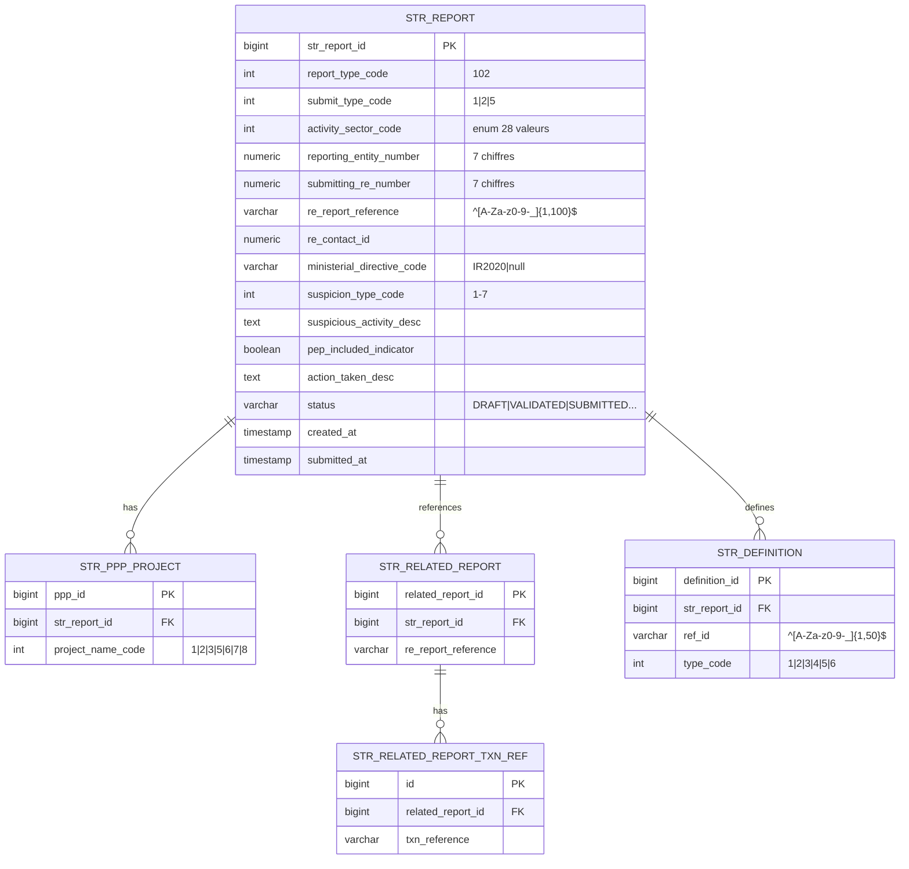
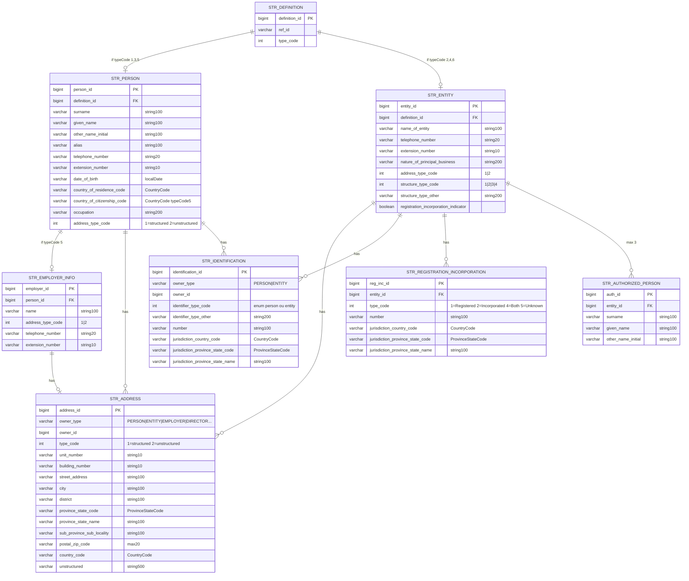
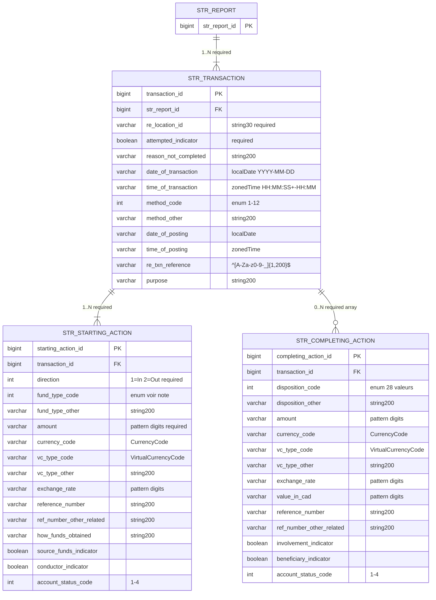
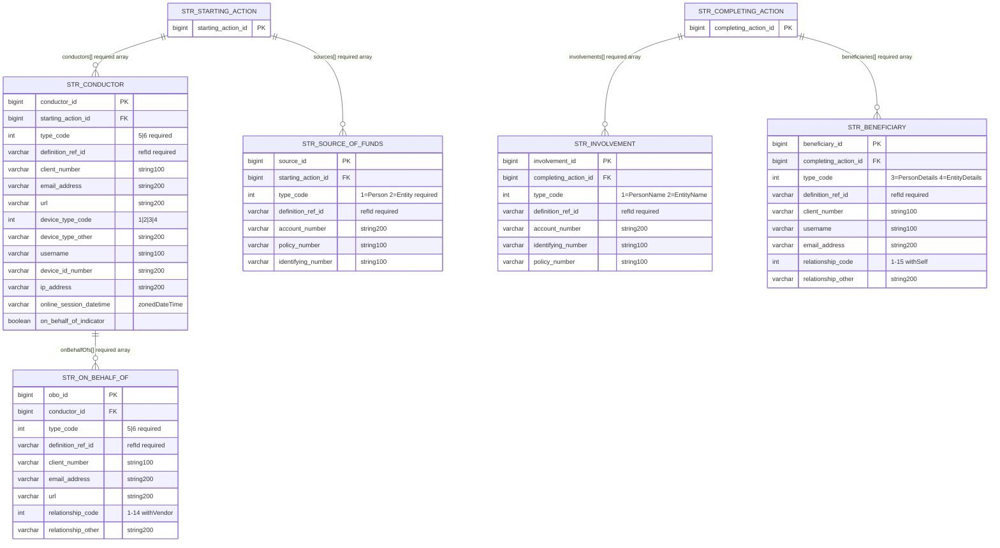
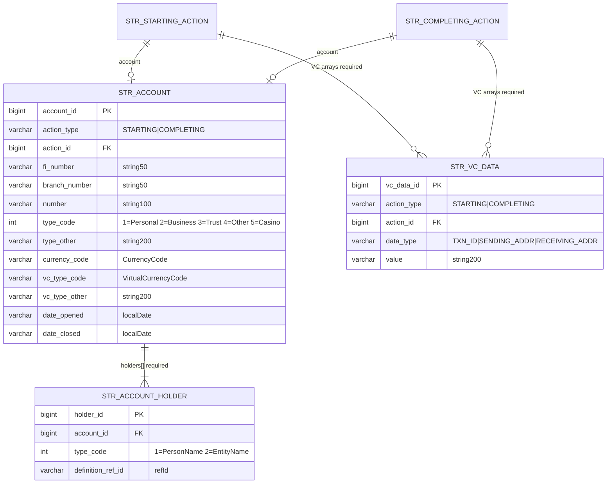
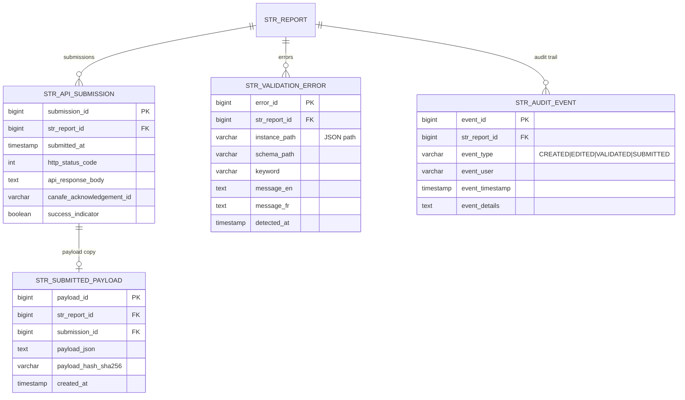
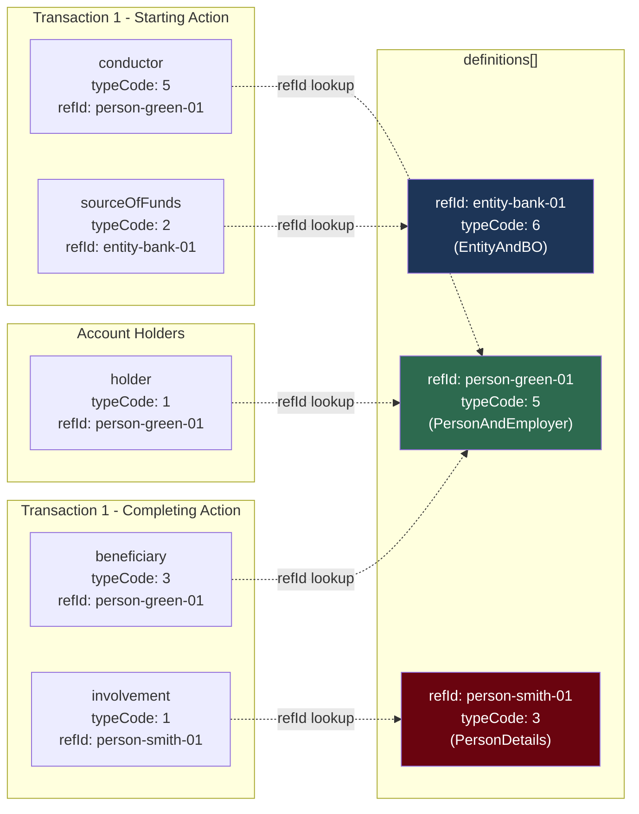

# Modèle de données cible V2 — STRReport CANAFE
## Corrigé selon le swaggerExternal.yaml officiel (261 Ko, 6883 lignes)

**Version :** 2.0 | **Date :** 2026-06-16

---

# DIAGRAMME GÉNÉRAL — Vue d'ensemble

```mermaid
graph TB
    subgraph "RAPPORT"
        STR_REPORT["STR_REPORT<br/>(Rapport STR principal)"]
    end

    subgraph "MÉTADONNÉES"
        STR_PPP["STR_PPP_PROJECT"]
        STR_RELATED["STR_RELATED_REPORT"]
        STR_REL_TXN["STR_RELATED_REPORT_TXN_REF"]
    end

    subgraph "DÉFINITIONS (Catalogue polymorphe)"
        STR_DEF["STR_DEFINITION<br/>(refId unique)"]
        STR_PERSON["STR_PERSON<br/>(typeCode 1,3,5)"]
        STR_ENTITY["STR_ENTITY<br/>(typeCode 2,4,6)"]
        STR_EMPLOYER["STR_EMPLOYER_INFO<br/>(typeCode 5)"]
        STR_REG_INC["STR_REGISTRATION_INCORPORATION"]
        STR_AUTH["STR_AUTHORIZED_PERSON"]
        STR_DIRECTOR["STR_DIRECTOR"]
        STR_SHARE["STR_SHARE_OWNER"]
        STR_TRUSTEE["STR_TRUSTEE"]
        STR_SETTLOR["STR_SETTLOR"]
        STR_UNIT_OWN["STR_TRUST_UNIT_OWNER"]
        STR_TRUST_BEN["STR_TRUST_BENEFICIARY"]
        STR_OTHER_OWN["STR_OTHER_ENTITY_OWNER"]
    end

    subgraph "IDENTITÉ & CONTACT"
        STR_ADDR["STR_ADDRESS"]
        STR_IDENT["STR_IDENTIFICATION"]
    end

    subgraph "TRANSACTIONS"
        STR_TXN["STR_TRANSACTION"]
        STR_SA["STR_STARTING_ACTION"]
        STR_CA["STR_COMPLETING_ACTION"]
    end

    subgraph "RÔLES TRANSACTIONNELS"
        STR_COND["STR_CONDUCTOR"]
        STR_OBO["STR_ON_BEHALF_OF"]
        STR_SRC["STR_SOURCE_OF_FUNDS"]
        STR_INV["STR_INVOLVEMENT"]
        STR_BEN["STR_BENEFICIARY"]
    end

    subgraph "COMPTES"
        STR_ACCT["STR_ACCOUNT"]
        STR_HOLD["STR_ACCOUNT_HOLDER"]
        STR_VC["STR_VC_DATA"]
    end

    subgraph "AUDIT"
        STR_SUB["STR_API_SUBMISSION"]
        STR_PAY["STR_SUBMITTED_PAYLOAD"]
        STR_ERR["STR_VALIDATION_ERROR"]
        STR_EVT["STR_AUDIT_EVENT"]
    end

    STR_REPORT --> STR_PPP
    STR_REPORT --> STR_RELATED
    STR_RELATED --> STR_REL_TXN
    STR_REPORT --> STR_DEF
    STR_REPORT --> STR_TXN

    STR_DEF --> STR_PERSON
    STR_DEF --> STR_ENTITY
    STR_PERSON --> STR_EMPLOYER
    STR_PERSON --> STR_ADDR
    STR_PERSON --> STR_IDENT
    STR_ENTITY --> STR_ADDR
    STR_ENTITY --> STR_IDENT
    STR_ENTITY --> STR_REG_INC
    STR_ENTITY --> STR_AUTH
    STR_ENTITY --> STR_DIRECTOR
    STR_ENTITY --> STR_SHARE
    STR_ENTITY --> STR_TRUSTEE
    STR_ENTITY --> STR_SETTLOR
    STR_ENTITY --> STR_UNIT_OWN
    STR_ENTITY --> STR_TRUST_BEN
    STR_ENTITY --> STR_OTHER_OWN

    STR_TXN --> STR_SA
    STR_TXN --> STR_CA
    STR_SA --> STR_COND
    STR_SA --> STR_SRC
    STR_SA --> STR_ACCT
    STR_SA --> STR_VC
    STR_COND --> STR_OBO
    STR_CA --> STR_INV
    STR_CA --> STR_BEN
    STR_CA --> STR_ACCT
    STR_CA --> STR_VC
    STR_ACCT --> STR_HOLD

    STR_REPORT --> STR_SUB
    STR_SUB --> STR_PAY
    STR_REPORT --> STR_ERR
    STR_REPORT --> STR_EVT
```

---

# DIAGRAMME ER DÉTAILLÉ — Partie 1 : Rapport + Définitions

---

# DIAGRAMME ER DÉTAILLÉ — Partie 2 : Personnes et Entités

---

# DIAGRAMME ER — Partie 3 : Beneficial Ownership (typeCode 6)

```mermaid
erDiagram
    STR_ENTITY {
        bigint entity_id PK
        varchar name_of_entity
        int structure_type_code "1=Corp 2=Other 3=Trust 4=PublicTrust"
    }

    STR_DIRECTOR {
        bigint director_id PK
        bigint entity_id FK
        varchar surname "string100"
        varchar given_name "string100"
        varchar other_name_initial "string100"
        int address_type_code "1|2"
        varchar telephone_number "string20"
        varchar extension_number "string10"
    }

    STR_SHARE_OWNER {
        bigint share_owner_id PK
        bigint entity_id FK
        varchar surname "string100"
        varchar given_name "string100"
        varchar other_name_initial "string100"
    }

    STR_TRUSTEE {
        bigint trustee_id PK
        bigint entity_id FK
        varchar surname "string100"
        varchar given_name "string100"
        varchar other_name_initial "string100"
        int address_type_code "1|2"
        varchar telephone_number "string20"
        varchar extension_number "string10"
    }

    STR_SETTLOR {
        bigint settlor_id PK
        bigint entity_id FK
        varchar surname "string100"
        varchar given_name "string100"
        varchar other_name_initial "string100"
        int address_type_code "1|2"
        varchar telephone_number "string20"
        varchar extension_number "string10"
    }

    STR_TRUST_UNIT_OWNER {
        bigint unit_owner_id PK
        bigint entity_id FK
        varchar surname "string100"
        varchar given_name "string100"
        varchar other_name_initial "string100"
        int address_type_code "1|2"
        varchar telephone_number "string20"
        varchar extension_number "string10"
    }

    STR_TRUST_BENEFICIARY {
        bigint trust_ben_id PK
        bigint entity_id FK
        varchar surname "string100"
        varchar given_name "string100"
        varchar other_name_initial "string100"
        int address_type_code "1|2"
        varchar telephone_number "string20"
        varchar extension_number "string10"
    }

    STR_OTHER_ENTITY_OWNER {
        bigint other_owner_id PK
        bigint entity_id FK
        varchar surname "string100"
        varchar given_name "string100"
        varchar other_name_initial "string100"
    }

    STR_ENTITY ||--o{ STR_DIRECTOR : "directorsOfCorporation"
    STR_ENTITY ||--o{ STR_SHARE_OWNER : "personsOwningSharesOfCorporation"
    STR_ENTITY ||--o{ STR_TRUSTEE : "trusteesOfTrust"
    STR_ENTITY ||--o{ STR_SETTLOR : "settlorsOfTrust"
    STR_ENTITY ||--o{ STR_TRUST_UNIT_OWNER : "personsOwningUnitsOfTrust"
    STR_ENTITY ||--o{ STR_TRUST_BENEFICIARY : "beneficiariesOfTrust"
    STR_ENTITY ||--o{ STR_OTHER_ENTITY_OWNER : "personsOwningEntityNotCorpOrTrust"

    STR_DIRECTOR ||--o| STR_ADDRESS : "has address"
    STR_TRUSTEE ||--o| STR_ADDRESS : "has address"
    STR_SETTLOR ||--o| STR_ADDRESS : "has address"
    STR_TRUST_UNIT_OWNER ||--o| STR_ADDRESS : "has address"
    STR_TRUST_BENEFICIARY ||--o| STR_ADDRESS : "has address"
```

**Note :** Les BO avec `personContact` (Director, Trustee, Settlor, TrustUnitOwner, TrustBeneficiary) ont adresse+téléphone. Les BO avec uniquement nom (ShareOwner, OtherEntityOwner) n'ont pas d'adresse.

# Modèle de données cible V2 — Partie 2 : Transactions + Audit

---

# DIAGRAMME ER — Partie 4 : Transactions

---

# DIAGRAMME ER — Partie 5 : Rôles transactionnels

---

# DIAGRAMME ER — Partie 6 : Comptes et Monnaie Virtuelle

---

# DIAGRAMME ER — Partie 7 : Audit et Traçabilité

---

# SCHÉMA EXPLICATIF — Pattern de référencement `definitions[] ↔ refId`

**Explication :** Une même personne (person-green-01) peut être référencée comme **conductor**, **beneficiary** ET **account holder** via le même `refId`. La définition est stockée **une seule fois** dans `definitions[]`.

---

# SCHÉMA EXPLICATIF — Flux d'une transaction STR

```mermaid
sequenceDiagram
    participant SA as Starting Action<br/>(Entrée des fonds)
    participant TXN as Transaction
    participant CA as Completing Action<br/>(Disposition des fonds)

    Note over SA: direction: 1 (In)<br/>fundType: 2 (Cash)<br/>amount: 9900.00 CAD

    SA->>TXN: Fonds reçus
    Note over TXN: date: 2026-06-15<br/>method: 1 (In person)<br/>location: LOC-001

    TXN->>CA: Fonds disposés
    Note over CA: disposition: 1 (Deposit)<br/>amount: 9900.00 CAD<br/>account: 9876543-21

    Note over SA: Qui?
    SA-->>SA: conductor → refId person-green-01<br/>onBehalfOf → [] (vide)

    Note over CA: Pour qui?
    CA-->>CA: beneficiary → refId person-green-01<br/>involvement → [] (vide)
```

---

# TABLEAU DES CARDINALITÉS COMPLÈTES

| Parent | Enfant | Cardinalité | Required YAML | Peut être vide? |
|--------|--------|------------|--------------|-----------------|
| STR_REPORT | STR_TRANSACTION | 1→N | ✅ `minItems: 1` | ❌ Min 1 |
| STR_REPORT | STR_DEFINITION | 1→N | ✅ required | ✅ Oui `[]` |
| STR_REPORT | STR_PPP_PROJECT | 1→N | ✅ required | ✅ Oui `[]` |
| STR_REPORT | STR_RELATED_REPORT | 1→N | ✅ required | ✅ Oui `[]` |
| STR_TRANSACTION | STR_STARTING_ACTION | 1→N | ✅ required | ❌ Min 1 |
| STR_TRANSACTION | STR_COMPLETING_ACTION | 1→N | ✅ required | ✅ Oui `[]` |
| STR_STARTING_ACTION | STR_CONDUCTOR | 1→N | ✅ required | ✅ Oui `[]` |
| STR_STARTING_ACTION | STR_SOURCE_OF_FUNDS | 1→N | ✅ required | ✅ Oui `[]` |
| STR_CONDUCTOR | STR_ON_BEHALF_OF | 1→N | ✅ required | ✅ Oui `[]` |
| STR_COMPLETING_ACTION | STR_INVOLVEMENT | 1→N | ✅ required | ✅ Oui `[]` |
| STR_COMPLETING_ACTION | STR_BENEFICIARY | 1→N | ✅ required | ✅ Oui `[]` |
| STR_ACCOUNT | STR_ACCOUNT_HOLDER | 1→N | ✅ required | ❌ Min 1 |
| STR_ENTITY | STR_AUTHORIZED_PERSON | 1→N | ✅ required | ✅ Oui `[]` |
| STR_ENTITY | STR_REGISTRATION_INCORPORATION | 1→N | ✅ required | ✅ Oui `[]` |
| STR_ENTITY (tc6) | STR_DIRECTOR | 1→N | ✅ required | ✅ Oui `[]` |
| STR_ENTITY (tc6) | STR_SHARE_OWNER | 1→N | ✅ required | ✅ Oui `[]` |
| STR_ENTITY (tc6) | STR_TRUSTEE | 1→N | ✅ required | ✅ Oui `[]` |
| STR_ENTITY (tc6) | STR_SETTLOR | 1→N | ✅ required | ✅ Oui `[]` |
| STR_ENTITY (tc6) | STR_TRUST_UNIT_OWNER | 1→N | ✅ required | ✅ Oui `[]` |
| STR_ENTITY (tc6) | STR_TRUST_BENEFICIARY | 1→N | ✅ required | ✅ Oui `[]` |
| STR_ENTITY (tc6) | STR_OTHER_ENTITY_OWNER | 1→N | ✅ required | ✅ Oui `[]` |

**Note critique :** La colonne "Required YAML" signifie que le champ doit être **présent** dans le JSON. "Peut être vide" signifie qu'un array vide `[]` est accepté. Ceci est dû au `additionalProperties: false` — tout champ absent provoquera un rejet.

---

# TABLEAU DES TYPES typeCode PAR CONTEXTE

| Contexte d'utilisation | typeCodes acceptés | Schéma YAML |
|----------------------|-------------------|-------------|
| `definitions[]` | 1, 2, 3, 4, 5, 6 | oneOf PersonName\|EntityName\|PersonDetails\|EntityDetails\|personAndEmployerDetails\|entityAndBeneficialOwnershipDetails |
| `conductors[].typeCode` | **5, 6** | `definitionType56` |
| `onBehalfOfs[].typeCode` | **5, 6** | `definitionType56` |
| `sourcesOfFundsOrVirtualCurrency[].typeCode` | **1, 2** | `definitionType12` |
| `involvements[].typeCode` | **1, 2** | `definitionType12` |
| `beneficiaries[].typeCode` | **3, 4** | `definitionType34` |
| `account.holders[].typeCode` | **1, 2** | `definitionType12` |

**Règle :** Le `typeCode` dans le rôle transactionnel doit correspondre à un `typeCode` compatible dans `definitions[]`. Ex: un conductor avec `typeCode: 5` doit référencer un `refId` dont la définition est de `typeCode: 5` (personAndEmployerDetails).

---

# COMPTEUR FINAL DES TABLES

| Catégorie | Tables | Nombre |
|-----------|--------|--------|
| **Rapport** | STR_REPORT, STR_PPP_PROJECT, STR_RELATED_REPORT, STR_RELATED_REPORT_TXN_REF | 4 |
| **Définitions** | STR_DEFINITION, STR_PERSON, STR_ENTITY, STR_EMPLOYER_INFO | 4 |
| **Identité** | STR_ADDRESS, STR_IDENTIFICATION | 2 |
| **Entité détails** | STR_REGISTRATION_INCORPORATION, STR_AUTHORIZED_PERSON | 2 |
| **Beneficial Ownership** | STR_DIRECTOR, STR_SHARE_OWNER, STR_TRUSTEE, STR_SETTLOR, STR_TRUST_UNIT_OWNER, STR_TRUST_BENEFICIARY, STR_OTHER_ENTITY_OWNER | 7 |
| **Transactions** | STR_TRANSACTION, STR_STARTING_ACTION, STR_COMPLETING_ACTION | 3 |
| **Rôles** | STR_CONDUCTOR, STR_ON_BEHALF_OF, STR_SOURCE_OF_FUNDS, STR_INVOLVEMENT, STR_BENEFICIARY | 5 |
| **Comptes** | STR_ACCOUNT, STR_ACCOUNT_HOLDER, STR_VC_DATA | 3 |
| **Audit** | STR_API_SUBMISSION, STR_SUBMITTED_PAYLOAD, STR_VALIDATION_ERROR, STR_AUDIT_EVENT | 4 |
| **TOTAL** | | **34 tables** |

