# Modèle de données cible — STRReport CANAFE (Suspicious Transaction Report)

## Document d'architecture pour la soumission de déclarations d'opérations douteuses via l'API d'ingestion CANAFE

**Version :** 1.0  
**Date :** 2026-06-16  
**Sources analysées :**
- Swagger officiel : `https://www148.fintrac-canafe.canada.ca/swagger`
- YAML externe : `https://www148.fintrac-canafe.canada.ca/reporting-ingest/api-doc-files/swaggerExternal.yaml`
- Guidance STR officielle : `https://fintrac-canafe.canada.ca/guidance-directives/transaction-operation/str-dod/str-dod-eng`
- Annex A — Field instructions to complete a Suspicious Transaction Report

---

# SECTION 1 — Résumé exécutif

## 1.1 Qu'est-ce qu'un STRReport ?

Un **STRReport** (Suspicious Transaction Report / Déclaration d'opérations douteuses — DOD) est un rapport réglementaire qu'une entité déclarante canadienne doit soumettre au Centre d'analyse des opérations et déclarations financières du Canada (**CANAFE / FINTRAC**) lorsqu'elle a des **motifs raisonnables de soupçonner** qu'une transaction financière est liée au blanchiment d'argent, au financement d'activités terroristes, ou à l'évasion de sanctions.

Le code de type de rapport dans l'API est **`reportTypeCode = 102`**.

## 1.2 Pourquoi une banque doit-elle soumettre des STR ?

- **Obligation légale** : Loi sur le recyclage des produits de la criminalité et le financement des activités terroristes (LRPCFAT), article 7
- **Pénalités** : Non-conformité = sanctions administratives ou pénales
- **Aucun seuil monétaire** : Contrairement aux LCTR ($10 000+), un STR peut concerner tout montant
- **Délai** : Dès que praticable après avoir complété les mesures d'évaluation
- Depuis **août 2024**, l'obligation couvre aussi l'évasion de sanctions

## 1.3 Ce que l'API CANAFE attend

L'API d'ingestion CANAFE (`POST /api/v1/reports`) attend un **payload JSON** structuré conforme au schéma **STRReport** exposé dans le Swagger. Ce payload contient :

| Élément | Description |
|---------|-------------|
| `reportDetails` | Métadonnées du rapport (entité déclarante, références, secteur d'activité) |
| `detailsOfSuspicion` | Narratif de suspicion, type de suspicion, indicateurs PEP |
| `relatedReports[]` | Références à des rapports précédemment soumis |
| `actionTaken` | Description des mesures prises |
| `definitions[]` | Catalogue polymorphe des personnes et entités (noms, détails, employeurs, beneficial ownership) |
| `transactions[]` | Transactions suspectes avec startingActions[] et completingActions[] |

## 1.4 Différence entre un dossier AML interne et un STRReport CANAFE

| Aspect | Dossier AML interne (Case) | STRReport CANAFE |
|--------|---------------------------|------------------|
| **Portée** | Tout le cycle d'investigation | Uniquement le payload de déclaration |
| **Contenu** | Notes internes, scores, alertes, workflow | Données structurées + narratif |
| **Format** | Propriétaire (base relationnelle interne) | JSON normé selon schéma OpenAPI CANAFE |
| **Destinataire** | Équipe conformité interne | CANAFE via API ou FWR |
| **Conservation** | Politiques internes | Copie 5 ans minimum (obligation légale) |
| **Confidentialité** | Ne pas révéler au client (tipping off interdit) | Idem |

## 1.5 Périmètre du modèle cible proposé

Ce document couvre **exclusivement** le modèle de données nécessaire pour :
1. **Stocker** les données cibles alimentant le JSON STRReport
2. **Valider** la conformité des données avant soumission
3. **Générer** le payload JSON conforme au schéma CANAFE
4. **Soumettre** via l'API (`POST /api/v1/reports`)
5. **Auditer** les soumissions (journalisation, réponses API, corrections)

> **Hors périmètre** : Modèle source bancaire, case management AML, scoring de risque, workflow d'investigation.

---

# SECTION 2 — Compréhension fonctionnelle du STRReport

## 2.1 General Information / Métadonnées du rapport (`reportDetails`)

**Rôle :** Identifie l'entité déclarante, le type de rapport, le secteur d'activité et les références uniques.

**Pourquoi CANAFE en a besoin :** Permet de router, valider et tracer le rapport. Le `reportingEntityReportReference` est l'identifiant unique du côté de l'entité déclarante.

**Champs clés observés dans le Swagger :**

| Champ | Type | Requis | Description |
|-------|------|--------|-------------|
| `reportTypeCode` | integer | ✅ Oui | Toujours `102` pour STR |
| `submitTypeCode` | integer | ✅ Oui | `1`=Submit, `2`=Update, `5`=Delete |
| `activitySectorCode` | integer | Oui | Secteur : `2`=Banque, `14`=Credit Union, etc. |
| `reportingEntityNumber` | string | ✅ Oui | Numéro CANAFE à 7 chiffres |
| `submittingReportingEntityNumber` | string | ✅ Oui | Si soumis par un tiers |
| `reportingEntityReportReference` | string | ✅ Oui | Référence unique (pattern: `^[A-Za-z0-9-_]{1,100}$`) |
| `reportingEntityContactId` | string | ✅ Oui | Contact pour suivi CANAFE |
| `ministerialDirectiveCode` | string | Non | Ex: `IR2020` |

**Pièges de modélisation :**
- Le `reportingEntityReportReference` doit être **globalement unique** dans votre organisation — jamais réutilisé
- Si `ministerialDirectiveCode` est renseigné, le rapport ne peut contenir qu'**une seule transaction** complétée et les sections `detailsOfSuspicion` et `actionTaken` ne doivent **pas** être remplies
- Le `submitTypeCode` contrôle si c'est une soumission initiale, une correction ou une suppression

## 2.2 Détails de suspicion (`detailsOfSuspicion`)

**Rôle :** Section narrative et structurée décrivant les motifs de suspicion.

**Pourquoi CANAFE en a besoin :** C'est la section la plus critique — elle est partagée avec les forces de l'ordre dans les divulgations CANAFE.

| Champ | Type | Requis | Description |
|-------|------|--------|-------------|
| `descriptionOfSuspiciousActivity` | string | Oui* | Narratif libre décrivant faits, contexte, indicateurs |
| `suspicionTypeCode` | integer | Oui | Enum: `1`-`7` (voir ci-dessous) |
| `publicPrivatePartnershipProjectNameCodes` | integer[] | Non | Codes projet PPP |
| `politicallyExposedPersonIncludedIndicator` | boolean | Non | Le rapport inclut-il un PEP ? |

**Valeurs `suspicionTypeCode` :**

| Code | Signification |
|------|--------------|
| 1 | Blanchiment d'argent |
| 2 | Financement du terrorisme |
| 3 | Blanchiment d'argent ET financement du terrorisme |
| 4 | Évasion de sanctions |
| 5 | Blanchiment d'argent ET évasion de sanctions |
| 6 | Financement du terrorisme ET évasion de sanctions |
| 7 | Blanchiment, financement du terrorisme ET évasion de sanctions |

**Valeurs `publicPrivatePartnershipProjectNameCodes` :**

| Code | Projet |
|------|--------|
| 1 | ANTON |
| 2 | ATHENA |
| 3 | CHAMELEON |
| 5 | GUARDIAN |
| 6 | LEGION |
| 7 | PROTECT |
| 8 | SHADOW |

**Pièges :**
- Le narratif ne doit **pas** contenir d'acronymes internes, de références à des dossiers internes, ni de mise en forme (gras, italique)
- Doit être **cohérent** avec les champs structurés du rapport
- Ne doit **pas** être complété si le rapport est soumis sous directive ministérielle

## 2.3 Rapports liés (`relatedReports[]`)

**Rôle :** Références à des STR précédemment soumis relatifs à la même activité suspecte.

| Champ | Type | Requis |
|-------|------|--------|
| `reportingEntityReportReference` | string | ✅ Oui |
| `reportingEntityTransactionReferences` | string[] | Non |

**Pourquoi :** Permet à CANAFE de lier les analyses et construire des dossiers plus complets.

## 2.4 Mesures prises (`actionTaken`)

**Rôle :** Description des actions entreprises ou prévues suite à la transaction suspecte.

| Champ | Type | Description |
|-------|------|-------------|
| `description` | string | Texte libre (ex: monitoring renforcé, fermeture de compte, signalement aux forces de l'ordre) |

## 2.5 Définitions des parties (`definitions[]`)

**Rôle :** Catalogue centralisé et polymorphe de toutes les personnes et entités référencées dans le rapport.

C'est un **design pattern de référencement** : chaque personne/entité est définie une seule fois dans `definitions[]` avec un `refId` unique, puis référencée par ce `refId` dans les transactions (conductors, beneficiaries, onBehalfOfs, etc.).

**Types polymorphes (via `typeCode`) :**

| typeCode | Type | Description |
|----------|------|-------------|
| 1 | PersonName | Nom d'une personne (surname, givenName, otherInitial) |
| 2 | EntityName | Nom d'une entité |
| 3 | PersonDetails | Détails complets d'une personne (adresse, téléphone, email, DOB, occupation, identifications) |
| 4 | EntityDetails | Détails complets d'une entité (adresse, structure, incorporation, directors, beneficial owners) |
| 5 | PersonAndEmployerDetails | Personne avec info employeur |
| 6 | EntityAndBeneficialOwnershipDetails | Entité avec structure de propriété effective |

**Pièges critiques :**
- Le `refId` doit être unique au sein du rapport
- Une même personne physique avec différents rôles (conducteur + bénéficiaire) peut utiliser le **même refId**
- Les `typeCode` acceptés varient selon le contexte d'utilisation (conductors n'acceptent que 5/6, beneficiaries n'acceptent que 3/4, etc.)

## 2.6 Transactions (`transactions[]`)

**Rôle :** Cœur du rapport — contient les détails de chaque transaction suspecte.

Un STR peut contenir **plusieurs transactions**. Chaque transaction contient :

### 2.6.1 Métadonnées de transaction (`suspiciousTransactionDetails`)

| Champ | Type | Requis |
|-------|------|--------|
| `attemptedTransactionIndicator` | boolean | ✅ Oui |
| `reasonNotCompleted` | string(200) | Si tentée |
| `dateOfTransaction` | date | †Conditionnel |
| `timeOfTransaction` | zonedTime | Non |
| `methodCode` | integer | Oui* |
| `methodOther` | string(200) | Si method=7 |
| `dateOfPosting` | date | Conditionnel |
| `reportingEntityTransactionReference` | string | ‡Processing |
| `purposeOfTransaction` | string | Non |

**Valeurs `methodCode` :**

| Code | Méthode |
|------|---------|
| 1 | En personne |
| 2 | ABM/GAB |
| 3 | Dépôt blindé |
| 4 | Correspondant bancaire |
| 5 | Courrier |
| 6 | Dépôt de nuit |
| 7 | Autre |
| 8 | Quick drop |
| 9 | Téléphone |
| 10 | Télécopieur |
| 11 | GAB monnaie virtuelle |
| 12 | En ligne |

### 2.6.2 Actions de départ (`startingActions[]`)

Chaque transaction a au moins 1 starting action. Contient :

- **`details`** : direction (in/out), type de fonds, montant, devise, comptes, adresses VC
- **`sourcesOfFundsOrVirtualCurrency[]`** : source des fonds (personne/entité)
- **`conductors[]`** : qui effectue la transaction, avec info device, et `onBehalfOfs[]` (tiers mandants)

**Valeurs `fundAssetVirtualCurrencyTypeCode` (direction IN) :**

| Code | Type |
|------|------|
| 1 | Traite bancaire |
| 2 | Espèces |
| 3 | Produit de casino |
| 4 | Chèque |
| 5 | Transfert de fonds domestique |
| 6 | Virement email (EMT) |
| 7 | Transfert de fonds international |
| 8 | Produit d'investissement |
| 9 | Bijoux |
| 10 | Transfert mobile |
| 11 | Mandat |
| 12 | Métaux précieux |
| 13 | Pierres précieuses |
| 14 | Transfert de fonds domestique (entrant) |
| 15 | Transfert de fonds international (entrant) |
| 16 | Monnaie virtuelle |
| 17 | Autre |

### 2.6.3 Actions de complétion (`completingActions[]`)

Décrivent la disposition des fonds. Contiennent :

- **`details`** : dispositionCode, montant, devise, comptes, adresses VC
- **`involvements[]`** : autres personnes/entités impliquées
- **`beneficiaries[]`** : bénéficiaires

**Valeurs `dispositionCode` (sélection) :**

| Code | Disposition |
|------|------------|
| 1 | Dépôt au compte |
| 2 | Échange en monnaie virtuelle |
| 3 | Échange en devise fiduciaire |
| 4 | Transfert international sortant |
| 5 | Transfert domestique sortant |
| 6 | Achat de traite bancaire |
| 7 | Achat de mandat |
| 8 | Achat de bijoux |
| 9 | Achat de métaux précieux |
| 10 | Décaissement (cash out) |
| 11 | Ajout au portefeuille VC |
| 12 | Change de dénomination |
| 13 | Rétention de fonds |
| 14 | Achat d'investissement |
| 15 | Achat d'assurance vie |
| 16 | Émission de chèque |
| 17 | EMT sortant |
| 18 | Transfert mobile sortant |
| 19 | Transfert VC sortant |
| 20 | Paiement au compte |
| 21 | Achat de pierres précieuses |
| 22 | Achat prépayé |
| 23 | Achat immobilier |
| 24 | Achat de biens |
| 25 | Achat de services |
| 26-31 | (Autres dispositions) |
| 32 | Retrait d'espèces (compte) |

## 2.7 Localisation de la transaction

Chaque transaction est liée à un emplacement via `reportingEntityLocationId` — un identifiant de localisation créé lors de l'enrôlement dans CANAFE FWR.

## 2.8 Comptes (`strAccount` dans starting/completing actions)

Les comptes sont intégrés dans les starting et completing actions avec :
- `financialInstitutionNumber`, `branchNumber`, `accountNumber`
- `accountType`, `accountCurrency`, `accountVirtualCurrencyType`
- `dateAccountOpened`, `dateAccountClosed`
- `accountStatusAtTimeOfTransaction`
- Account holders (personne ou entité)

## 2.9 Instruments de monnaie virtuelle

Les transactions impliquant la monnaie virtuelle incluent :
- `virtualCurrencyTransactionIds[]`
- `sendingVirtualCurrencyAddresses[]`
- `receivingVirtualCurrencyAddresses[]`
- `virtualCurrencyTypeCode`

---

# SECTION 3 — Structure logique du payload STRReport

Structure JSON reconstituée fidèlement à partir du schéma Swagger observé :

```
STRReport
├── reportDetails (required)
│   ├── reportTypeCode* (102)
│   ├── submitTypeCode* (1|2|5)
│   ├── activitySectorCode
│   ├── reportingEntityNumber*
│   ├── submittingReportingEntityNumber*
│   ├── reportingEntityReportReference*
│   ├── reportingEntityContactId*
│   └── ministerialDirectiveCode
│
├── detailsOfSuspicion
│   ├── descriptionOfSuspiciousActivity
│   ├── suspicionTypeCode (1-7)
│   ├── publicPrivatePartnershipProjectNameCodes[]
│   └── politicallyExposedPersonIncludedIndicator
│
├── relatedReports[]
│   ├── reportingEntityReportReference*
│   └── reportingEntityTransactionReferences[]
│
├── actionTaken
│   └── description
│
├── definitions[] (polymorphic: OneOf)
│   ├── typeCode* (1=PersonName|2=EntityName|3=PersonDetails|4=EntityDetails|5=PersonAndEmployer|6=EntityAndBO)
│   ├── refId* (unique string)
│   └── details (varies by typeCode)
│       ├── [PersonName]: surname, givenName, otherInitial
│       ├── [EntityName]: entityName
│       ├── [PersonDetails]: name, alias, address, phone, email, DOB,
│       │   countryOfResidence, countryOfCitizenship, occupation,
│       │   employer, identifications[]
│       ├── [EntityDetails]: entityName, address, phone, email, URL,
│       │   entityStructureType, principalBusiness, incorporation[],
│       │   registration[], identifications[], personsAuthorized[]
│       ├── [PersonAndEmployer]: personDetails + employerDetails
│       │   (address, phone)
│       └── [EntityAndBO]: entityDetails + beneficialOwnership
│           (directors[], owners25pct[], trustees[], settlors[],
│            trustBeneficiaries[])
│
└── transactions[] (required, array)
    ├── reportingEntityLocationId* (string30)
    ├── suspiciousTransactionDetails* (required)
    │   ├── attemptedTransactionIndicator* (boolean)
    │   ├── reasonNotCompleted (string200)
    │   ├── dateOfTransaction (date)
    │   ├── timeOfTransaction (zonedTime)
    │   ├── methodCode (enum 1-12)
    │   ├── methodOther (string200)
    │   ├── dateOfPosting (date)
    │   ├── timeOfPosting (zonedTime)
    │   ├── reportingEntityTransactionReference‡
    │   └── purposeOfTransaction
    │
    ├── startingActions[] (required, array)
    │   ├── details* (required)
    │   │   ├── direction (1=In|2=Out)
    │   │   ├── fundAssetVirtualCurrencyTypeCode (enum 1-17)
    │   │   ├── fundAssetVirtualCurrencyTypeOther
    │   │   ├── amount* (number)
    │   │   ├── currencyCode
    │   │   ├── currencyOther
    │   │   ├── virtualCurrencyTypeCode
    │   │   ├── virtualCurrencyTypeOther
    │   │   ├── exchangeRate
    │   │   ├── virtualCurrencyTransactionIds[]
    │   │   ├── sendingVirtualCurrencyAddresses[]
    │   │   ├── receivingVirtualCurrencyAddresses[]
    │   │   ├── referenceNumber
    │   │   ├── otherReferenceNumber
    │   │   ├── account (strAccount)
    │   │   │   ├── financialInstitutionNumber
    │   │   │   ├── branchNumber
    │   │   │   ├── accountNumber
    │   │   │   ├── accountType / accountTypeOther
    │   │   │   ├── accountCurrency / accountCurrencyOther
    │   │   │   ├── accountVirtualCurrencyType / Other
    │   │   │   ├── dateAccountOpened / dateAccountClosed
    │   │   │   └── accountHolders[] (typeCode 1|2, refId)
    │   │   ├── accountStatusAtTimeOfTransaction
    │   │   ├── howFundsOrVirtualCurrencyObtained
    │   │   ├── sourcesOfFundsOrVirtualCurrencyIndicator‡
    │   │   └── conductorIndicator‡
    │   │
    │   ├── sourcesOfFundsOrVirtualCurrency[]
    │   │   ├── typeCode* (1=Person|2=Entity)
    │   │   ├── refId*
    │   │   └── details (accountNumber, policyNumber, identifyingNumber)
    │   │
    │   └── conductors[]
    │       ├── typeCode* (5=PersonAndEmployer|6=EntityAndBO)
    │       ├── refId*
    │       ├── details
    │       │   ├── clientNumber
    │       │   ├── typeOfDeviceCode (1=Computer|2=Mobile|3=Tablet|4=Other)
    │       │   ├── typeOfDeviceOther
    │       │   ├── username
    │       │   ├── deviceIdentifierNumber
    │       │   ├── internetProtocolAddress
    │       │   ├── dateTimeOfOnlineSession
    │       │   └── onBehalfOfIndicator‡
    │       └── onBehalfOfs[]
    │           ├── typeCode* (5|6)
    │           ├── refId*
    │           └── details
    │               ├── clientNumber
    │               ├── relationshipOfConductorCode (enum 1-14)
    │               ├── relationshipOfConductorOther
    │               └── [device info fields]
    │
    └── completingActions[] (required, array)
        ├── details* (required)
        │   ├── dispositionCode (enum 1-32)
        │   ├── dispositionOther
        │   ├── amount
        │   ├── currencyCode / virtualCurrencyTypeCode
        │   ├── exchangeRate
        │   ├── valueInCanadianDollars
        │   ├── virtualCurrencyTransactionIds[]
        │   ├── sendingVirtualCurrencyAddresses[]
        │   ├── receivingVirtualCurrencyAddresses[]
        │   ├── referenceNumber / otherReferenceNumber
        │   ├── account (strAccount)
        │   ├── accountStatusAtTimeOfTransaction
        │   ├── involvementIndicator‡
        │   └── beneficiaryIndicator‡
        │
        ├── involvements[]
        │   ├── typeCode* (1=PersonName|2=EntityName)
        │   ├── refId*
        │   └── details (accountNumber, policyNumber, identifyingNumber)
        │
        └── beneficiaries[]
            ├── typeCode* (3=PersonDetails|4=EntityDetails)
            ├── refId*
            └── details (clientNumber, username, emailAddress)
```

**Légende :**
- `*` = Requis (required dans le schéma OpenAPI)
- `‡` = Mandatory for processing
- `†` = Mandatory if applicable
- Pas de symbole = Reasonable measures / optionnel

# SECTION 4 — Modèle de données cible recommandé

> **Source :** Schéma STRReport du Swagger CANAFE + Guidance officielle Annex A

## 4.1 Table `STR_REPORT`

**Objectif :** Enregistrement principal d'un STRReport. Un enregistrement = un rapport soumis ou à soumettre.

| Colonne | Type SQL | Nullable | Validation | JSON CANAFE |
|---------|----------|----------|------------|-------------|
| `str_report_id` (PK) | BIGINT AUTO | Non | — | — (interne) |
| `report_type_code` | SMALLINT | Non | Toujours 102 | `reportDetails.reportTypeCode` |
| `submit_type_code` | SMALLINT | Non | 1,2,5 | `reportDetails.submitTypeCode` |
| `activity_sector_code` | SMALLINT | Non | Enum (2,3,6,10,14,16,19,20...) | `reportDetails.activitySectorCode` |
| `reporting_entity_number` | VARCHAR(7) | Non | 7 chiffres | `reportDetails.reportingEntityNumber` |
| `submitting_re_number` | VARCHAR(7) | Non | 7 chiffres | `reportDetails.submittingReportingEntityNumber` |
| `re_report_reference` | VARCHAR(100) | Non | Unique, `^[A-Za-z0-9-_]{1,100}$` | `reportDetails.reportingEntityReportReference` |
| `re_contact_id` | VARCHAR(100) | Non | — | `reportDetails.reportingEntityContactId` |
| `ministerial_directive_code` | VARCHAR(10) | Oui | Ex: IR2020 | `reportDetails.ministerialDirectiveCode` |
| `suspicion_type_code` | SMALLINT | Oui | 1-7 | `detailsOfSuspicion.suspicionTypeCode` |
| `suspicious_activity_desc` | TEXT | Oui | — | `detailsOfSuspicion.descriptionOfSuspiciousActivity` |
| `pep_included_indicator` | BOOLEAN | Oui | — | `detailsOfSuspicion.politicallyExposedPersonIncludedIndicator` |
| `action_taken_desc` | TEXT | Oui | — | `actionTaken.description` |
| `status` | VARCHAR(20) | Non | DRAFT/VALIDATED/SUBMITTED/ACCEPTED/REJECTED | — (interne) |
| `created_at` | TIMESTAMP | Non | — | — (interne) |
| `updated_at` | TIMESTAMP | Non | — | — (interne) |
| `submitted_at` | TIMESTAMP | Oui | — | — (interne) |

**Cardinalité :** 1 STR_REPORT → N STR_TRANSACTION, N STR_DEFINITION, N STR_RELATED_REPORT

---

## 4.2 Table `STR_PPP_PROJECT`

**Objectif :** Codes de projet partenariat public-privé associés au rapport.

| Colonne | Type SQL | Nullable | JSON CANAFE |
|---------|----------|----------|-------------|
| `ppp_id` (PK) | BIGINT AUTO | Non | — |
| `str_report_id` (FK) | BIGINT | Non | — |
| `project_name_code` | SMALLINT | Non | `detailsOfSuspicion.publicPrivatePartnershipProjectNameCodes[]` |

**Cardinalité :** STR_REPORT 1→N STR_PPP_PROJECT

---

## 4.3 Table `STR_RELATED_REPORT`

**Objectif :** Références aux rapports précédemment soumis liés à l'activité suspecte.

| Colonne | Type SQL | Nullable | JSON CANAFE |
|---------|----------|----------|-------------|
| `related_report_id` (PK) | BIGINT AUTO | Non | — |
| `str_report_id` (FK) | BIGINT | Non | — |
| `re_report_reference` | VARCHAR(100) | Non | `relatedReports[].reportingEntityReportReference` |

**Cardinalité :** STR_REPORT 1→N STR_RELATED_REPORT

---

## 4.4 Table `STR_RELATED_REPORT_TXN_REF`

**Objectif :** Références de transaction des rapports liés.

| Colonne | Type SQL | Nullable | JSON CANAFE |
|---------|----------|----------|-------------|
| `id` (PK) | BIGINT AUTO | Non | — |
| `related_report_id` (FK) | BIGINT | Non | — |
| `txn_reference` | VARCHAR(100) | Non | `relatedReports[].reportingEntityTransactionReferences[]` |

---

## 4.5 Table `STR_DEFINITION`

**Objectif :** Catalogue polymorphe des personnes et entités. Un `refId` unique par définition dans le rapport.

| Colonne | Type SQL | Nullable | JSON CANAFE |
|---------|----------|----------|-------------|
| `definition_id` (PK) | BIGINT AUTO | Non | — |
| `str_report_id` (FK) | BIGINT | Non | — |
| `ref_id` | VARCHAR(50) | Non | `definitions[].refId` |
| `type_code` | SMALLINT | Non | `definitions[].typeCode` (1-6) |

**Cardinalité :** STR_REPORT 1→N STR_DEFINITION. Le `ref_id` est unique au sein d'un rapport.

---

## 4.6 Table `STR_PERSON`

**Objectif :** Détails d'une personne (typeCode 1, 3 ou 5). Liée à STR_DEFINITION.

| Colonne | Type SQL | Nullable | JSON CANAFE |
|---------|----------|----------|-------------|
| `person_id` (PK) | BIGINT AUTO | Non | — |
| `definition_id` (FK) | BIGINT | Non | — |
| `surname` | VARCHAR(100) | Oui | `surname` |
| `given_name` | VARCHAR(100) | Oui | `givenName` |
| `other_initial` | VARCHAR(100) | Oui | `otherInitial` |
| `alias` | VARCHAR(100) | Oui | `alias` |
| `client_number` | VARCHAR(50) | Oui | `clientNumber` |
| `date_of_birth` | DATE | Oui | `dateOfBirth` |
| `country_of_residence` | VARCHAR(3) | Oui | `countryOfResidence` |
| `country_of_citizenship` | VARCHAR(3) | Oui | `countryOfCitizenship` |
| `occupation` | VARCHAR(200) | Oui | `occupation` |
| `employer_name` | VARCHAR(200) | Oui | `nameOfEmployer` |
| `email_address` | VARCHAR(200) | Oui | `emailAddress` |
| `url` | VARCHAR(500) | Oui | `url` |
| `username` | VARCHAR(200) | Oui | `username` |

---

## 4.7 Table `STR_ENTITY`

**Objectif :** Détails d'une entité (typeCode 2, 4 ou 6).

| Colonne | Type SQL | Nullable | JSON CANAFE |
|---------|----------|----------|-------------|
| `entity_id` (PK) | BIGINT AUTO | Non | — |
| `definition_id` (FK) | BIGINT | Non | — |
| `entity_name` | VARCHAR(200) | Non | `entityName` |
| `client_number` | VARCHAR(50) | Oui | `clientNumber` |
| `entity_structure_type` | VARCHAR(50) | Oui | `entityStructureType` (Corporation/Trust/...) |
| `principal_business` | VARCHAR(200) | Oui | `natureOfEntityPrincipalBusiness` |
| `is_incorporated_registered` | VARCHAR(30) | Oui | `incorporatedOrRegistered` |
| `email_address` | VARCHAR(200) | Oui | `emailAddress` |
| `url` | VARCHAR(500) | Oui | `url` |

---

## 4.8 Table `STR_ADDRESS`

**Objectif :** Adresses structurées ou non structurées pour personnes, entités, employeurs.

| Colonne | Type SQL | Nullable | JSON CANAFE |
|---------|----------|----------|-------------|
| `address_id` (PK) | BIGINT AUTO | Non | — |
| `owner_type` | VARCHAR(20) | Non | 'PERSON','ENTITY','EMPLOYER','DIRECTOR','TRUSTEE','SETTLOR','BO_OWNER' |
| `owner_id` | BIGINT | Non | FK polymorphe vers person/entity/etc. |
| `unit_number` | VARCHAR(50) | Oui | `unitNumber` |
| `building_number` | VARCHAR(50) | Oui | `buildingNumber` |
| `street_address` | VARCHAR(200) | Oui | `streetAddress` |
| `city` | VARCHAR(100) | Oui | `city` |
| `district` | VARCHAR(100) | Oui | `district` |
| `country_code` | VARCHAR(3) | Oui | `country` |
| `province_state_code` | VARCHAR(10) | Oui | `provinceStateCode` |
| `province_state_name` | VARCHAR(100) | Oui | `provinceStateName` |
| `sub_province_locality` | VARCHAR(100) | Oui | `subProvinceLocality` |
| `postal_zip_code` | VARCHAR(20) | Oui | `postalZipCode` |
| `unstructured_address` | VARCHAR(500) | Oui | `unstructuredAddressDetails` |

---

## 4.9 Table `STR_PHONE`

| Colonne | Type SQL | Nullable | JSON CANAFE |
|---------|----------|----------|-------------|
| `phone_id` (PK) | BIGINT AUTO | Non | — |
| `owner_type` | VARCHAR(20) | Non | — |
| `owner_id` | BIGINT | Non | — |
| `phone_number` | VARCHAR(30) | Non | `telephoneNumber` |
| `extension` | VARCHAR(10) | Oui | `extension` |

---

## 4.10 Table `STR_IDENTIFICATION`

**Objectif :** Pièces d'identité pour personnes ou entités.

| Colonne | Type SQL | Nullable | JSON CANAFE |
|---------|----------|----------|-------------|
| `identification_id` (PK) | BIGINT AUTO | Non | — |
| `owner_type` | VARCHAR(20) | Non | 'PERSON' ou 'ENTITY' |
| `owner_id` | BIGINT | Non | — |
| `identifier_type` | VARCHAR(50) | Non | `identifierType` |
| `identifier_type_other` | VARCHAR(200) | Oui | si "Other" |
| `identifier_number` | VARCHAR(100) | Non | `numberAssociatedWithIdentifierType` |
| `jurisdiction_country` | VARCHAR(3) | Oui | `jurisdictionOfIssueCountry` |
| `jurisdiction_province` | VARCHAR(100) | Oui | `jurisdictionOfIssueProvinceState` |

---

## 4.11 Table `STR_INCORPORATION`

| Colonne | Type SQL | Nullable | JSON CANAFE |
|---------|----------|----------|-------------|
| `incorporation_id` (PK) | BIGINT AUTO | Non | — |
| `entity_id` (FK) | BIGINT | Non | — |
| `incorporation_number` | VARCHAR(100) | Non | `incorporationNumber` |
| `country` | VARCHAR(3) | Oui | `jurisdictionOfIssueCountry` |
| `province_state` | VARCHAR(100) | Oui | `jurisdictionOfIssueProvinceState` |

---

## 4.12 Table `STR_REGISTRATION`

| Colonne | Type SQL | Nullable | JSON CANAFE |
|---------|----------|----------|-------------|
| `registration_id` (PK) | BIGINT AUTO | Non | — |
| `entity_id` (FK) | BIGINT | Non | — |
| `registration_number` | VARCHAR(100) | Non | `registrationNumber` |
| `country` | VARCHAR(3) | Oui | `jurisdictionOfIssueCountry` |
| `province_state` | VARCHAR(100) | Oui | `jurisdictionOfIssueProvinceState` |

---

## 4.13 Table `STR_BENEFICIAL_OWNER`

**Objectif :** Propriétaire effectif, directeur, fiduciaire, constituant d'entité (typeCode 6).

| Colonne | Type SQL | Nullable | JSON CANAFE |
|---------|----------|----------|-------------|
| `bo_id` (PK) | BIGINT AUTO | Non | — |
| `entity_id` (FK) | BIGINT | Non | — |
| `role_type` | VARCHAR(30) | Non | 'DIRECTOR','OWNER_25PCT','TRUSTEE','SETTLOR','TRUST_BENEFICIARY' |
| `surname` | VARCHAR(100) | Oui | `surname` |
| `given_name` | VARCHAR(100) | Oui | `givenName` |
| `other_initial` | VARCHAR(100) | Oui | `otherInitial` |

**Note :** Chaque BO peut avoir des adresses et téléphones (via STR_ADDRESS, STR_PHONE avec owner_type approprié).

---

## 4.14 Table `STR_PERSON_AUTHORIZED`

| Colonne | Type SQL | Nullable | JSON CANAFE |
|---------|----------|----------|-------------|
| `auth_id` (PK) | BIGINT AUTO | Non | — |
| `entity_id` (FK) | BIGINT | Non | — |
| `surname` | VARCHAR(100) | Non | `surname` |
| `given_name` | VARCHAR(100) | Oui | `givenName` |
| `other_initial` | VARCHAR(100) | Oui | `otherInitial` |

---

## 4.15 Table `STR_TRANSACTION`

| Colonne | Type SQL | Nullable | JSON CANAFE |
|---------|----------|----------|-------------|
| `transaction_id` (PK) | BIGINT AUTO | Non | — |
| `str_report_id` (FK) | BIGINT | Non | — |
| `re_location_id` | VARCHAR(30) | Non | `reportingEntityLocationId` |
| `attempted_indicator` | BOOLEAN | Non | `attemptedTransactionIndicator` |
| `reason_not_completed` | VARCHAR(200) | Oui | `reasonNotCompleted` |
| `date_of_transaction` | DATE | Oui | `dateOfTransaction` |
| `time_of_transaction` | VARCHAR(25) | Oui | `timeOfTransaction` (HH:MM:SS±ZZ:ZZ) |
| `method_code` | SMALLINT | Oui | `methodCode` (1-12) |
| `method_other` | VARCHAR(200) | Oui | `methodOther` |
| `date_of_posting` | DATE | Oui | `dateOfPosting` |
| `time_of_posting` | VARCHAR(25) | Oui | `timeOfPosting` |
| `re_txn_reference` | VARCHAR(100) | Oui | `reportingEntityTransactionReference` |
| `purpose_of_transaction` | VARCHAR(500) | Oui | `purposeOfTransaction` |

---

## 4.16 Table `STR_STARTING_ACTION`

| Colonne | Type SQL | Nullable | JSON CANAFE |
|---------|----------|----------|-------------|
| `starting_action_id` (PK) | BIGINT AUTO | Non | — |
| `transaction_id` (FK) | BIGINT | Non | — |
| `direction_code` | SMALLINT | Non | `direction` (1=In, 2=Out) |
| `fund_type_code` | SMALLINT | Oui | `fundAssetVirtualCurrencyTypeCode` |
| `fund_type_other` | VARCHAR(200) | Oui | — |
| `amount` | DECIMAL(18,2) | Non | `amount` |
| `currency_code` | VARCHAR(3) | Oui | `currencyCode` |
| `currency_other` | VARCHAR(50) | Oui | — |
| `vc_type_code` | VARCHAR(10) | Oui | `virtualCurrencyTypeCode` |
| `vc_type_other` | VARCHAR(50) | Oui | — |
| `exchange_rate` | DECIMAL(18,8) | Oui | `exchangeRate` |
| `reference_number` | VARCHAR(100) | Oui | `referenceNumber` |
| `other_reference_number` | VARCHAR(100) | Oui | `otherReferenceNumber` |
| `how_funds_obtained` | VARCHAR(500) | Oui | `howFundsOrVirtualCurrencyObtained` |
| `source_funds_indicator` | BOOLEAN | Oui | `sourcesOfFundsOrVirtualCurrencyIndicator` |
| `conductor_indicator` | BOOLEAN | Oui | `conductorIndicator` |

---

## 4.17 Table `STR_COMPLETING_ACTION`

| Colonne | Type SQL | Nullable | JSON CANAFE |
|---------|----------|----------|-------------|
| `completing_action_id` (PK) | BIGINT AUTO | Non | — |
| `transaction_id` (FK) | BIGINT | Non | — |
| `disposition_code` | SMALLINT | Non | `dispositionCode` (1-32) |
| `disposition_other` | VARCHAR(200) | Oui | — |
| `amount` | DECIMAL(18,2) | Oui | `amount` |
| `currency_code` | VARCHAR(3) | Oui | `currencyCode` |
| `currency_other` | VARCHAR(50) | Oui | — |
| `vc_type_code` | VARCHAR(10) | Oui | `virtualCurrencyTypeCode` |
| `exchange_rate` | DECIMAL(18,8) | Oui | `exchangeRate` |
| `value_in_cad` | DECIMAL(18,2) | Oui | `valueInCanadianDollars` |
| `reference_number` | VARCHAR(100) | Oui | `referenceNumber` |
| `other_reference_number` | VARCHAR(100) | Oui | — |
| `involvement_indicator` | BOOLEAN | Oui | `involvementIndicator` |
| `beneficiary_indicator` | BOOLEAN | Oui | `beneficiaryIndicator` |

---

## 4.18 Table `STR_ACCOUNT`

**Objectif :** Comptes liés aux starting/completing actions.

| Colonne | Type SQL | Nullable | JSON CANAFE |
|---------|----------|----------|-------------|
| `account_id` (PK) | BIGINT AUTO | Non | — |
| `action_type` | VARCHAR(10) | Non | 'STARTING' ou 'COMPLETING' |
| `action_id` | BIGINT | Non | FK vers starting/completing action |
| `fi_number` | VARCHAR(10) | Oui | `financialInstitutionNumber` |
| `branch_number` | VARCHAR(10) | Oui | `branchNumber` |
| `account_number` | VARCHAR(50) | Oui | `accountNumber` |
| `account_type` | VARCHAR(50) | Oui | `accountType` |
| `account_type_other` | VARCHAR(100) | Oui | — |
| `account_currency` | VARCHAR(3) | Oui | `accountCurrency` |
| `account_currency_other` | VARCHAR(50) | Oui | — |
| `account_vc_type` | VARCHAR(20) | Oui | `accountVirtualCurrencyType` |
| `date_opened` | DATE | Oui | `dateAccountOpened` |
| `date_closed` | DATE | Oui | `dateAccountClosed` |
| `status_at_txn` | VARCHAR(50) | Oui | `accountStatusAtTimeOfTransaction` |

---

## 4.19 Table `STR_ACCOUNT_HOLDER`

| Colonne | Type SQL | Nullable | JSON CANAFE |
|---------|----------|----------|-------------|
| `holder_id` (PK) | BIGINT AUTO | Non | — |
| `account_id` (FK) | BIGINT | Non | — |
| `type_code` | SMALLINT | Non | 1=Person, 2=Entity |
| `definition_ref_id` | VARCHAR(50) | Non | `refId` → référence à STR_DEFINITION |

---

## 4.20 Table `STR_VC_ADDRESS`

**Objectif :** Adresses de monnaie virtuelle (sending/receiving) et transaction IDs.

| Colonne | Type SQL | Nullable | JSON CANAFE |
|---------|----------|----------|-------------|
| `vc_address_id` (PK) | BIGINT AUTO | Non | — |
| `action_type` | VARCHAR(10) | Non | 'STARTING' ou 'COMPLETING' |
| `action_id` | BIGINT | Non | — |
| `address_type` | VARCHAR(10) | Non | 'SENDING','RECEIVING','TXN_ID' |
| `address_value` | VARCHAR(200) | Non | Adresse VC ou hash de transaction |

---

## 4.21 Table `STR_CONDUCTOR`

| Colonne | Type SQL | Nullable | JSON CANAFE |
|---------|----------|----------|-------------|
| `conductor_id` (PK) | BIGINT AUTO | Non | — |
| `starting_action_id` (FK) | BIGINT | Non | — |
| `type_code` | SMALLINT | Non | 5 ou 6 |
| `definition_ref_id` | VARCHAR(50) | Non | `refId` |
| `client_number` | VARCHAR(50) | Oui | `clientNumber` |
| `device_type_code` | SMALLINT | Oui | `typeOfDeviceCode` |
| `device_type_other` | VARCHAR(100) | Oui | — |
| `username` | VARCHAR(200) | Oui | `username` |
| `device_id_number` | VARCHAR(100) | Oui | `deviceIdentifierNumber` |
| `ip_address` | VARCHAR(50) | Oui | `internetProtocolAddress` |
| `online_session_datetime` | TIMESTAMP | Oui | `dateTimeOfOnlineSession` |
| `on_behalf_of_indicator` | BOOLEAN | Oui | `onBehalfOfIndicator` |

---

## 4.22 Table `STR_ON_BEHALF_OF`

| Colonne | Type SQL | Nullable | JSON CANAFE |
|---------|----------|----------|-------------|
| `obo_id` (PK) | BIGINT AUTO | Non | — |
| `conductor_id` (FK) | BIGINT | Non | — |
| `type_code` | SMALLINT | Non | 5 ou 6 |
| `definition_ref_id` | VARCHAR(50) | Non | `refId` |
| `client_number` | VARCHAR(50) | Oui | — |
| `relationship_code` | SMALLINT | Oui | `relationshipOfConductorCode` (1-14) |
| `relationship_other` | VARCHAR(200) | Oui | — |
| `device_type_code` | SMALLINT | Oui | — |
| `username` | VARCHAR(200) | Oui | — |
| `ip_address` | VARCHAR(50) | Oui | — |

---

## 4.23 Table `STR_SOURCE_OF_FUNDS`

| Colonne | Type SQL | Nullable | JSON CANAFE |
|---------|----------|----------|-------------|
| `source_id` (PK) | BIGINT AUTO | Non | — |
| `starting_action_id` (FK) | BIGINT | Non | — |
| `type_code` | SMALLINT | Non | 1=Person, 2=Entity |
| `definition_ref_id` | VARCHAR(50) | Non | `refId` |
| `account_number` | VARCHAR(50) | Oui | `accountNumber` |
| `policy_number` | VARCHAR(50) | Oui | `policyNumber` |
| `identifying_number` | VARCHAR(50) | Oui | `identifyingNumber` |

---

## 4.24 Table `STR_INVOLVEMENT`

| Colonne | Type SQL | Nullable | JSON CANAFE |
|---------|----------|----------|-------------|
| `involvement_id` (PK) | BIGINT AUTO | Non | — |
| `completing_action_id` (FK) | BIGINT | Non | — |
| `type_code` | SMALLINT | Non | 1=PersonName, 2=EntityName |
| `definition_ref_id` | VARCHAR(50) | Non | `refId` |
| `account_number` | VARCHAR(50) | Oui | `accountNumber` |
| `policy_number` | VARCHAR(50) | Oui | `policyNumber` |
| `identifying_number` | VARCHAR(50) | Oui | `identifyingNumber` |

---

## 4.25 Table `STR_BENEFICIARY`

| Colonne | Type SQL | Nullable | JSON CANAFE |
|---------|----------|----------|-------------|
| `beneficiary_id` (PK) | BIGINT AUTO | Non | — |
| `completing_action_id` (FK) | BIGINT | Non | — |
| `type_code` | SMALLINT | Non | 3=PersonDetails, 4=EntityDetails |
| `definition_ref_id` | VARCHAR(50) | Non | `refId` |
| `client_number` | VARCHAR(50) | Oui | `clientNumber` |
| `username` | VARCHAR(200) | Oui | `username` |
| `email_address` | VARCHAR(200) | Oui | `emailAddress` |

---

## 4.26 Tables d'audit et traçabilité (recommandation architecturale)

> ⚠️ Ces tables ne sont **pas** exigées par le schéma CANAFE mais sont des **recommandations d'architecture** essentielles.

### `STR_API_SUBMISSION`

| Colonne | Type SQL | Description |
|---------|----------|-------------|
| `submission_id` (PK) | BIGINT AUTO | — |
| `str_report_id` (FK) | BIGINT | — |
| `submitted_at` | TIMESTAMP | Date/heure de soumission |
| `http_status_code` | SMALLINT | 200, 400, 401, 500... |
| `api_response_body` | TEXT | Réponse JSON complète |
| `canafe_acknowledgement_id` | VARCHAR(100) | ID de confirmation CANAFE |
| `success_indicator` | BOOLEAN | Succès ou échec |

### `STR_VALIDATION_ERROR`

| Colonne | Type SQL | Description |
|---------|----------|-------------|
| `error_id` (PK) | BIGINT AUTO | — |
| `str_report_id` (FK) | BIGINT | — |
| `error_code` | VARCHAR(20) | Code erreur CANAFE (ex: 300, 324) |
| `field_path` | VARCHAR(200) | Chemin JSON du champ en erreur |
| `error_message` | TEXT | Message descriptif |
| `detected_at` | TIMESTAMP | — |

### `STR_AUDIT_EVENT`

| Colonne | Type SQL | Description |
|---------|----------|-------------|
| `event_id` (PK) | BIGINT AUTO | — |
| `str_report_id` (FK) | BIGINT | — |
| `event_type` | VARCHAR(30) | CREATED/EDITED/VALIDATED/SUBMITTED/CORRECTED |
| `event_user` | VARCHAR(100) | Utilisateur |
| `event_timestamp` | TIMESTAMP | — |
| `event_details` | TEXT | Détails/diff |

### `STR_SUBMITTED_PAYLOAD`

| Colonne | Type SQL | Description |
|---------|----------|-------------|
| `payload_id` (PK) | BIGINT AUTO | — |
| `str_report_id` (FK) | BIGINT | — |
| `submission_id` (FK) | BIGINT | — |
| `payload_json` | TEXT | Copie intégrale du JSON soumis |
| `payload_hash` | VARCHAR(64) | SHA-256 du payload (intégrité) |
| `created_at` | TIMESTAMP | — |

# SECTION 5 — Diagramme relationnel

```mermaid
erDiagram
    STR_REPORT ||--o{ STR_PPP_PROJECT : "1→N"
    STR_REPORT ||--o{ STR_RELATED_REPORT : "1→N"
    STR_REPORT ||--o{ STR_DEFINITION : "1→N"
    STR_REPORT ||--|{ STR_TRANSACTION : "1→N (min 1)"
    STR_REPORT ||--o{ STR_API_SUBMISSION : "1→N"
    STR_REPORT ||--o{ STR_VALIDATION_ERROR : "1→N"
    STR_REPORT ||--o{ STR_AUDIT_EVENT : "1→N"

    STR_RELATED_REPORT ||--o{ STR_RELATED_REPORT_TXN_REF : "1→N"

    STR_DEFINITION ||--o| STR_PERSON : "1→0..1"
    STR_DEFINITION ||--o| STR_ENTITY : "1→0..1"

    STR_PERSON ||--o{ STR_ADDRESS : "1→N"
    STR_PERSON ||--o{ STR_PHONE : "1→N"
    STR_PERSON ||--o{ STR_IDENTIFICATION : "1→N"

    STR_ENTITY ||--o{ STR_ADDRESS : "1→N"
    STR_ENTITY ||--o{ STR_PHONE : "1→N"
    STR_ENTITY ||--o{ STR_IDENTIFICATION : "1→N"
    STR_ENTITY ||--o{ STR_INCORPORATION : "1→N"
    STR_ENTITY ||--o{ STR_REGISTRATION : "1→N"
    STR_ENTITY ||--o{ STR_BENEFICIAL_OWNER : "1→N"
    STR_ENTITY ||--o{ STR_PERSON_AUTHORIZED : "1→N (max 3)"

    STR_BENEFICIAL_OWNER ||--o{ STR_ADDRESS : "1→N"
    STR_BENEFICIAL_OWNER ||--o{ STR_PHONE : "1→N"

    STR_TRANSACTION ||--|{ STR_STARTING_ACTION : "1→N (min 1)"
    STR_TRANSACTION ||--o{ STR_COMPLETING_ACTION : "1→N"

    STR_STARTING_ACTION ||--o| STR_ACCOUNT : "1→0..1"
    STR_STARTING_ACTION ||--o{ STR_VC_ADDRESS : "1→N"
    STR_STARTING_ACTION ||--o{ STR_CONDUCTOR : "1→N"
    STR_STARTING_ACTION ||--o{ STR_SOURCE_OF_FUNDS : "1→N"

    STR_CONDUCTOR ||--o{ STR_ON_BEHALF_OF : "1→N"

    STR_COMPLETING_ACTION ||--o| STR_ACCOUNT : "1→0..1"
    STR_COMPLETING_ACTION ||--o{ STR_VC_ADDRESS : "1→N"
    STR_COMPLETING_ACTION ||--o{ STR_INVOLVEMENT : "1→N"
    STR_COMPLETING_ACTION ||--o{ STR_BENEFICIARY : "1→N"

    STR_ACCOUNT ||--o{ STR_ACCOUNT_HOLDER : "1→N"

    STR_API_SUBMISSION ||--o| STR_SUBMITTED_PAYLOAD : "1→1"
```



### Résumé des cardinalités

| Relation | Cardinalité | Source |
|----------|------------|--------|
| STR_REPORT → STR_TRANSACTION | 1→N (min 1) | Swagger: `transactions` required array |
| STR_REPORT → STR_DEFINITION | 1→N | Swagger: `definitions` array |
| STR_REPORT → STR_RELATED_REPORT | 1→0..N | Swagger: `relatedReports` optional array |
| STR_TRANSACTION → STR_STARTING_ACTION | 1→N (min 1) | Swagger: `startingActions` required |
| STR_TRANSACTION → STR_COMPLETING_ACTION | 1→0..N | Guidance: required si complétée |
| STR_STARTING_ACTION → STR_CONDUCTOR | 1→0..N | Swagger: `conductors` array |
| STR_STARTING_ACTION → STR_SOURCE_OF_FUNDS | 1→0..N | Swagger: array |
| STR_CONDUCTOR → STR_ON_BEHALF_OF | 1→0..N | Swagger: `onBehalfOfs` array |
| STR_COMPLETING_ACTION → STR_BENEFICIARY | 1→0..N | Swagger: `beneficiaries` array |
| STR_COMPLETING_ACTION → STR_INVOLVEMENT | 1→0..N | Swagger: `involvements` array |
| STR_DEFINITION → STR_PERSON | 1→0..1 | Si typeCode 1,3,5 |
| STR_DEFINITION → STR_ENTITY | 1→0..1 | Si typeCode 2,4,6 |
| STR_ENTITY → STR_BENEFICIAL_OWNER | 1→0..N | Si typeCode 6 |
| STR_ENTITY → STR_PERSON_AUTHORIZED | 1→0..3 | Max 3 par le Swagger |

---

# SECTION 6 — Dictionnaire de données détaillé (extrait principal)

> Le dictionnaire complet couvre toutes les tables de la Section 4. Ci-dessous les tables principales.

## 6.1 STR_REPORT

| Colonne | Description métier | Type SQL | Nullable | Valeur permise / enum | Règle de validation | JSON CANAFE | Exemple |
|---------|-------------------|----------|----------|----------------------|---------------------|-------------|---------|
| `str_report_id` | Clé primaire interne | BIGINT | Non | Auto-incrémenté | PK | — | 10001 |
| `report_type_code` | Type de rapport CANAFE | SMALLINT | Non | 102 | Toujours 102 pour STR | `reportDetails.reportTypeCode` | 102 |
| `submit_type_code` | Type de soumission | SMALLINT | Non | 1=Submit, 2=Update, 5=Delete | Enum fermé | `reportDetails.submitTypeCode` | 1 |
| `activity_sector_code` | Secteur d'activité | SMALLINT | Non | 2=Banque, 3=Caisse populaire, 6=Co-op credit, 10=Assurance vie, 14=Credit union, 16=Trust/Loan, 19=CU central, 20=Financial services coop | Enum CANAFE | `reportDetails.activitySectorCode` | 2 |
| `reporting_entity_number` | # CANAFE 7 chiffres | VARCHAR(7) | Non | `^\d{7}$` | Exactement 7 chiffres | `reportDetails.reportingEntityNumber` | 1234567 |
| `re_report_reference` | Référence unique du rapport | VARCHAR(100) | Non | `^[A-Za-z0-9_-]{1,100}$` | Unicité globale | `reportDetails.reportingEntityReportReference` | STR-2026-00142 |
| `suspicion_type_code` | Type de suspicion | SMALLINT | Oui | 1-7 | Requis si pas directive ministérielle | `detailsOfSuspicion.suspicionTypeCode` | 1 |
| `suspicious_activity_desc` | Narratif de suspicion | TEXT | Oui | Texte libre max ~20000 car. | Pas d'acronymes internes, pas de formatting | `detailsOfSuspicion.descriptionOfSuspiciousActivity` | "Le client a effectué..." |
| `action_taken_desc` | Actions prises | TEXT | Oui | Texte libre | Requis si pas directive | `actionTaken.description` | "Monitoring renforcé..." |
| `ministerial_directive_code` | Directive ministérielle | VARCHAR(10) | Oui | IR2020 | Si renseigné: 1 seule txn, pas de suspicion | `reportDetails.ministerialDirectiveCode` | null |

## 6.2 STR_TRANSACTION

| Colonne | Description métier | Type SQL | Nullable | Règle de validation | JSON CANAFE | Exemple |
|---------|-------------------|----------|----------|---------------------|-------------|---------|
| `re_location_id` | # localisation CANAFE | VARCHAR(30) | Non | Assigné par CANAFE à l'enrôlement | `reportingEntityLocationId` | LOC001 |
| `attempted_indicator` | Transaction tentée? | BOOLEAN | Non | true/false | `attemptedTransactionIndicator` | false |
| `reason_not_completed` | Raison non complétée | VARCHAR(200) | Oui | Requis si attempted=true | `reasonNotCompleted` | null |
| `date_of_transaction` | Date de transaction | DATE | Oui | Pas dans le futur, ≠ date posting | `dateOfTransaction` | 2026-06-15 |
| `time_of_transaction` | Heure avec fuseau | VARCHAR(25) | Oui | Format HH:MM:SS±ZZ:ZZ | `timeOfTransaction` | 13:25:06-05:00 |
| `method_code` | Méthode de transaction | SMALLINT | Oui | 1-12 | `methodCode` | 1 |
| `re_txn_reference` | Référence unique txn | VARCHAR(100) | Oui | Unique dans le rapport | `reportingEntityTransactionReference` | TXN-2026-A1 |

## 6.3 STR_STARTING_ACTION

| Colonne | Description métier | Type SQL | Nullable | Règle | JSON CANAFE | Exemple |
|---------|-------------------|----------|----------|-------|-------------|---------|
| `direction_code` | Direction des fonds | SMALLINT | Non | 1=In, 2=Out | `direction` | 1 |
| `fund_type_code` | Type de fonds/actif/VC | SMALLINT | Oui | 1-17 (selon direction) | `fundAssetVirtualCurrencyTypeCode` | 2 |
| `amount` | Montant | DECIMAL(18,2) | Non | >0 | `amount` | 9900.00 |
| `currency_code` | Code devise ISO 4217 | VARCHAR(3) | Oui | CAD, USD, EUR... | `currencyCode` | CAD |

## 6.4 STR_PERSON

| Colonne | Description métier | Type SQL | Nullable | Règle | JSON CANAFE | Exemple |
|---------|-------------------|----------|----------|-------|-------------|---------|
| `surname` | Nom de famille | VARCHAR(100) | Oui | Si nom unique: givenName=XXX | `surname` | Green |
| `given_name` | Prénom | VARCHAR(100) | Oui | — | `givenName` | Jennifer |
| `alias` | Alias/surnom | VARCHAR(100) | Oui | — | `alias` | Jenny |
| `date_of_birth` | Date de naissance | DATE | Oui | Pas dans le futur | `dateOfBirth` | 1985-03-15 |
| `occupation` | Profession détaillée | VARCHAR(200) | Oui | Descriptif, pas juste un code | `occupation` | Hotel reservations manager |
| `employer_name` | Nom de l'employeur | VARCHAR(200) | Oui | Nom d'entreprise, pas superviseur | `nameOfEmployer` | Blue Moon Hotel Inc. |

---

# SECTION 7 — Mapping relationnel vers JSON CANAFE

## 7.1 Stratégie de mapping

Le mapping des tables relationnelles vers le JSON STRReport suit une approche **bottom-up avec assemblage par étapes** :

```
1. Assembler les STR_DEFINITION → definitions[]
2. Assembler chaque STR_STARTING_ACTION avec ses conductors, sources, accounts → startingActions[]
3. Assembler chaque STR_COMPLETING_ACTION avec ses beneficiaries, involvements → completingActions[]
4. Assembler chaque STR_TRANSACTION avec ses starting/completing actions → transactions[]
5. Assembler le rapport racine avec reportDetails, detailsOfSuspicion, relatedReports, actionTaken, definitions[], transactions[]
```

## 7.2 Gestion des definitions[] (pattern de référencement)

Le pattern `definitions[]` est le concept clé du schéma CANAFE. Chaque personne/entité est définie **une seule fois** avec un `refId` unique, puis référencée partout par ce `refId`.

**Règle d'assemblage :**
```sql
-- Pour chaque STR_DEFINITION liée au rapport:
SELECT d.ref_id, d.type_code,
       p.surname, p.given_name, ...  -- si personne
       e.entity_name, ...            -- si entité
       addr.*, phone.*, id.*         -- détails associés
FROM STR_DEFINITION d
LEFT JOIN STR_PERSON p ON p.definition_id = d.definition_id
LEFT JOIN STR_ENTITY e ON e.definition_id = d.definition_id
...
WHERE d.str_report_id = ?
```

**JSON résultant :**
```json
{
  "definitions": [
    {
      "typeCode": 5,
      "refId": "person-green-01",
      "details": {
        "personDetails": { "surname": "Green", "givenName": "Jennifer", ... },
        "employerDetails": { "nameOfEmployer": "...", ... }
      }
    }
  ]
}
```

## 7.3 Gestion des arrays

| Array JSON | Table source | Jointure |
|------------|-------------|----------|
| `transactions[]` | STR_TRANSACTION | `WHERE str_report_id = ?` |
| `startingActions[]` | STR_STARTING_ACTION | `WHERE transaction_id = ?` |
| `completingActions[]` | STR_COMPLETING_ACTION | `WHERE transaction_id = ?` |
| `conductors[]` | STR_CONDUCTOR | `WHERE starting_action_id = ?` |
| `onBehalfOfs[]` | STR_ON_BEHALF_OF | `WHERE conductor_id = ?` |
| `beneficiaries[]` | STR_BENEFICIARY | `WHERE completing_action_id = ?` |
| `involvements[]` | STR_INVOLVEMENT | `WHERE completing_action_id = ?` |
| `sourcesOfFundsOrVirtualCurrency[]` | STR_SOURCE_OF_FUNDS | `WHERE starting_action_id = ?` |
| `relatedReports[]` | STR_RELATED_REPORT | `WHERE str_report_id = ?` |
| `definitions[]` | STR_DEFINITION + enfants | `WHERE str_report_id = ?` |

## 7.4 Gestion des rôles multiples d'une même personne

Une même personne physique peut être conducteur d'une transaction et bénéficiaire d'une autre (ex: Mme Green dépose de l'argent dans son propre compte).

**Stratégie :** Utiliser le **même `refId`** dans `definitions[]` et le référencer dans les deux rôles.

```json
{
  "definitions": [
    { "typeCode": 5, "refId": "green-01", "details": { ... } }
  ],
  "transactions": [{
    "startingActions": [{
      "conductors": [{ "typeCode": 5, "refId": "green-01", ... }]
    }],
    "completingActions": [{
      "beneficiaries": [{ "typeCode": 3, "refId": "green-01", ... }]
    }]
  }]
}
```

> **Attention :** Le `typeCode` dans le rôle peut différer du `typeCode` dans la définition. Le `refId` reste le lien.

## 7.5 Gestion de plusieurs transactions dans un même STR

Chaque transaction est un objet distinct dans l'array `transactions[]`. Chaque transaction a ses propres starting/completing actions, mais peut référencer les mêmes personnes via `refId`.

## 7.6 Gestion des rapports liés

Assembler `relatedReports[]` à partir de `STR_RELATED_REPORT` et `STR_RELATED_REPORT_TXN_REF` :

```json
{
  "relatedReports": [
    {
      "reportingEntityReportReference": "STR-2026-00100",
      "reportingEntityTransactionReferences": ["TXN-A1", "TXN-A2"]
    }
  ]
}
```

## 7.7 Cohérence champs structurés / narration

**Règle critique :** Toute information mentionnée dans le narratif (`descriptionOfSuspiciousActivity`) doit aussi être renseignée dans les champs structurés correspondants. CANAFE considère comme un défaut de conformité le fait de résumer les transactions uniquement dans le narratif sans les déclarer dans les champs structurés.

**Contrôle recommandé :**
- Vérifier que chaque personne mentionnée dans le narratif a un `refId` dans `definitions[]`
- Vérifier que chaque transaction mentionnée dans le narratif est dans `transactions[]`
- Vérifier que les montants du narratif concordent avec les champs `amount`

---

# SECTION 8 — Exemple de pseudo-payload JSON

> ⚠️ Données entièrement fictives. Certains noms de champs sont basés sur l'analyse du Swagger; le nom exact doit être confirmé dans la documentation technique CANAFE.

```json
{
  "reportDetails": {
    "reportTypeCode": 102,
    "submitTypeCode": 1,
    "activitySectorCode": 2,
    "reportingEntityNumber": "1234567",
    "submittingReportingEntityNumber": "1234567",
    "reportingEntityReportReference": "STR-2026-00142",
    "reportingEntityContactId": "CONTACT-001"
  },
  "detailsOfSuspicion": {
    "descriptionOfSuspiciousActivity": "Le 15 juin 2026, Mme Jennifer Green a deposé 9 900 dollars canadiens en espèces dans son compte d'epargne à la succursale 1 de la Banque Exemple. Le depot est juste sous le seuil de 10 000 dollars. Mme Green a change plusieurs fois son explication pour le depot. Son historique de revenus n'est pas coherent avec les montants deposes. Ces elements constituent des motifs raisonnables de soupconner que la transaction est liee au blanchiment d'argent.",
    "suspicionTypeCode": 1,
    "politicallyExposedPersonIncludedIndicator": false
  },
  "relatedReports": [],
  "actionTaken": {
    "description": "Monitoring transactionnel renforce sur le compte de Mme Green. Les activites seront revues dans les 30 prochains jours."
  },
  "definitions": [
    {
      "typeCode": 5,
      "refId": "person-green-01",
      "details": {
        "personDetails": {
          "surname": "Green",
          "givenName": "Jennifer",
          "dateOfBirth": "1985-03-15",
          "countryOfResidence": "CA",
          "countryOfCitizenship": "CA",
          "occupation": "Restaurant server",
          "address": {
            "buildingNumber": "456",
            "streetAddress": "Rue Principale",
            "city": "Montreal",
            "provinceStateCode": "QC",
            "country": "CA",
            "postalZipCode": "H2X 1Y4"
          },
          "telephoneNumber": "1-514-555-1234",
          "emailAddress": "j.green@example.ca",
          "identifications": [
            {
              "identifierType": "DriversLicense",
              "numberAssociatedWithIdentifierType": "G1234-567890-12",
              "jurisdictionOfIssueCountry": "CA",
              "jurisdictionOfIssueProvinceState": "QC"
            }
          ]
        },
        "employerDetails": {
          "nameOfEmployer": "Restaurant Le Bon Gout Inc."
        }
      }
    }
  ],
  "transactions": [
    {
      "reportingEntityLocationId": "LOC-BRANCH-001",
      "suspiciousTransactionDetails": {
        "attemptedTransactionIndicator": false,
        "dateOfTransaction": "2026-06-15",
        "timeOfTransaction": "14:30:00-04:00",
        "methodCode": 1,
        "reportingEntityTransactionReference": "TXN-2026-A1",
        "purposeOfTransaction": "Cash deposit into savings account"
      },
      "startingActions": [
        {
          "details": {
            "direction": 1,
            "fundAssetVirtualCurrencyTypeCode": 2,
            "amount": 9900.00,
            "currencyCode": "CAD",
            "sourcesOfFundsOrVirtualCurrencyIndicator": false,
            "conductorIndicator": true,
            "howFundsOrVirtualCurrencyObtained": "Employment tips"
          },
          "conductors": [
            {
              "typeCode": 5,
              "refId": "person-green-01",
              "details": {
                "onBehalfOfIndicator": false
              }
            }
          ]
        }
      ],
      "completingActions": [
        {
          "details": {
            "dispositionCode": 1,
            "amount": 9900.00,
            "currencyCode": "CAD",
            "account": {
              "financialInstitutionNumber": "001",
              "branchNumber": "12345",
              "accountNumber": "9876543-21",
              "accountType": "Savings",
              "accountCurrency": "CAD",
              "dateAccountOpened": "2020-01-15",
              "accountHolders": [
                { "typeCode": 1, "refId": "person-green-01" }
              ]
            },
            "beneficiaryIndicator": true
          },
          "beneficiaries": [
            {
              "typeCode": 3,
              "refId": "person-green-01",
              "details": {}
            }
          ]
        }
      ]
    }
  ]
}
```

> **Note importante :** Les noms exacts des propriétés JSON (camelCase, nesting exact) doivent être validés contre le schéma OpenAPI officiel accessible via le portail API CANAFE après enrôlement. L'exemple ci-dessus est basé sur l'analyse du Swagger public et de la guidance officielle.

# SECTION 9 — Règles de validation et contrôles qualité

## 9.1 Contrôles obligatoires avant soumission

### Présence des champs obligatoires

| Contrôle | Règle | Priorité |
|----------|-------|----------|
| `reportDetails.reportTypeCode` | Doit être 102 | BLOQUANT |
| `reportDetails.submitTypeCode` | Doit être 1, 2 ou 5 | BLOQUANT |
| `reportDetails.reportingEntityNumber` | Exactement 7 chiffres | BLOQUANT |
| `reportDetails.reportingEntityReportReference` | Non vide, unique, pattern `^[A-Za-z0-9_-]{1,100}$` | BLOQUANT |
| `transactions[]` | Au moins 1 transaction | BLOQUANT |
| `transactions[].startingActions[]` | Au moins 1 par transaction | BLOQUANT |
| `transactions[].suspiciousTransactionDetails.attemptedTransactionIndicator` | Requis | BLOQUANT |
| `detailsOfSuspicion.descriptionOfSuspiciousActivity` | Requis sauf directive ministérielle | BLOQUANT |
| `detailsOfSuspicion.suspicionTypeCode` | Requis sauf directive ministérielle | BLOQUANT |
| `actionTaken.description` | Requis sauf directive ministérielle | BLOQUANT |

### Format des dates

| Contrôle | Règle |
|----------|-------|
| `dateOfTransaction` | Format ISO 8601 (YYYY-MM-DD), pas dans le futur |
| `timeOfTransaction` | Format HH:MM:SS±ZZ:ZZ |
| `dateOfPosting` | ≠ `dateOfTransaction`, pas dans le futur |
| `dateOfBirth` | Pas dans le futur |
| `dateAccountOpened` | Avant `dateAccountClosed` si les deux présents |

### Montants et devises

| Contrôle | Règle |
|----------|-------|
| `amount` (starting/completing) | > 0, DECIMAL(18,2) |
| `currencyCode` | Code ISO 4217 valide ou "Other" + spécification |
| `exchangeRate` | > 0 si présent |
| `valueInCanadianDollars` | Requis si disposition non monétaire (bijoux, métaux) |
| Cohérence montant starting vs completing | À vérifier si une seule SA/CA |

### Cohérence des rôles et parties

| Contrôle | Règle |
|----------|-------|
| Chaque `refId` dans conductors/beneficiaries/etc. | Doit exister dans `definitions[]` |
| `typeCode` du rôle vs `typeCode` de la définition | Cohérence (conducteur = 5 ou 6, bénéficiaire = 3 ou 4) |
| `conductorIndicator` = true | Au moins 1 conductor dans `conductors[]` |
| `onBehalfOfIndicator` = true | Au moins 1 entry dans `onBehalfOfs[]` |
| `beneficiaryIndicator` = true | Au moins 1 entry dans `beneficiaries[]` |
| `involvementIndicator` = true | Au moins 1 entry dans `involvements[]` |
| `sourcesOfFundsOrVirtualCurrencyIndicator` = true | Au moins 1 entry dans `sourcesOfFundsOrVirtualCurrency[]` |

### Cohérence personnes / entités

| Contrôle | Règle |
|----------|-------|
| Personne avec nom unique | `givenName` = "XXX", `surname` = nom réel |
| Occupation | Descriptive (pas juste un code NOC) |
| Champs non applicables | Laisser vide — ne pas mettre "N/A", "x", "-", "unknown" |
| Adresse | Structurée OU non structurée, pas les deux |
| Téléphone | Format: CC-CCC-CCCC-CCCC |

### Présence des narratifs

| Contrôle | Règle |
|----------|-------|
| `descriptionOfSuspiciousActivity` | Non vide (sauf directive ministérielle) |
| Pas d'acronymes internes | Vérification textuelle |
| Pas de références internes | Pas de # de dossier interne |
| Pas de formatting | Pas de HTML/markdown/bold/italic |

### Directive ministérielle

| Contrôle | Règle |
|----------|-------|
| Si `ministerialDirectiveCode` renseigné | Exactement 1 transaction, pas de suspicion, pas d'action |
| Transaction sous directive | Doit être complétée (pas attempted), avec SA et CA |

### Domaines de valeurs (enums)

| Champ | Valeurs permises |
|-------|-----------------|
| `suspicionTypeCode` | 1, 2, 3, 4, 5, 6, 7 |
| `methodCode` | 1-12 |
| `direction` | 1 (In), 2 (Out) |
| `fundAssetVirtualCurrencyTypeCode` | 1-17 |
| `dispositionCode` | 1-32 |
| `typeOfDeviceCode` | 1-4 |
| `relationshipOfConductorCode` | 1-14 |
| `activitySectorCode` | 2, 3, 6, 10, 14, 16, 19, 20 (+ autres à confirmer) |

### Doublons

| Contrôle | Règle |
|----------|-------|
| `reportingEntityReportReference` | Unicité globale — jamais réutilisé |
| `refId` dans definitions | Unique dans le rapport |
| `reportingEntityTransactionReference` | Unique dans le rapport |

### Gestion des erreurs API

| Code HTTP | Action |
|-----------|--------|
| 200 | Succès — stocker l'acknowledgement |
| 400 | Erreur de validation — parser les erreurs, corriger, resoumettre |
| 401/403 | Erreur d'authentification — vérifier les clés API |
| 500 | Erreur serveur — retry avec backoff exponentiel |

---

# SECTION 10 — Architecture cible minimale

```
┌─────────────────────────────────────────────────────────────┐
│                    SYSTÈME AML / CASE MANAGEMENT            │
│  (Investigation, scoring, alertes, workflow interne)        │
└──────────────────────────┬──────────────────────────────────┘
                           │ Décision: soumettre STR
                           â–¼
┌─────────────────────────────────────────────────────────────┐
│              COUCHE D'EXTRACTION / MAPPING                  │
│  - Extract des données du case AML                          │
│  - Mapping vers le modèle cible STR                         │
│  - Enrichissement (KYC, comptes, identifications)           │
│  - Rédaction du narratif (assistance ou manuel)             │
└──────────────────────────┬──────────────────────────────────┘
                           â–¼
┌─────────────────────────────────────────────────────────────┐
│                   BASE DE DONNÉES CIBLE STR                 │
│  Tables: STR_REPORT, STR_TRANSACTION, STR_DEFINITION,       │
│  STR_PERSON, STR_ENTITY, STR_STARTING_ACTION, etc.          │
│  (Modèle Section 4)                                         │
└──────────────────────────┬──────────────────────────────────┘
                           â–¼
┌─────────────────────────────────────────────────────────────┐
│                  MOTEUR DE VALIDATION                       │
│  - Champs obligatoires                                      │
│  - Formats (dates, montants, téléphones)                    │
│  - Enums / domaines de valeurs                              │
│  - Cohérence inter-champs                                   │
│  - Cohérence refId definitions ↔ rôles                     │
│  - Résultat: PASS / FAIL + détails erreurs                  │
└──────────────────────────┬──────────────────────────────────┘
                           â–¼
┌─────────────────────────────────────────────────────────────┐
│                   GÉNÉRATEUR JSON                           │
│  - Assemblage bottom-up (Section 7)                         │
│  - Sérialisation JSON conforme au schéma CANAFE             │
│  - Validation contre le schéma OpenAPI (optionnel)          │
└──────────────────────────┬──────────────────────────────────┘
                           â–¼
┌─────────────────────────────────────────────────────────────┐
│                   CLIENT API CANAFE                         │
│  - Authentification (clés secrètes via portail API)         │
│  - POST /api/v1/reports                                     │
│  - Gestion TLS, timeout, retry                              │
│  - Parsing de la réponse                                    │
└──────────────────────────┬──────────────────────────────────┘
                           â–¼
┌─────────────────────────────────────────────────────────────┐
│              JOURNALISATION & STOCKAGE                      │
│  - STR_API_SUBMISSION: statut, code HTTP, réponse           │
│  - STR_SUBMITTED_PAYLOAD: copie JSON + hash SHA-256         │
│  - STR_VALIDATION_ERROR: erreurs CANAFE parsées             │
│  - STR_AUDIT_EVENT: trace de chaque action                  │
└──────────────────────────┬──────────────────────────────────┘
                           â–¼
┌─────────────────────────────────────────────────────────────┐
│               MÉCANISME DE CORRECTION                       │
│  - Charger le rapport existant                              │
│  - Modifier les données                                     │
│  - submitTypeCode = 2 (Update)                              │
│  - Resoumettre dans les 20 jours                            │
│  - Journaliser la correction et sa raison                   │
└─────────────────────────────────────────────────────────────┘
```

### Composants et responsabilités

| Composant | Responsabilité | Technologie recommandée |
|-----------|---------------|------------------------|
| Base cible STR | Stockage normalisé | PostgreSQL / Oracle |
| Moteur de validation | Règles métier pré-soumission | Java/Python + bibliothèque de règles |
| Générateur JSON | Assemblage du payload | Service dédié avec mapping ORM |
| Client API | Communication HTTPS avec CANAFE | Client HTTP avec auth OAuth2/API Key |
| Journalisation | Audit trail complet | Tables dédiées + logs applicatifs |
| Conservation | Copie 5 ans minimum | Archivage du JSON soumis avec hash |

---

# SECTION 11 — Recommandations d'implémentation

## 11.1 Modélisation relationnelle vs JSON natif

**Recommandation : Modèle relationnel normalisé** (tel que proposé en Section 4).

| Approche | Avantages | Inconvénients |
|----------|-----------|---------------|
| Relationnel normalisé | Requêtable, indexable, auditable, validable par contraintes SQL | Plus de tables, mapping JSON nécessaire |
| JSON natif (JSONB) | Fidélité directe au schéma CANAFE, moins de mapping | Difficile à requêter, valider, auditer |
| **Hybride (recommandé)** | Tables relationnelles + colonne JSONB pour payload soumis | Meilleur des deux mondes |

## 11.2 Historisation

- Chaque modification d'un STR_REPORT doit créer un événement dans `STR_AUDIT_EVENT`
- Conserver le payload JSON de chaque soumission dans `STR_SUBMITTED_PAYLOAD`
- Ne jamais supprimer physiquement un rapport — utiliser un statut `DELETED` ou `ARCHIVED`
- Conservation minimum : **5 ans** après soumission (obligation légale)

## 11.3 Gestion des versions du schéma CANAFE

- Stocker la version du schéma utilisée dans chaque rapport
- Maintenir un mécanisme de migration si CANAFE modifie le schéma
- Surveiller les mises à jour du Swagger et les bulletins techniques CANAFE
- Tester dans l'**environnement de test CANAFE** avant toute mise en production

## 11.4 Séparation données structurées / narratifs

- Les narratifs (`descriptionOfSuspiciousActivity`, `actionTaken.description`) sont des champs TEXT libres
- Les stocker séparément permet une rédaction indépendante du remplissage structuré
- Implémenter un contrôle de cohérence narratif ↔ données structurées

## 11.5 Gestion des erreurs de validation

- **Pré-soumission** : Moteur de validation interne (Section 9)
- **Post-soumission** : Parser la réponse API CANAFE et stocker dans `STR_VALIDATION_ERROR`
- Implémenter un workflow de correction avec notification
- Le rapport corrigé doit être soumis dans les **20 jours**

## 11.6 Gouvernance des enums

- Créer des **tables de référence** pour chaque enum CANAFE (`REF_SUSPICION_TYPE`, `REF_METHOD_CODE`, `REF_DISPOSITION_CODE`, etc.)
- Mettre à jour ces tables lorsque CANAFE publie de nouvelles valeurs
- Utiliser des contraintes FK pour empêcher les valeurs invalides

## 11.7 Tests unitaires de génération JSON

- Test unitaire pour chaque type de définition (PersonName, EntityDetails, etc.)
- Test d'intégration pour un rapport complet avec multiple transactions
- Validation du JSON généré contre le schéma OpenAPI
- Tests de régression lors des mises à jour du schéma
- Utiliser les scénarios de l'Annex B de la guidance CANAFE comme cas de test

## 11.8 Environnement de test CANAFE

- CANAFE fournit un **Report Ingest Test API** pour valider les soumissions
- Utiliser cet environnement pour chaque release
- Tester les cas limites : transactions tentées, directive ministérielle, monnaie virtuelle
- Contacter `tech@fintrac-canafe.gc.ca` pour support technique

## 11.9 Stratégie de preuve / audit

- **Non-répudiation** : Hash SHA-256 du payload soumis
- **Traçabilité** : Chaque action (création, édition, validation, soumission) est journalisée avec utilisateur et timestamp
- **Intégrité** : La copie du JSON soumis est immuable
- **Preuve de soumission** : Stocker la réponse API CANAFE (acknowledgement ID, timestamp)
- **Preuve de conservation** : Mécanisme d'archivage avec rétention 5 ans

---

# SECTION 12 — Liste des zones à confirmer

> Les éléments suivants nécessitent une validation auprès de CANAFE, dans le Swagger authentifié (portail API), ou dans la documentation technique officielle.

## 12.1 Champs ambigus

| Élément | Ambiguïté | Source |
|---------|-----------|--------|
| `definitions[].typeCode` | La correspondance exacte typeCode ↔ structure JSON imbriquée doit être validée dans le schéma OpenAPI authentifié | Swagger public limité |
| `accountType` enum values | La liste complète des types de comptes n'est pas visible dans le Swagger public | À confirmer dans le portail API |
| `accountStatusAtTimeOfTransaction` | Format libre ou enum ? (active, inactive, dormant, closed mentionnés dans la guidance mais pas comme enum formel) | Guidance vs Swagger |
| `virtualCurrencyTypeCode` | Liste complète des codes VC non exposée publiquement | Portail API |

## 12.2 Règles conditionnelles non explicites

| Règle | Question |
|-------|----------|
| Night deposit / Quick drop | Exemption du conductor — le champ `conductorIndicator` doit-il être `false` automatiquement ? |
| Transaction tentée | Les champs mandatory (*) deviennent-ils tous "reasonable measures" ? Comment le schéma JSON gère-t-il ce changement de cardinalité ? |
| Directive ministérielle | La validation API rejette-t-elle si `detailsOfSuspicion` est renseigné avec une directive ? |

## 12.3 Cardinalités non évidentes

| Élément | Question |
|---------|----------|
| `transactions[]` maximum | Y a-t-il une limite au nombre de transactions par rapport ? (guidance mentionne des limites de soumission) |
| `definitions[]` maximum | Limite au nombre de définitions ? |
| `personsAuthorized[]` | Maximum 3 confirmé par guidance, mais validé par le schéma ? |
| `completingActions[]` minimum | Requis pour transaction complétée, optionnel pour tentée ? |

## 12.4 Valeurs permises non exposées

| Enum | Statut |
|------|--------|
| `activitySectorCode` | Liste partielle connue (2,3,6,10,14,16,19,20) — liste complète à confirmer |
| `currencyCode` | ISO 4217 supposé — confirmé ? Ou sous-ensemble CANAFE ? |
| `identifierType` | Liste fermée ou ouverte avec "Other" ? |
| `accountType` | Liste fermée ou ouverte avec "Other" ? |
| `relationshipOfConductorCode` | 1-14 visible, signification exacte de chaque code à confirmer |
| `publicPrivatePartnershipProjectNameCodes` | Liste de 8 codes visible — peut évoluer |

## 12.5 Contraintes API non visibles

| Élément | Question |
|---------|----------|
| Rate limiting | Combien de rapports par minute/heure ? |
| Taille maximale du payload | Limite en Ko/Mo du JSON ? |
| Authentification | OAuth2, API Key, ou autre mécanisme ? |
| Idempotence | Que se passe-t-il si le même `reportingEntityReportReference` est soumis deux fois ? |
| Réponse API | Structure exacte de la réponse (acknowledgement ID, erreurs) ? |
| Certificats TLS | Mutual TLS requis ? |

## 12.6 Exigences de correction / modification

| Élément | Question |
|---------|----------|
| `submitTypeCode = 2` (Update) | Faut-il renvoyer le rapport complet ou seulement les champs modifiés ? |
| `submitTypeCode = 5` (Delete) | Quelles conditions permettent la suppression ? |
| Délai de correction | 20 jours confirmé dans la guidance — validé dans l'API ? |
| Raison de modification | Où/comment fournir la raison du changement dans le JSON ? |
| Versioning | CANAFE conserve-t-il l'historique des versions ? |

## 12.7 Éléments du schéma non confirmés publiquement

| Élément | Statut |
|---------|--------|
| Structure exacte de `details` dans `definitions[]` selon `typeCode` | Schéma polymorphe (oneOf) à valider dans le Swagger authentifié |
| `strAccount` — structure exacte des champs imbriqués | À confirmer |
| Noms exacts des propriétés JSON (camelCase) | Basés sur l'analyse du Swagger public — à valider |
| Champs `required` dans les sous-objets | La profondeur des validations requises n'est pas entièrement visible publiquement |

---

## Contacts CANAFE pour validation

| Besoin | Contact |
|--------|---------|
| Questions techniques API | tech@fintrac-canafe.gc.ca |
| Accès au portail API | F2R@fintrac-canafe.gc.ca |
| Questions réglementaires | guidelines-lignesdirectrices@fintrac-canafe.gc.ca |
| Téléphone | 1-866-346-8722 |

