# SECTION 5 — Diagramme relationnel

```mermaid
erDiagram
    STR_REPORT ||--o{ STR_PPP_PROJECT : "1→N"
    STR_REPORT ||--o{ STR_RELATED_REPORT : "1→N"
    STR_REPORT ||--o{ STR_DEFINITION : "1→N"
    STR_REPORT ||--|{ STR_TRANSACTION : "1→N (min 1)"
    STR_REPORT ||--o{ STR_API_SUBMISSION : "1→N"
    STR_REPORT ||--o{ STR_VALIDATION_ERROR : "1→N"
    STR_REPORT ||--o{ STR_AUDIT_EVENT : "1→N"

    STR_RELATED_REPORT ||--o{ STR_RELATED_REPORT_TXN_REF : "1→N"

    STR_DEFINITION ||--o| STR_PERSON : "1→0..1"
    STR_DEFINITION ||--o| STR_ENTITY : "1→0..1"

    STR_PERSON ||--o{ STR_ADDRESS : "1→N"
    STR_PERSON ||--o{ STR_PHONE : "1→N"
    STR_PERSON ||--o{ STR_IDENTIFICATION : "1→N"

    STR_ENTITY ||--o{ STR_ADDRESS : "1→N"
    STR_ENTITY ||--o{ STR_PHONE : "1→N"
    STR_ENTITY ||--o{ STR_IDENTIFICATION : "1→N"
    STR_ENTITY ||--o{ STR_INCORPORATION : "1→N"
    STR_ENTITY ||--o{ STR_REGISTRATION : "1→N"
    STR_ENTITY ||--o{ STR_BENEFICIAL_OWNER : "1→N"
    STR_ENTITY ||--o{ STR_PERSON_AUTHORIZED : "1→N (max 3)"

    STR_BENEFICIAL_OWNER ||--o{ STR_ADDRESS : "1→N"
    STR_BENEFICIAL_OWNER ||--o{ STR_PHONE : "1→N"

    STR_TRANSACTION ||--|{ STR_STARTING_ACTION : "1→N (min 1)"
    STR_TRANSACTION ||--o{ STR_COMPLETING_ACTION : "1→N"

    STR_STARTING_ACTION ||--o| STR_ACCOUNT : "1→0..1"
    STR_STARTING_ACTION ||--o{ STR_VC_ADDRESS : "1→N"
    STR_STARTING_ACTION ||--o{ STR_CONDUCTOR : "1→N"
    STR_STARTING_ACTION ||--o{ STR_SOURCE_OF_FUNDS : "1→N"

    STR_CONDUCTOR ||--o{ STR_ON_BEHALF_OF : "1→N"

    STR_COMPLETING_ACTION ||--o| STR_ACCOUNT : "1→0..1"
    STR_COMPLETING_ACTION ||--o{ STR_VC_ADDRESS : "1→N"
    STR_COMPLETING_ACTION ||--o{ STR_INVOLVEMENT : "1→N"
    STR_COMPLETING_ACTION ||--o{ STR_BENEFICIARY : "1→N"

    STR_ACCOUNT ||--o{ STR_ACCOUNT_HOLDER : "1→N"

    STR_API_SUBMISSION ||--o| STR_SUBMITTED_PAYLOAD : "1→1"
```



### Résumé des cardinalités

| Relation | Cardinalité | Source |
|----------|------------|--------|
| STR_REPORT → STR_TRANSACTION | 1→N (min 1) | Swagger: `transactions` required array |
| STR_REPORT → STR_DEFINITION | 1→N | Swagger: `definitions` array |
| STR_REPORT → STR_RELATED_REPORT | 1→0..N | Swagger: `relatedReports` optional array |
| STR_TRANSACTION → STR_STARTING_ACTION | 1→N (min 1) | Swagger: `startingActions` required |
| STR_TRANSACTION → STR_COMPLETING_ACTION | 1→0..N | Guidance: required si complétée |
| STR_STARTING_ACTION → STR_CONDUCTOR | 1→0..N | Swagger: `conductors` array |
| STR_STARTING_ACTION → STR_SOURCE_OF_FUNDS | 1→0..N | Swagger: array |
| STR_CONDUCTOR → STR_ON_BEHALF_OF | 1→0..N | Swagger: `onBehalfOfs` array |
| STR_COMPLETING_ACTION → STR_BENEFICIARY | 1→0..N | Swagger: `beneficiaries` array |
| STR_COMPLETING_ACTION → STR_INVOLVEMENT | 1→0..N | Swagger: `involvements` array |
| STR_DEFINITION → STR_PERSON | 1→0..1 | Si typeCode 1,3,5 |
| STR_DEFINITION → STR_ENTITY | 1→0..1 | Si typeCode 2,4,6 |
| STR_ENTITY → STR_BENEFICIAL_OWNER | 1→0..N | Si typeCode 6 |
| STR_ENTITY → STR_PERSON_AUTHORIZED | 1→0..3 | Max 3 par le Swagger |

---

# SECTION 6 — Dictionnaire de données détaillé (extrait principal)

> Le dictionnaire complet couvre toutes les tables de la Section 4. Ci-dessous les tables principales.

## 6.1 STR_REPORT

| Colonne | Description métier | Type SQL | Nullable | Valeur permise / enum | Règle de validation | JSON CANAFE | Exemple |
|---------|-------------------|----------|----------|----------------------|---------------------|-------------|---------|
| `str_report_id` | Clé primaire interne | BIGINT | Non | Auto-incrémenté | PK | — | 10001 |
| `report_type_code` | Type de rapport CANAFE | SMALLINT | Non | 102 | Toujours 102 pour STR | `reportDetails.reportTypeCode` | 102 |
| `submit_type_code` | Type de soumission | SMALLINT | Non | 1=Submit, 2=Update, 5=Delete | Enum fermé | `reportDetails.submitTypeCode` | 1 |
| `activity_sector_code` | Secteur d'activité | SMALLINT | Non | 2=Banque, 3=Caisse populaire, 6=Co-op credit, 10=Assurance vie, 14=Credit union, 16=Trust/Loan, 19=CU central, 20=Financial services coop | Enum CANAFE | `reportDetails.activitySectorCode` | 2 |
| `reporting_entity_number` | # CANAFE 7 chiffres | VARCHAR(7) | Non | `^\d{7}$` | Exactement 7 chiffres | `reportDetails.reportingEntityNumber` | 1234567 |
| `re_report_reference` | Référence unique du rapport | VARCHAR(100) | Non | `^[A-Za-z0-9_-]{1,100}$` | Unicité globale | `reportDetails.reportingEntityReportReference` | STR-2026-00142 |
| `suspicion_type_code` | Type de suspicion | SMALLINT | Oui | 1-7 | Requis si pas directive ministérielle | `detailsOfSuspicion.suspicionTypeCode` | 1 |
| `suspicious_activity_desc` | Narratif de suspicion | TEXT | Oui | Texte libre max ~20000 car. | Pas d'acronymes internes, pas de formatting | `detailsOfSuspicion.descriptionOfSuspiciousActivity` | "Le client a effectué..." |
| `action_taken_desc` | Actions prises | TEXT | Oui | Texte libre | Requis si pas directive | `actionTaken.description` | "Monitoring renforcé..." |
| `ministerial_directive_code` | Directive ministérielle | VARCHAR(10) | Oui | IR2020 | Si renseigné: 1 seule txn, pas de suspicion | `reportDetails.ministerialDirectiveCode` | null |

## 6.2 STR_TRANSACTION

| Colonne | Description métier | Type SQL | Nullable | Règle de validation | JSON CANAFE | Exemple |
|---------|-------------------|----------|----------|---------------------|-------------|---------|
| `re_location_id` | # localisation CANAFE | VARCHAR(30) | Non | Assigné par CANAFE à l'enrôlement | `reportingEntityLocationId` | LOC001 |
| `attempted_indicator` | Transaction tentée? | BOOLEAN | Non | true/false | `attemptedTransactionIndicator` | false |
| `reason_not_completed` | Raison non complétée | VARCHAR(200) | Oui | Requis si attempted=true | `reasonNotCompleted` | null |
| `date_of_transaction` | Date de transaction | DATE | Oui | Pas dans le futur, ≠ date posting | `dateOfTransaction` | 2026-06-15 |
| `time_of_transaction` | Heure avec fuseau | VARCHAR(25) | Oui | Format HH:MM:SS±ZZ:ZZ | `timeOfTransaction` | 13:25:06-05:00 |
| `method_code` | Méthode de transaction | SMALLINT | Oui | 1-12 | `methodCode` | 1 |
| `re_txn_reference` | Référence unique txn | VARCHAR(100) | Oui | Unique dans le rapport | `reportingEntityTransactionReference` | TXN-2026-A1 |

## 6.3 STR_STARTING_ACTION

| Colonne | Description métier | Type SQL | Nullable | Règle | JSON CANAFE | Exemple |
|---------|-------------------|----------|----------|-------|-------------|---------|
| `direction_code` | Direction des fonds | SMALLINT | Non | 1=In, 2=Out | `direction` | 1 |
| `fund_type_code` | Type de fonds/actif/VC | SMALLINT | Oui | 1-17 (selon direction) | `fundAssetVirtualCurrencyTypeCode` | 2 |
| `amount` | Montant | DECIMAL(18,2) | Non | >0 | `amount` | 9900.00 |
| `currency_code` | Code devise ISO 4217 | VARCHAR(3) | Oui | CAD, USD, EUR... | `currencyCode` | CAD |

## 6.4 STR_PERSON

| Colonne | Description métier | Type SQL | Nullable | Règle | JSON CANAFE | Exemple |
|---------|-------------------|----------|----------|-------|-------------|---------|
| `surname` | Nom de famille | VARCHAR(100) | Oui | Si nom unique: givenName=XXX | `surname` | Green |
| `given_name` | Prénom | VARCHAR(100) | Oui | — | `givenName` | Jennifer |
| `alias` | Alias/surnom | VARCHAR(100) | Oui | — | `alias` | Jenny |
| `date_of_birth` | Date de naissance | DATE | Oui | Pas dans le futur | `dateOfBirth` | 1985-03-15 |
| `occupation` | Profession détaillée | VARCHAR(200) | Oui | Descriptif, pas juste un code | `occupation` | Hotel reservations manager |
| `employer_name` | Nom de l'employeur | VARCHAR(200) | Oui | Nom d'entreprise, pas superviseur | `nameOfEmployer` | Blue Moon Hotel Inc. |

---

# SECTION 7 — Mapping relationnel vers JSON CANAFE

## 7.1 Stratégie de mapping

Le mapping des tables relationnelles vers le JSON STRReport suit une approche **bottom-up avec assemblage par étapes** :

```
1. Assembler les STR_DEFINITION → definitions[]
2. Assembler chaque STR_STARTING_ACTION avec ses conductors, sources, accounts → startingActions[]
3. Assembler chaque STR_COMPLETING_ACTION avec ses beneficiaries, involvements → completingActions[]
4. Assembler chaque STR_TRANSACTION avec ses starting/completing actions → transactions[]
5. Assembler le rapport racine avec reportDetails, detailsOfSuspicion, relatedReports, actionTaken, definitions[], transactions[]
```

## 7.2 Gestion des definitions[] (pattern de référencement)

Le pattern `definitions[]` est le concept clé du schéma CANAFE. Chaque personne/entité est définie **une seule fois** avec un `refId` unique, puis référencée partout par ce `refId`.

**Règle d'assemblage :**
```sql
-- Pour chaque STR_DEFINITION liée au rapport:
SELECT d.ref_id, d.type_code,
       p.surname, p.given_name, ...  -- si personne
       e.entity_name, ...            -- si entité
       addr.*, phone.*, id.*         -- détails associés
FROM STR_DEFINITION d
LEFT JOIN STR_PERSON p ON p.definition_id = d.definition_id
LEFT JOIN STR_ENTITY e ON e.definition_id = d.definition_id
...
WHERE d.str_report_id = ?
```

**JSON résultant :**
```json
{
  "definitions": [
    {
      "typeCode": 5,
      "refId": "person-green-01",
      "details": {
        "personDetails": { "surname": "Green", "givenName": "Jennifer", ... },
        "employerDetails": { "nameOfEmployer": "...", ... }
      }
    }
  ]
}
```

## 7.3 Gestion des arrays

| Array JSON | Table source | Jointure |
|------------|-------------|----------|
| `transactions[]` | STR_TRANSACTION | `WHERE str_report_id = ?` |
| `startingActions[]` | STR_STARTING_ACTION | `WHERE transaction_id = ?` |
| `completingActions[]` | STR_COMPLETING_ACTION | `WHERE transaction_id = ?` |
| `conductors[]` | STR_CONDUCTOR | `WHERE starting_action_id = ?` |
| `onBehalfOfs[]` | STR_ON_BEHALF_OF | `WHERE conductor_id = ?` |
| `beneficiaries[]` | STR_BENEFICIARY | `WHERE completing_action_id = ?` |
| `involvements[]` | STR_INVOLVEMENT | `WHERE completing_action_id = ?` |
| `sourcesOfFundsOrVirtualCurrency[]` | STR_SOURCE_OF_FUNDS | `WHERE starting_action_id = ?` |
| `relatedReports[]` | STR_RELATED_REPORT | `WHERE str_report_id = ?` |
| `definitions[]` | STR_DEFINITION + enfants | `WHERE str_report_id = ?` |

## 7.4 Gestion des rôles multiples d'une même personne

Une même personne physique peut être conducteur d'une transaction et bénéficiaire d'une autre (ex: Mme Green dépose de l'argent dans son propre compte).

**Stratégie :** Utiliser le **même `refId`** dans `definitions[]` et le référencer dans les deux rôles.

```json
{
  "definitions": [
    { "typeCode": 5, "refId": "green-01", "details": { ... } }
  ],
  "transactions": [{
    "startingActions": [{
      "conductors": [{ "typeCode": 5, "refId": "green-01", ... }]
    }],
    "completingActions": [{
      "beneficiaries": [{ "typeCode": 3, "refId": "green-01", ... }]
    }]
  }]
}
```

> **Attention :** Le `typeCode` dans le rôle peut différer du `typeCode` dans la définition. Le `refId` reste le lien.

## 7.5 Gestion de plusieurs transactions dans un même STR

Chaque transaction est un objet distinct dans l'array `transactions[]`. Chaque transaction a ses propres starting/completing actions, mais peut référencer les mêmes personnes via `refId`.

## 7.6 Gestion des rapports liés

Assembler `relatedReports[]` à partir de `STR_RELATED_REPORT` et `STR_RELATED_REPORT_TXN_REF` :

```json
{
  "relatedReports": [
    {
      "reportingEntityReportReference": "STR-2026-00100",
      "reportingEntityTransactionReferences": ["TXN-A1", "TXN-A2"]
    }
  ]
}
```

## 7.7 Cohérence champs structurés / narration

**Règle critique :** Toute information mentionnée dans le narratif (`descriptionOfSuspiciousActivity`) doit aussi être renseignée dans les champs structurés correspondants. CANAFE considère comme un défaut de conformité le fait de résumer les transactions uniquement dans le narratif sans les déclarer dans les champs structurés.

**Contrôle recommandé :**
- Vérifier que chaque personne mentionnée dans le narratif a un `refId` dans `definitions[]`
- Vérifier que chaque transaction mentionnée dans le narratif est dans `transactions[]`
- Vérifier que les montants du narratif concordent avec les champs `amount`

---

# SECTION 8 — Exemple de pseudo-payload JSON

> ⚠️ Données entièrement fictives. Certains noms de champs sont basés sur l'analyse du Swagger; le nom exact doit être confirmé dans la documentation technique CANAFE.

```json
{
  "reportDetails": {
    "reportTypeCode": 102,
    "submitTypeCode": 1,
    "activitySectorCode": 2,
    "reportingEntityNumber": "1234567",
    "submittingReportingEntityNumber": "1234567",
    "reportingEntityReportReference": "STR-2026-00142",
    "reportingEntityContactId": "CONTACT-001"
  },
  "detailsOfSuspicion": {
    "descriptionOfSuspiciousActivity": "Le 15 juin 2026, Mme Jennifer Green a deposé 9 900 dollars canadiens en espèces dans son compte d'epargne à la succursale 1 de la Banque Exemple. Le depot est juste sous le seuil de 10 000 dollars. Mme Green a change plusieurs fois son explication pour le depot. Son historique de revenus n'est pas coherent avec les montants deposes. Ces elements constituent des motifs raisonnables de soupconner que la transaction est liee au blanchiment d'argent.",
    "suspicionTypeCode": 1,
    "politicallyExposedPersonIncludedIndicator": false
  },
  "relatedReports": [],
  "actionTaken": {
    "description": "Monitoring transactionnel renforce sur le compte de Mme Green. Les activites seront revues dans les 30 prochains jours."
  },
  "definitions": [
    {
      "typeCode": 5,
      "refId": "person-green-01",
      "details": {
        "personDetails": {
          "surname": "Green",
          "givenName": "Jennifer",
          "dateOfBirth": "1985-03-15",
          "countryOfResidence": "CA",
          "countryOfCitizenship": "CA",
          "occupation": "Restaurant server",
          "address": {
            "buildingNumber": "456",
            "streetAddress": "Rue Principale",
            "city": "Montreal",
            "provinceStateCode": "QC",
            "country": "CA",
            "postalZipCode": "H2X 1Y4"
          },
          "telephoneNumber": "1-514-555-1234",
          "emailAddress": "j.green@example.ca",
          "identifications": [
            {
              "identifierType": "DriversLicense",
              "numberAssociatedWithIdentifierType": "G1234-567890-12",
              "jurisdictionOfIssueCountry": "CA",
              "jurisdictionOfIssueProvinceState": "QC"
            }
          ]
        },
        "employerDetails": {
          "nameOfEmployer": "Restaurant Le Bon Gout Inc."
        }
      }
    }
  ],
  "transactions": [
    {
      "reportingEntityLocationId": "LOC-BRANCH-001",
      "suspiciousTransactionDetails": {
        "attemptedTransactionIndicator": false,
        "dateOfTransaction": "2026-06-15",
        "timeOfTransaction": "14:30:00-04:00",
        "methodCode": 1,
        "reportingEntityTransactionReference": "TXN-2026-A1",
        "purposeOfTransaction": "Cash deposit into savings account"
      },
      "startingActions": [
        {
          "details": {
            "direction": 1,
            "fundAssetVirtualCurrencyTypeCode": 2,
            "amount": 9900.00,
            "currencyCode": "CAD",
            "sourcesOfFundsOrVirtualCurrencyIndicator": false,
            "conductorIndicator": true,
            "howFundsOrVirtualCurrencyObtained": "Employment tips"
          },
          "conductors": [
            {
              "typeCode": 5,
              "refId": "person-green-01",
              "details": {
                "onBehalfOfIndicator": false
              }
            }
          ]
        }
      ],
      "completingActions": [
        {
          "details": {
            "dispositionCode": 1,
            "amount": 9900.00,
            "currencyCode": "CAD",
            "account": {
              "financialInstitutionNumber": "001",
              "branchNumber": "12345",
              "accountNumber": "9876543-21",
              "accountType": "Savings",
              "accountCurrency": "CAD",
              "dateAccountOpened": "2020-01-15",
              "accountHolders": [
                { "typeCode": 1, "refId": "person-green-01" }
              ]
            },
            "beneficiaryIndicator": true
          },
          "beneficiaries": [
            {
              "typeCode": 3,
              "refId": "person-green-01",
              "details": {}
            }
          ]
        }
      ]
    }
  ]
}
```

> **Note importante :** Les noms exacts des propriétés JSON (camelCase, nesting exact) doivent être validés contre le schéma OpenAPI officiel accessible via le portail API CANAFE après enrôlement. L'exemple ci-dessus est basé sur l'analyse du Swagger public et de la guidance officielle.

