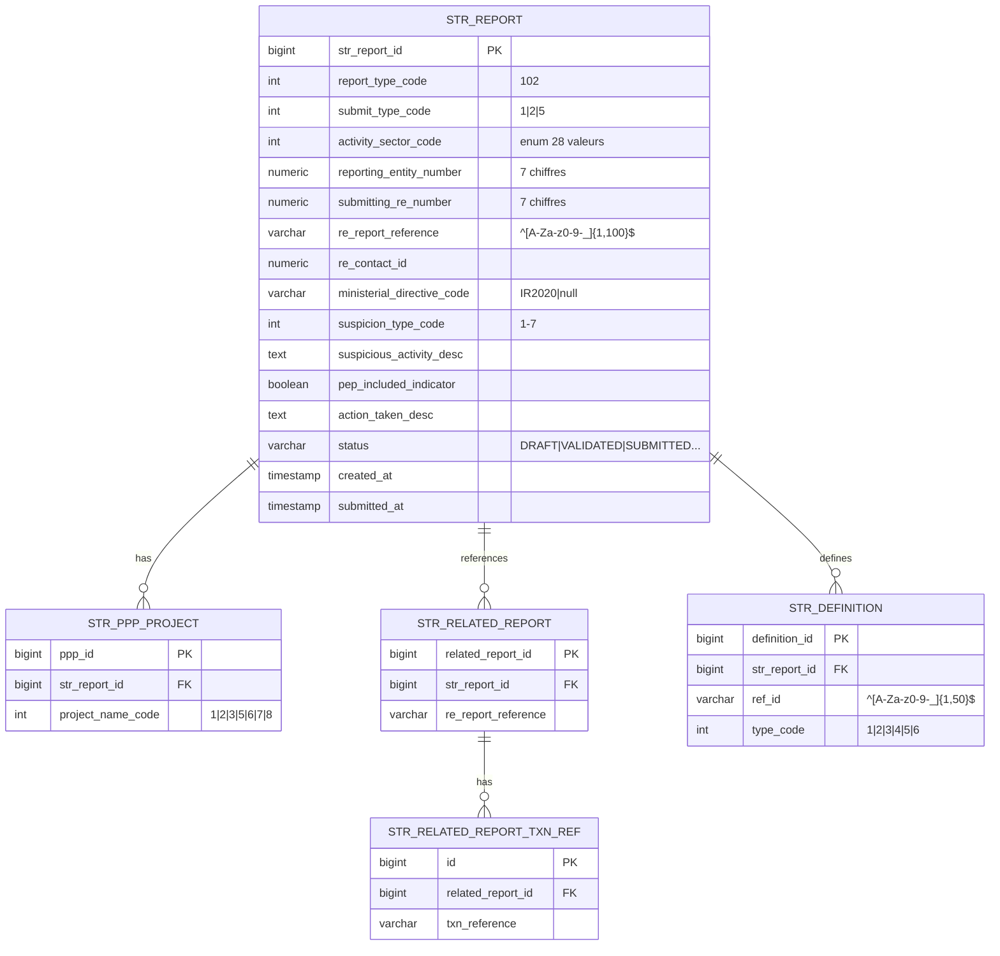
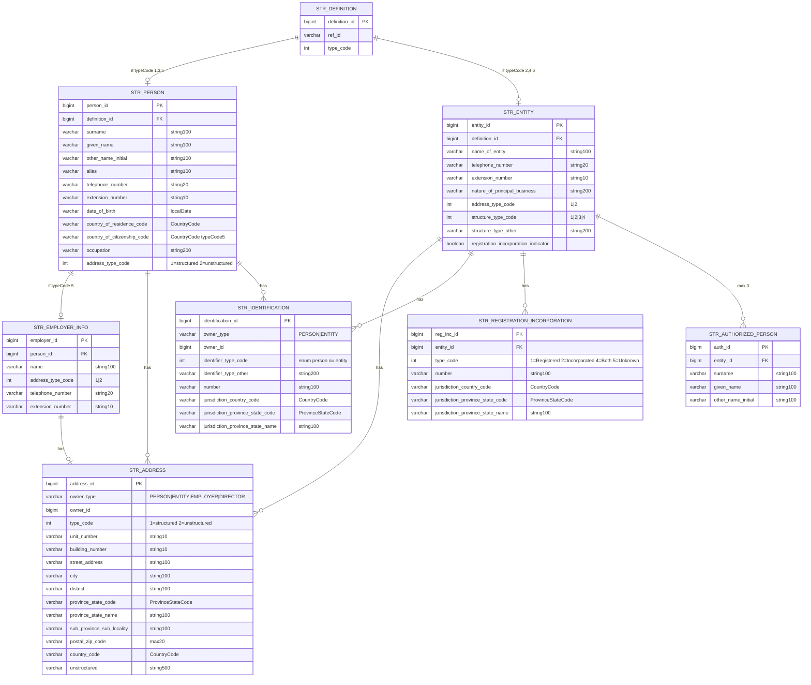

# Modèle de données cible V2 — STRReport CANAFE
## Corrigé selon le swaggerExternal.yaml officiel (261 Ko, 6883 lignes)

**Version :** 2.0 | **Date :** 2026-06-16

---

# DIAGRAMME GÉNÉRAL — Vue d'ensemble

```mermaid
graph TB
    subgraph "RAPPORT"
        STR_REPORT["STR_REPORT<br/>(Rapport STR principal)"]
    end

    subgraph "MÉTADONNÉES"
        STR_PPP["STR_PPP_PROJECT"]
        STR_RELATED["STR_RELATED_REPORT"]
        STR_REL_TXN["STR_RELATED_REPORT_TXN_REF"]
    end

    subgraph "DÉFINITIONS (Catalogue polymorphe)"
        STR_DEF["STR_DEFINITION<br/>(refId unique)"]
        STR_PERSON["STR_PERSON<br/>(typeCode 1,3,5)"]
        STR_ENTITY["STR_ENTITY<br/>(typeCode 2,4,6)"]
        STR_EMPLOYER["STR_EMPLOYER_INFO<br/>(typeCode 5)"]
        STR_REG_INC["STR_REGISTRATION_INCORPORATION"]
        STR_AUTH["STR_AUTHORIZED_PERSON"]
        STR_DIRECTOR["STR_DIRECTOR"]
        STR_SHARE["STR_SHARE_OWNER"]
        STR_TRUSTEE["STR_TRUSTEE"]
        STR_SETTLOR["STR_SETTLOR"]
        STR_UNIT_OWN["STR_TRUST_UNIT_OWNER"]
        STR_TRUST_BEN["STR_TRUST_BENEFICIARY"]
        STR_OTHER_OWN["STR_OTHER_ENTITY_OWNER"]
    end

    subgraph "IDENTITÉ & CONTACT"
        STR_ADDR["STR_ADDRESS"]
        STR_IDENT["STR_IDENTIFICATION"]
    end

    subgraph "TRANSACTIONS"
        STR_TXN["STR_TRANSACTION"]
        STR_SA["STR_STARTING_ACTION"]
        STR_CA["STR_COMPLETING_ACTION"]
    end

    subgraph "RÔLES TRANSACTIONNELS"
        STR_COND["STR_CONDUCTOR"]
        STR_OBO["STR_ON_BEHALF_OF"]
        STR_SRC["STR_SOURCE_OF_FUNDS"]
        STR_INV["STR_INVOLVEMENT"]
        STR_BEN["STR_BENEFICIARY"]
    end

    subgraph "COMPTES"
        STR_ACCT["STR_ACCOUNT"]
        STR_HOLD["STR_ACCOUNT_HOLDER"]
        STR_VC["STR_VC_DATA"]
    end

    subgraph "AUDIT"
        STR_SUB["STR_API_SUBMISSION"]
        STR_PAY["STR_SUBMITTED_PAYLOAD"]
        STR_ERR["STR_VALIDATION_ERROR"]
        STR_EVT["STR_AUDIT_EVENT"]
    end

    STR_REPORT --> STR_PPP
    STR_REPORT --> STR_RELATED
    STR_RELATED --> STR_REL_TXN
    STR_REPORT --> STR_DEF
    STR_REPORT --> STR_TXN

    STR_DEF --> STR_PERSON
    STR_DEF --> STR_ENTITY
    STR_PERSON --> STR_EMPLOYER
    STR_PERSON --> STR_ADDR
    STR_PERSON --> STR_IDENT
    STR_ENTITY --> STR_ADDR
    STR_ENTITY --> STR_IDENT
    STR_ENTITY --> STR_REG_INC
    STR_ENTITY --> STR_AUTH
    STR_ENTITY --> STR_DIRECTOR
    STR_ENTITY --> STR_SHARE
    STR_ENTITY --> STR_TRUSTEE
    STR_ENTITY --> STR_SETTLOR
    STR_ENTITY --> STR_UNIT_OWN
    STR_ENTITY --> STR_TRUST_BEN
    STR_ENTITY --> STR_OTHER_OWN

    STR_TXN --> STR_SA
    STR_TXN --> STR_CA
    STR_SA --> STR_COND
    STR_SA --> STR_SRC
    STR_SA --> STR_ACCT
    STR_SA --> STR_VC
    STR_COND --> STR_OBO
    STR_CA --> STR_INV
    STR_CA --> STR_BEN
    STR_CA --> STR_ACCT
    STR_CA --> STR_VC
    STR_ACCT --> STR_HOLD

    STR_REPORT --> STR_SUB
    STR_SUB --> STR_PAY
    STR_REPORT --> STR_ERR
    STR_REPORT --> STR_EVT
```

---

# DIAGRAMME ER DÉTAILLÉ — Partie 1 : Rapport + Définitions

---

# DIAGRAMME ER DÉTAILLÉ — Partie 2 : Personnes et Entités

---

# DIAGRAMME ER — Partie 3 : Beneficial Ownership (typeCode 6)

```mermaid
erDiagram
    STR_ENTITY {
        bigint entity_id PK
        varchar name_of_entity
        int structure_type_code "1=Corp 2=Other 3=Trust 4=PublicTrust"
    }

    STR_DIRECTOR {
        bigint director_id PK
        bigint entity_id FK
        varchar surname "string100"
        varchar given_name "string100"
        varchar other_name_initial "string100"
        int address_type_code "1|2"
        varchar telephone_number "string20"
        varchar extension_number "string10"
    }

    STR_SHARE_OWNER {
        bigint share_owner_id PK
        bigint entity_id FK
        varchar surname "string100"
        varchar given_name "string100"
        varchar other_name_initial "string100"
    }

    STR_TRUSTEE {
        bigint trustee_id PK
        bigint entity_id FK
        varchar surname "string100"
        varchar given_name "string100"
        varchar other_name_initial "string100"
        int address_type_code "1|2"
        varchar telephone_number "string20"
        varchar extension_number "string10"
    }

    STR_SETTLOR {
        bigint settlor_id PK
        bigint entity_id FK
        varchar surname "string100"
        varchar given_name "string100"
        varchar other_name_initial "string100"
        int address_type_code "1|2"
        varchar telephone_number "string20"
        varchar extension_number "string10"
    }

    STR_TRUST_UNIT_OWNER {
        bigint unit_owner_id PK
        bigint entity_id FK
        varchar surname "string100"
        varchar given_name "string100"
        varchar other_name_initial "string100"
        int address_type_code "1|2"
        varchar telephone_number "string20"
        varchar extension_number "string10"
    }

    STR_TRUST_BENEFICIARY {
        bigint trust_ben_id PK
        bigint entity_id FK
        varchar surname "string100"
        varchar given_name "string100"
        varchar other_name_initial "string100"
        int address_type_code "1|2"
        varchar telephone_number "string20"
        varchar extension_number "string10"
    }

    STR_OTHER_ENTITY_OWNER {
        bigint other_owner_id PK
        bigint entity_id FK
        varchar surname "string100"
        varchar given_name "string100"
        varchar other_name_initial "string100"
    }

    STR_ENTITY ||--o{ STR_DIRECTOR : "directorsOfCorporation"
    STR_ENTITY ||--o{ STR_SHARE_OWNER : "personsOwningSharesOfCorporation"
    STR_ENTITY ||--o{ STR_TRUSTEE : "trusteesOfTrust"
    STR_ENTITY ||--o{ STR_SETTLOR : "settlorsOfTrust"
    STR_ENTITY ||--o{ STR_TRUST_UNIT_OWNER : "personsOwningUnitsOfTrust"
    STR_ENTITY ||--o{ STR_TRUST_BENEFICIARY : "beneficiariesOfTrust"
    STR_ENTITY ||--o{ STR_OTHER_ENTITY_OWNER : "personsOwningEntityNotCorpOrTrust"

    STR_DIRECTOR ||--o| STR_ADDRESS : "has address"
    STR_TRUSTEE ||--o| STR_ADDRESS : "has address"
    STR_SETTLOR ||--o| STR_ADDRESS : "has address"
    STR_TRUST_UNIT_OWNER ||--o| STR_ADDRESS : "has address"
    STR_TRUST_BENEFICIARY ||--o| STR_ADDRESS : "has address"
```

**Note :** Les BO avec `personContact` (Director, Trustee, Settlor, TrustUnitOwner, TrustBeneficiary) ont adresse+téléphone. Les BO avec uniquement nom (ShareOwner, OtherEntityOwner) n'ont pas d'adresse.

