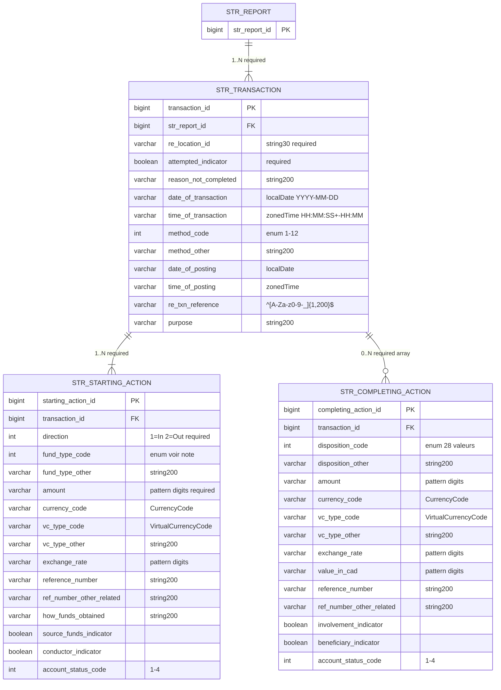
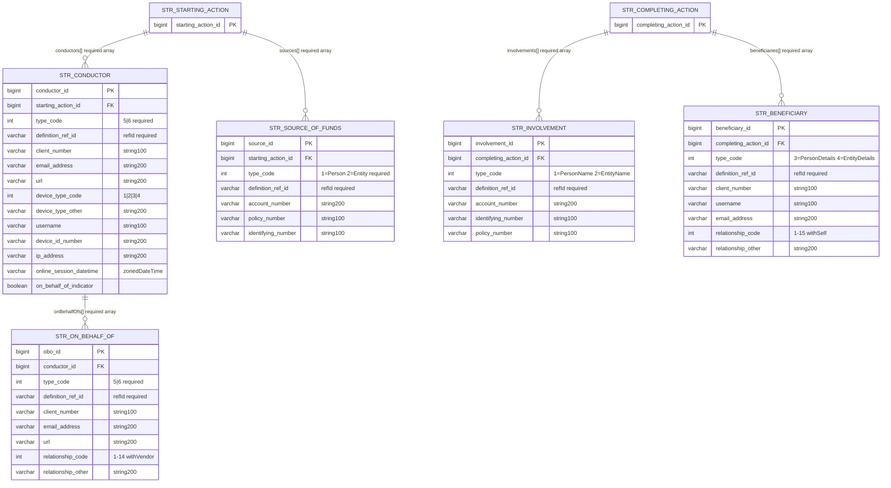
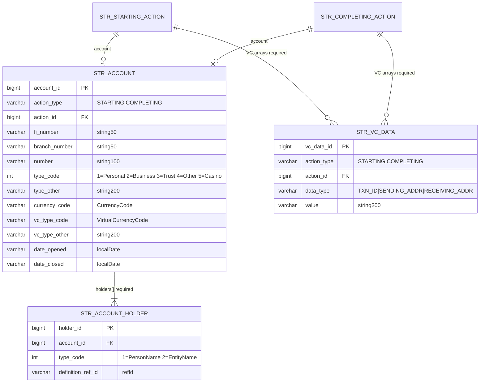
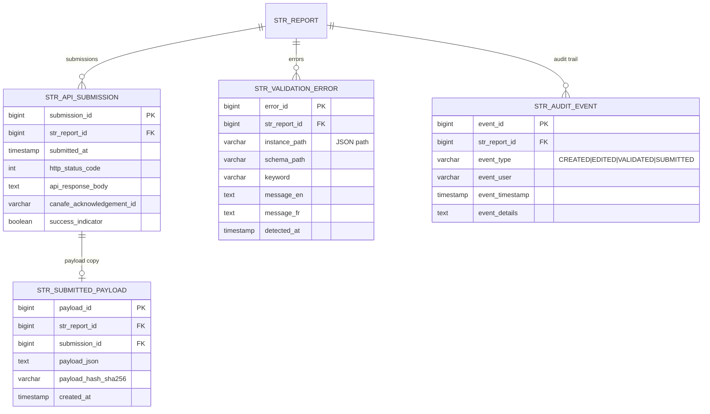
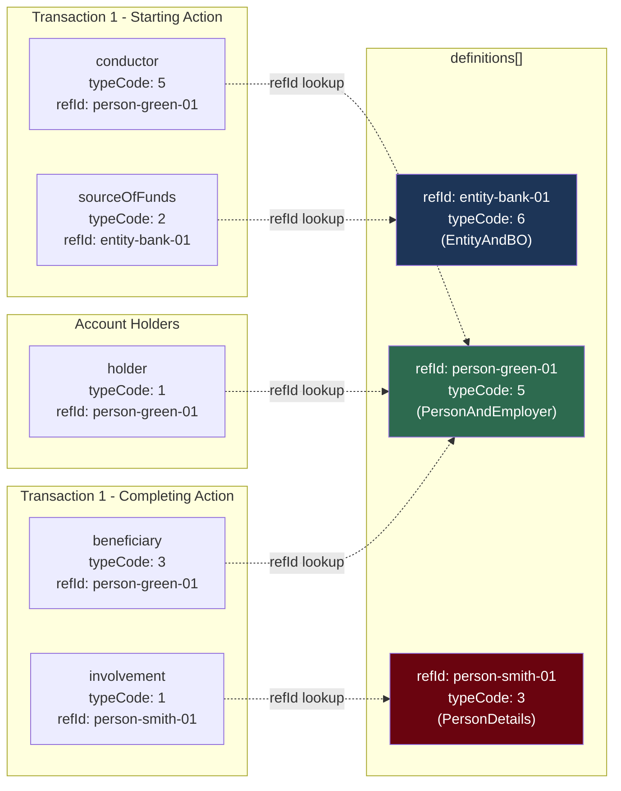
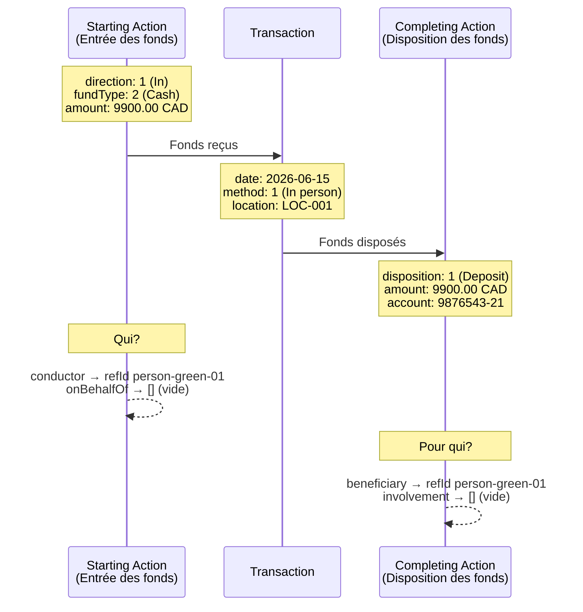

# Modèle de données cible V2 — Partie 2 : Transactions + Audit

---

# DIAGRAMME ER — Partie 4 : Transactions

---

# DIAGRAMME ER — Partie 5 : Rôles transactionnels

---

# DIAGRAMME ER — Partie 6 : Comptes et Monnaie Virtuelle

---

# DIAGRAMME ER — Partie 7 : Audit et Traçabilité

---

# SCHÉMA EXPLICATIF — Pattern de référencement `definitions[] ↔ refId`

**Explication :** Une même personne (person-green-01) peut être référencée comme **conductor**, **beneficiary** ET **account holder** via le même `refId`. La définition est stockée **une seule fois** dans `definitions[]`.

---

# SCHÉMA EXPLICATIF — Flux d'une transaction STR

---

# TABLEAU DES CARDINALITÉS COMPLÈTES

| Parent | Enfant | Cardinalité | Required YAML | Peut être vide? |
|--------|--------|------------|--------------|-----------------|
| STR_REPORT | STR_TRANSACTION | 1→N | ✅ `minItems: 1` | ❌ Min 1 |
| STR_REPORT | STR_DEFINITION | 1→N | ✅ required | ✅ Oui `[]` |
| STR_REPORT | STR_PPP_PROJECT | 1→N | ✅ required | ✅ Oui `[]` |
| STR_REPORT | STR_RELATED_REPORT | 1→N | ✅ required | ✅ Oui `[]` |
| STR_TRANSACTION | STR_STARTING_ACTION | 1→N | ✅ required | ❌ Min 1 |
| STR_TRANSACTION | STR_COMPLETING_ACTION | 1→N | ✅ required | ✅ Oui `[]` |
| STR_STARTING_ACTION | STR_CONDUCTOR | 1→N | ✅ required | ✅ Oui `[]` |
| STR_STARTING_ACTION | STR_SOURCE_OF_FUNDS | 1→N | ✅ required | ✅ Oui `[]` |
| STR_CONDUCTOR | STR_ON_BEHALF_OF | 1→N | ✅ required | ✅ Oui `[]` |
| STR_COMPLETING_ACTION | STR_INVOLVEMENT | 1→N | ✅ required | ✅ Oui `[]` |
| STR_COMPLETING_ACTION | STR_BENEFICIARY | 1→N | ✅ required | ✅ Oui `[]` |
| STR_ACCOUNT | STR_ACCOUNT_HOLDER | 1→N | ✅ required | ❌ Min 1 |
| STR_ENTITY | STR_AUTHORIZED_PERSON | 1→N | ✅ required | ✅ Oui `[]` |
| STR_ENTITY | STR_REGISTRATION_INCORPORATION | 1→N | ✅ required | ✅ Oui `[]` |
| STR_ENTITY (tc6) | STR_DIRECTOR | 1→N | ✅ required | ✅ Oui `[]` |
| STR_ENTITY (tc6) | STR_SHARE_OWNER | 1→N | ✅ required | ✅ Oui `[]` |
| STR_ENTITY (tc6) | STR_TRUSTEE | 1→N | ✅ required | ✅ Oui `[]` |
| STR_ENTITY (tc6) | STR_SETTLOR | 1→N | ✅ required | ✅ Oui `[]` |
| STR_ENTITY (tc6) | STR_TRUST_UNIT_OWNER | 1→N | ✅ required | ✅ Oui `[]` |
| STR_ENTITY (tc6) | STR_TRUST_BENEFICIARY | 1→N | ✅ required | ✅ Oui `[]` |
| STR_ENTITY (tc6) | STR_OTHER_ENTITY_OWNER | 1→N | ✅ required | ✅ Oui `[]` |

**Note critique :** La colonne "Required YAML" signifie que le champ doit être **présent** dans le JSON. "Peut être vide" signifie qu'un array vide `[]` est accepté. Ceci est dû au `additionalProperties: false` — tout champ absent provoquera un rejet.

---

# TABLEAU DES TYPES typeCode PAR CONTEXTE

| Contexte d'utilisation | typeCodes acceptés | Schéma YAML |
|----------------------|-------------------|-------------|
| `definitions[]` | 1, 2, 3, 4, 5, 6 | oneOf PersonName\|EntityName\|PersonDetails\|EntityDetails\|personAndEmployerDetails\|entityAndBeneficialOwnershipDetails |
| `conductors[].typeCode` | **5, 6** | `definitionType56` |
| `onBehalfOfs[].typeCode` | **5, 6** | `definitionType56` |
| `sourcesOfFundsOrVirtualCurrency[].typeCode` | **1, 2** | `definitionType12` |
| `involvements[].typeCode` | **1, 2** | `definitionType12` |
| `beneficiaries[].typeCode` | **3, 4** | `definitionType34` |
| `account.holders[].typeCode` | **1, 2** | `definitionType12` |

**Règle :** Le `typeCode` dans le rôle transactionnel doit correspondre à un `typeCode` compatible dans `definitions[]`. Ex: un conductor avec `typeCode: 5` doit référencer un `refId` dont la définition est de `typeCode: 5` (personAndEmployerDetails).

---

# COMPTEUR FINAL DES TABLES

| Catégorie | Tables | Nombre |
|-----------|--------|--------|
| **Rapport** | STR_REPORT, STR_PPP_PROJECT, STR_RELATED_REPORT, STR_RELATED_REPORT_TXN_REF | 4 |
| **Définitions** | STR_DEFINITION, STR_PERSON, STR_ENTITY, STR_EMPLOYER_INFO | 4 |
| **Identité** | STR_ADDRESS, STR_IDENTIFICATION | 2 |
| **Entité détails** | STR_REGISTRATION_INCORPORATION, STR_AUTHORIZED_PERSON | 2 |
| **Beneficial Ownership** | STR_DIRECTOR, STR_SHARE_OWNER, STR_TRUSTEE, STR_SETTLOR, STR_TRUST_UNIT_OWNER, STR_TRUST_BENEFICIARY, STR_OTHER_ENTITY_OWNER | 7 |
| **Transactions** | STR_TRANSACTION, STR_STARTING_ACTION, STR_COMPLETING_ACTION | 3 |
| **Rôles** | STR_CONDUCTOR, STR_ON_BEHALF_OF, STR_SOURCE_OF_FUNDS, STR_INVOLVEMENT, STR_BENEFICIARY | 5 |
| **Comptes** | STR_ACCOUNT, STR_ACCOUNT_HOLDER, STR_VC_DATA | 3 |
| **Audit** | STR_API_SUBMISSION, STR_SUBMITTED_PAYLOAD, STR_VALIDATION_ERROR, STR_AUDIT_EVENT | 4 |
| **TOTAL** | | **34 tables** |

