---

# SECTION 5 — Diagramme relationnel (corrigé — 34 tables)

```mermaid
erDiagram
    STR_REPORT ||--o{ STR_PPP_PROJECT : "1→N"
    STR_REPORT ||--o{ STR_RELATED_REPORT : "1→N"
    STR_REPORT ||--o{ STR_DEFINITION : "1→N"
    STR_REPORT ||--|{ STR_TRANSACTION : "1→N min1"
    STR_REPORT ||--o{ STR_API_SUBMISSION : "1→N"
    STR_REPORT ||--o{ STR_VALIDATION_ERROR : "1→N"
    STR_REPORT ||--o{ STR_AUDIT_EVENT : "1→N"

    STR_RELATED_REPORT ||--o{ STR_RELATED_REPORT_TXN_REF : "1→N"

    STR_DEFINITION ||--o| STR_PERSON : "if tc 1,3,5"
    STR_DEFINITION ||--o| STR_ENTITY : "if tc 2,4,6"

    STR_PERSON ||--o| STR_EMPLOYER_INFO : "if tc 5"
    STR_PERSON ||--o{ STR_ADDRESS : "1→N"
    STR_PERSON ||--o{ STR_IDENTIFICATION : "1→N"

    STR_EMPLOYER_INFO ||--o| STR_ADDRESS : "0..1"

    STR_ENTITY ||--o{ STR_ADDRESS : "1→N"
    STR_ENTITY ||--o{ STR_IDENTIFICATION : "1→N"
    STR_ENTITY ||--o{ STR_REGISTRATION_INCORPORATION : "1→N"
    STR_ENTITY ||--o{ STR_AUTHORIZED_PERSON : "max 3"
    STR_ENTITY ||--o{ STR_DIRECTOR : "tc6 personContact"
    STR_ENTITY ||--o{ STR_SHARE_OWNER : "tc6 nom seul"
    STR_ENTITY ||--o{ STR_TRUSTEE : "tc6 personContact"
    STR_ENTITY ||--o{ STR_SETTLOR : "tc6 personContact"
    STR_ENTITY ||--o{ STR_TRUST_UNIT_OWNER : "tc6 personContact"
    STR_ENTITY ||--o{ STR_TRUST_BENEFICIARY : "tc6 personContact"
    STR_ENTITY ||--o{ STR_OTHER_ENTITY_OWNER : "tc6 nom seul"

    STR_DIRECTOR ||--o| STR_ADDRESS : "0..1"
    STR_TRUSTEE ||--o| STR_ADDRESS : "0..1"
    STR_SETTLOR ||--o| STR_ADDRESS : "0..1"
    STR_TRUST_UNIT_OWNER ||--o| STR_ADDRESS : "0..1"
    STR_TRUST_BENEFICIARY ||--o| STR_ADDRESS : "0..1"

    STR_TRANSACTION ||--|{ STR_STARTING_ACTION : "1→N min1"
    STR_TRANSACTION ||--o{ STR_COMPLETING_ACTION : "required array"

    STR_STARTING_ACTION ||--o| STR_ACCOUNT : "0..1"
    STR_STARTING_ACTION ||--o{ STR_VC_DATA : "required arrays"
    STR_STARTING_ACTION ||--o{ STR_CONDUCTOR : "required array"
    STR_STARTING_ACTION ||--o{ STR_SOURCE_OF_FUNDS : "required array"

    STR_CONDUCTOR ||--o{ STR_ON_BEHALF_OF : "required array"

    STR_COMPLETING_ACTION ||--o| STR_ACCOUNT : "0..1"
    STR_COMPLETING_ACTION ||--o{ STR_VC_DATA : "required arrays"
    STR_COMPLETING_ACTION ||--o{ STR_INVOLVEMENT : "required array"
    STR_COMPLETING_ACTION ||--o{ STR_BENEFICIARY : "required array"

    STR_ACCOUNT ||--|{ STR_ACCOUNT_HOLDER : "min 1"

    STR_API_SUBMISSION ||--o| STR_SUBMITTED_PAYLOAD : "1→1"
```



---

# SECTION 6 — Mapping relationnel → JSON CANAFE (corrigé)

## 6.1 Assemblage bottom-up

```
1. STR_DEFINITION + STR_PERSON/STR_ENTITY + enfants → definitions[]
2. STR_STARTING_ACTION + conductors + sources + account → startingActions[]
3. STR_COMPLETING_ACTION + involvements + beneficiaries + account → completingActions[]
4. STR_TRANSACTION + starting/completing → transactions[]
5. STR_REPORT + tous les blocs → JSON racine
```

## 6.2 Mapping des noms de colonnes → noms JSON

| Table.Colonne | JSON exact |
|---------------|------------|
| STR_REPORT.re_report_reference | `reportDetails.reportingEntityReportReference` |
| STR_REPORT.reporting_entity_number | `reportDetails.reportingEntityNumber` (number) |
| STR_PERSON.given_name | `givenName` |
| STR_PERSON.other_name_initial | `otherNameInitial` |
| STR_PERSON.country_of_residence_code | `countryOfResidenceCode` |
| STR_PERSON.country_of_citizenship_code | `countryOfCitizenshipCode` |
| STR_ENTITY.name_of_entity | `nameOfEntity` |
| STR_ENTITY.nature_of_principal_business | `natureOfPrincipalBusiness` |
| STR_ENTITY.structure_type_code | `structureTypeCode` |
| STR_EMPLOYER_INFO.name | `employerInformation.name` |
| STR_TRANSACTION.re_location_id | `reportingEntityLocationId` |
| STR_TRANSACTION.purpose | `purpose` (pas `purposeOfTransaction`) |
| STR_STARTING_ACTION.amount | `details.amount` (STRING!) |
| STR_STARTING_ACTION.ref_number_other | `details.referenceNumberOtherRelatedNumber` |
| STR_ACCOUNT.number | `number` (pas `accountNumber`) |
| STR_ACCOUNT.date_opened | `dateOpened` (pas `dateAccountOpened`) |
| STR_ACCOUNT.date_closed | `dateClosed` |
| STR_ADDRESS.sub_province_sub_locality | `subProvinceSubLocality` |

## 6.3 Gestion des arrays required vides

Le pattern CANAFE exige que les arrays required soient **présents** même s'ils sont vides. Le générateur JSON doit toujours émettre `[]` pour ces champs.

| Array JSON | Quand vide |
|------------|-----------|
| `publicPrivatePartnershipProjectNameCodes` | `[]` |
| `relatedReports` | `[]` |
| `definitions` | `[]` |
| `startingActions[n].conductors` | `[]` |
| `startingActions[n].sourcesOfFundsOrVirtualCurrency` | `[]` |
| `startingActions[n].details.virtualCurrencyTransactionIds` | `[]` |
| `startingActions[n].details.sendingVirtualCurrencyAddresses` | `[]` |
| `startingActions[n].details.receivingVirtualCurrencyAddresses` | `[]` |
| `conductors[n].onBehalfOfs` | `[]` |
| `completingActions` | `[]` |
| `completingActions[n].involvements` | `[]` |
| `completingActions[n].beneficiaries` | `[]` |
| `completingActions[n].details.virtualCurrencyTransactionIds` | `[]` |
| `completingActions[n].details.sendingVirtualCurrencyAddresses` | `[]` |
| `completingActions[n].details.receivingVirtualCurrencyAddresses` | `[]` |

---

# SECTION 7 — Exemple de payload JSON V2 (noms YAML exacts)

```json
{
  "reportDetails": {
    "reportTypeCode": 102,
    "submitTypeCode": 1,
    "activitySectorCode": 2,
    "reportingEntityNumber": 1234567,
    "submittingReportingEntityNumber": 1234567,
    "reportingEntityReportReference": "STR-2026-00142",
    "reportingEntityContactId": 98765
  },
  "detailsOfSuspicion": {
    "descriptionOfSuspiciousActivity": "Le 15 juin 2026, Mme Jennifer Green a déposé 9 900 CAD en espèces dans son compte d'épargne à la succursale 1. Le dépôt est sous le seuil de 10 000 dollars. Mme Green a changé plusieurs fois son explication. Son historique de revenus n'est pas cohérent avec les montants déposés.",
    "suspicionTypeCode": 1,
    "publicPrivatePartnershipProjectNameCodes": [],
    "politicallyExposedPersonIncludedIndicator": false
  },
  "relatedReports": [],
  "actionTaken": {
    "description": "Monitoring transactionnel renforcé sur le compte de Mme Green."
  },
  "definitions": [
    {
      "typeCode": 5,
      "refId": "person-green-01",
      "surname": "Green",
      "givenName": "Jennifer",
      "otherNameInitial": "A",
      "alias": "Jenny",
      "addressTypeCode": 1,
      "address": {
        "typeCode": 1,
        "buildingNumber": "456",
        "streetAddress": "Rue Principale",
        "city": "Montreal",
        "provinceStateCode": "QC",
        "countryCode": "CA",
        "postalZipCode": "H2X 1Y4"
      },
      "telephoneNumber": "15145551234",
      "dateOfBirth": "1985-03-15",
      "countryOfResidenceCode": "CA",
      "countryOfCitizenshipCode": "CA",
      "occupation": "Restaurant server",
      "employerInformation": {
        "name": "Restaurant Le Bon Goût Inc.",
        "addressTypeCode": 1,
        "address": {
          "typeCode": 1,
          "streetAddress": "100 Boulevard Saint-Laurent",
          "city": "Montreal",
          "provinceStateCode": "QC",
          "countryCode": "CA",
          "postalZipCode": "H2X 2T3"
        },
        "telephoneNumber": "15145559876"
      },
      "identifications": [
        {
          "identifierTypeCode": 4,
          "number": "G1234-567890-12",
          "jurisdictionOfIssueCountryCode": "CA",
          "jurisdictionOfIssueProvinceStateCode": "QC"
        }
      ]
    }
  ],
  "transactions": [
    {
      "reportingEntityLocationId": "LOC-BRANCH-001",
      "suspiciousTransactionDetails": {
        "attemptedTransactionIndicator": false,
        "dateOfTransaction": "2026-06-15",
        "timeOfTransaction": "14:30:00-04:00",
        "methodCode": 1,
        "reportingEntityTransactionReference": "TXN-2026-A1",
        "purpose": "Cash deposit into savings account"
      },
      "startingActions": [
        {
          "details": {
            "direction": 1,
            "fundAssetVirtualCurrencyTypeCode": 2,
            "amount": "9900.00",
            "currencyCode": "CAD",
            "virtualCurrencyTransactionIds": [],
            "sendingVirtualCurrencyAddresses": [],
            "receivingVirtualCurrencyAddresses": [],
            "accountStatusAtTimeOfTransaction": 1,
            "howFundsOrVirtualCurrencyObtained": "Employment tips",
            "sourcesOfFundsOrVirtualCurrencyIndicator": false,
            "conductorIndicator": true
          },
          "sourcesOfFundsOrVirtualCurrency": [],
          "conductors": [
            {
              "typeCode": 5,
              "refId": "person-green-01",
              "details": {
                "onBehalfOfIndicator": false
              },
              "onBehalfOfs": []
            }
          ]
        }
      ],
      "completingActions": [
        {
          "details": {
            "dispositionCode": 1,
            "amount": "9900.00",
            "currencyCode": "CAD",
            "virtualCurrencyTransactionIds": [],
            "sendingVirtualCurrencyAddresses": [],
            "receivingVirtualCurrencyAddresses": [],
            "account": {
              "financialInstitutionNumber": "001",
              "branchNumber": "12345",
              "number": "9876543-21",
              "typeCode": 1,
              "currencyCode": "CAD",
              "dateOpened": "2020-01-15",
              "holders": [
                { "typeCode": 1, "refId": "person-green-01" }
              ]
            },
            "accountStatusAtTimeOfTransaction": 1,
            "beneficiaryIndicator": true,
            "involvementIndicator": false
          },
          "involvements": [],
          "beneficiaries": [
            {
              "typeCode": 3,
              "refId": "person-green-01",
              "details": {}
            }
          ]
        }
      ]
    }
  ]
}
```

---

# SECTION 8 — Différences clés entre la guidance et le schéma YAML

| Aspect | Guidance (Annex A) | Schéma YAML officiel |
|--------|-------------------|---------------------|
| `descriptionOfSuspiciousActivity` | Mandatory (*) | NOT in `required` |
| `suspicionTypeCode` | Mandatory (*) | NOT in `required` |
| `activitySectorCode` | Mandatory (*) | NOT in `required` |
| `amount` | Number type | **String** with regex pattern |
| PPP project codes | Optional | **Required** array (vide OK) |
| VC transaction IDs | Optional | **Required** arrays (vides OK) |
| `conductors[]` | Optional if no conductor | **Required** array (vide OK) |
| `onBehalfOfs[]` | Optional | **Required** array (vide OK) |
| `beneficiaries[]` | Optional if no beneficiary | **Required** array (vide OK) |
| `involvements[]` | Optional if no involvement | **Required** array (vide OK) |
| `completingActions[]` | Optional if attempted | **Required** array (vide OK) |
| `additionalProperties` | Not mentioned | **false** partout — rejet strict |

> **Implication :** Le moteur de validation doit implémenter **deux couches** :
> 1. **Validation de schéma** : required arrays, types, patterns (rejet API si non conforme)
> 2. **Validation business** : champs mandatory (*) de la guidance (rejet par business rules CANAFE)

